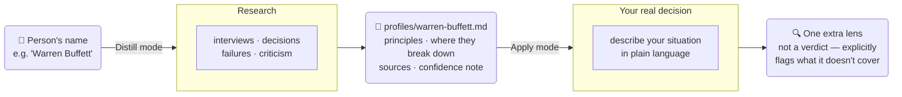

[English](README.md) | [简体中文](README.zh-CN.md)

[](LICENSE)
[](https://github.com/DOTfei/borrowed-brain-pro/stargazers)
[](SKILL.md)

**An AI instruction file that distills any public figure's thinking into a reusable framework — then applies it as an extra lens on a decision you're actually facing.**

Works with Claude (native Skill), ChatGPT, Open WebUI, local models like Hermes, or any AI that accepts a system prompt.

Not a chatbot impersonation. Not a quote generator. A structured "thinking profile" built from real public material — interviews, decisions, failures, criticism — that you can point at your own problem and ask: *what would this framework surface that I'm missing?*

**You can distill anyone with a substantial public record** — living or historical. The 9 profiles below ship ready to use, but the real power is that you can build a new one for any public figure in one command: Naval Ravikant, Charlie Munger, Jensen Huang, Paul Graham, anyone.

---

## Demo

https://github.com/user-attachments/assets/8a81e7cb-f938-40b1-ab87-a4512b96e322

> *Describe a real decision → skill reads the profile index → suggests the right lens → surfaces where two frameworks conflict*

<details>
<summary>📄 Read the full transcript from this demo</summary>

**Prompt 1**
> I'm building a SaaS product. We have a working MVP but there are still quite a few bugs. The team wants to launch now to get real user feedback. I'm not sure if we should push or wait until it's cleaner. What should I think about?

No saved profiles yet — but I can still help you think this through directly.

The "ship buggy MVP vs. wait" question usually comes down to a few distinctions worth separating:

- **What kind of bugs are they?** Bugs that corrupt data, break core workflows, or lose user trust → launch blockers. Cosmetic, edge-case, or workaroundable bugs → usually fine to ship.
- **What do you actually need from "real user feedback"?** If it's signal on whether the core value prop resonates, bugs in secondary features don't interfere. If it's signal on trustworthiness, shipping buggy erodes exactly what you're testing.
- **Who are the first users?** Friendly early adopters tolerate bugs. Cold or paying users judge once and leave.
- **Can you narrow the surface area instead of resolving the binary?** Launch to 20 people, launch behind a feature flag, launch without announcing broadly — this gets you feedback without betting the whole first impression on the current state.

*If you want, I can build a thinking profile for someone whose judgment you'd want on this call and run your situation through it — just name who.*

---

**Prompt 2**
> Use both Steve Jobs and Sam Altman's profiles. I want to see where they agree and where they conflict.

Neither profile exists yet — building both now from live research.

**Where they agree**

Both explicitly reject "ship no matter what" — neither is a pure speed-over-quality thinker.

- Jobs: "real artists ship," but never at the cost of being "up to Apple's standards."
- Altman: launch early and iterate, but "generally won't release something crappy… this is not an excuse to launch slowly."

Both also independently arrive at the same tactical move: **narrow the surface area** rather than resolve the binary. Jobs' MobileMe postmortem proposed launching sync first, then Mail, then Calendar — not the whole thing at once. Altman's framework says the same from the other direction: make a small number of users love a narrow product, rather than a large number merely tolerate a broad one.

**Where they conflict**

- **Jobs' lens → lean toward delay.** His instinct, when in doubt, puts "is the core thing right" ahead of the calendar. His documented failure (MobileMe, 2008) is a case where shipping on schedule when it wasn't ready cost him publicly — he called it "not our finest hour."
- **Altman's lens → lean toward ship.** His documented failure (OpenAI's compressed safety-testing timelines under competitive pressure) is a case where his stated principle *lost* to urgency — not a case where he chose to wait and regretted it. His instinct, in the gap between ideal and real pressure, leans toward ship.

**What neither lens covers**

Neither is speaking from your position — an early team wanting user feedback on an MVP, not a company already dominant enough to survive a bad launch's reputational cost. Both Jobs' and Altman's calls were made from positions of resource and reputational slack that a first-time SaaS team doesn't have yet.

---

**Prompt 3**
> What does the Jobs framework miss here that's specific to my situation?

Running Jobs' framework's blind spots for your situation specifically:

1. **He never operated from a position of needing outside validation for the idea itself.** Jobs' ship-vs.-wait calls were always about execution risk on a product whose market fit was already assumed. You're also trying to answer "do people want this at all" — his framework has very little to say about that, because he rarely faced it after Apple II days.

2. **He had a captive channel and a controlled reveal — you don't.** Apple controlled the moment, the press, the framing. A SaaS MVP going out through open channels (Product Hunt, cold signups, social) can permanently churn a user in one buggy session, with no press cycle to soften it.

3. **His failure case (MobileMe) is about infrastructure, not iteration.** MobileMe was a finished service pushed to millions of paying users, not an MVP to a small forgiving cohort. Applying his "delay until right" instinct too literally risks importing big-company caution that doesn't map onto your actual use case.

4. **He rarely had a team he needed to keep motivated through delay.** Jobs could impose delay by fiat. Extended delay didn't cost him team belief or runway the way it might cost you — his framework doesn't weigh team momentum as a real variable.

</details>

---

## 🚀 Just installed this? Start here

Open a new chat and type any of these — no special syntax, no slash command:

```
What profiles do I have?
```
```
Using the Warren Buffett profile, should I take this investment opportunity — [describe it]?
```
```
Build a thinking profile for Naval Ravikant
```
```
Build a thinking profile for Charlie Munger
```
```
Build a thinking profile for [anyone with a public record]
```
```
What does borrowed-brain-pro do?
```

The skill can distill **any public figure** — just name them. If they have interviews, documented decisions, or published writing, the skill can build a profile. The 9 included profiles are a starting point, not a limit.

That last one works too — if you're unsure what to ask, just ask the skill and it'll explain itself and give you a working first command.

---

## What it does

Two modes, one skill:

**Distill mode** — give it a name, it researches the person and produces `profiles/<name>.md`: their core stance, recurring principles (with where each one breaks down), default reasoning order, tradeoffs, a documented failure, and a confidence note on how solid the material was.

**Apply mode** — point an existing profile at a real question you're facing, and it reasons through your situation using that lens — explicitly flagged as one perspective with limits, not a verdict.



**Profile routing** — if you describe a decision without naming anyone, the skill reads [`profiles/INDEX.md`](profiles/INDEX.md) and suggests the 1–2 most relevant profiles. You confirm before it applies anything.

---

## 8 profiles included — ready to use immediately

This repo ships with 8 real profiles built by actually running Distill mode, not mocked up:

| Person | Domain | Best for |
|--------|--------|----------|
| [Warren Buffett](profiles/warren-buffett.md) | Investing | Should I bet on this? Long-term hold vs. sell. Valuation discipline. |
| [Steve Jobs](profiles/steve-jobs.md) | Product / entrepreneurship | Which feature to cut. Launch timing. Saying no to requests. |
| [Chris Voss](profiles/chris-voss.md) | Negotiation | Contract talks. Breaking a deadlock. Handling a hostile counterpart. |
| [Richard Feynman](profiles/richard-feynman.md) | Research / reasoning | Checking a hypothesis. Hunting for self-deception. Auditing your own logic. |
| [Cal Newport](profiles/cal-newport.md) | Productivity | Time allocation. Protecting focused work. Structural fixes vs. willpower. |
| [Reed Hastings](profiles/reed-hastings.md) | Leadership / culture | Building candor into a team. Handling a big strategic pivot. |
| [Travis Kalanick](profiles/travis-kalanick.md) | Aggressive growth | Push into a hostile market or wait. Speed vs. compliance. |
| [Julia Evans](profiles/julia-evans.md) | Technical writing | Explaining hard things simply. Writing for your past self. |

---

## Example

Real excerpt from [`profiles/reed-hastings.md`](profiles/reed-hastings.md) — generated by actually running Distill mode:

> **Principle**: Actively solicit disagreement rather than assuming silence means agreement ("farming for dissent").
> **Where it shows up**: Built directly out of the Qwikster failure (2011) — Hastings learned that multiple VPs privately doubted the split but didn't say so, with one VP telling him he was "so intense" when convinced of something that it felt unsafe to push back.
> **Where it likely breaks down**: The principle was reactive, not proactive — it was instituted *after* a public 800,000-subscriber, 77%-stock-collapse failure, not before.

Apply mode with two profiles loaded at once, surfacing real disagreement:

```
You: Fast-growing startup, pressure to expand into a city with hostile
regulations. Lawyers say it's legally risky. Push in or wait?

Claude: Loading both lenses surfaces real disagreement:

- Kalanick's framework → push in. His logic explicitly weights regulatory
  hostility as a positive signal — the harder the fight, the bigger the moat.
- Hastings's framework → wait. His principle is to let good judgment
  (including the lawyers') carry weight rather than override it with
  personal conviction. His own documented failure (Qwikster) is precisely
  a case where his certainty overrode people raising concerns.

These conflict because they weight the same signal — "resistance from an
authority" — in opposite directions. This tension is the useful output,
not something to resolve for you.
```

---

## Install

> **The short version:** clone the whole repo (not just `SKILL.md`) so the 8 included profiles come with it.

### Claude Code (CLI) — recommended

```bash
git clone https://github.com/DOTfei/borrowed-brain-pro.git ~/.claude/skills/borrowed-brain-pro
```

That's it. Restart your Claude Code session and the skill — plus all 8 profiles — is ready. To use it only inside one project, clone into `.claude/skills/borrowed-brain-pro/` inside that project folder instead.

To update later:
```bash
cd ~/.claude/skills/borrowed-brain-pro && git pull
```

### Claude.ai (web) / ChatGPT / any AI with a system prompt

Use the **all-in-one bundle** — it's `SKILL.md` + all 9 profiles merged into one file. Paste it once as your system prompt and everything works immediately, no separate file uploads needed.

1. Download [`claude-ai-bundle.md`](https://github.com/DOTfei/borrowed-brain-pro/raw/main/claude-ai-bundle.md)
2. Open a new chat, paste the entire contents as your system prompt
3. Start — all 9 profiles are already loaded

**Claude.ai via Skills upload** (SKILL.md only, no pre-built profiles):
1. Download [`SKILL.md`](https://github.com/DOTfei/borrowed-brain-pro/raw/main/SKILL.md)
2. Go to **Settings → Capabilities → Skills** and upload it
3. To use a pre-built profile, paste the contents of any `profiles/<name>.md` file at the start of your conversation

### Open WebUI / LM Studio / Ollama (local models)

Paste `SKILL.md` into the system prompt field. Research quality depends on whether your model has web-search access — without it, the skill draws on training knowledge, which may be less current.

---

## Guardrails (built in, not optional)

- No fabricated quotes; direct quotes stay under 15 words and one-per-source, everything else is paraphrased
- Every claim in a profile must trace to an actual found source
- Profiles are framed as "based on public material, their approach seems to be..." — never stated as verified private views
- Declines to build profiles of private individuals — only people with a substantial public record
- Contested figures: describes documented reasoning style, not speculation about private motives

## Why this exists

Most "think like X" prompts produce generic motivational-poster output — every profile sounds the same because it's built from the polished, public-facing version of a person.

`borrowed-brain-pro` deliberately searches for the messier material too — documented failures, criticism, moments where the person's own account and an outside account diverge — because that's where real decision logic actually shows up. It also forces every "principle" in the profile to trace back to a specific, sourced fact, so profiles stay grounded instead of turning into flattery.

## What this is not

- Not a way to generate fake quotes or put words in someone's mouth
- Not a substitute for reading the person's actual work — if you want their real view, read their real work; this is for finding an *angle* you might be missing
- Not a verdict-generator — it's built to end every application with "here's what this lens doesn't cover," on purpose

---

Contributions, better source-checklists, and example profiles welcome — see [CONTRIBUTING.md](CONTRIBUTING.md).
