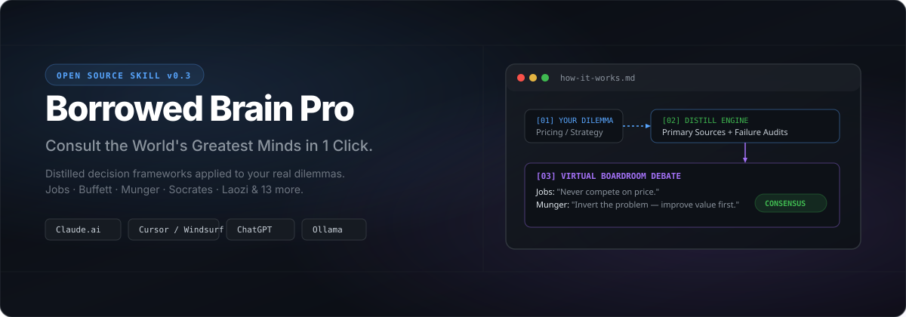
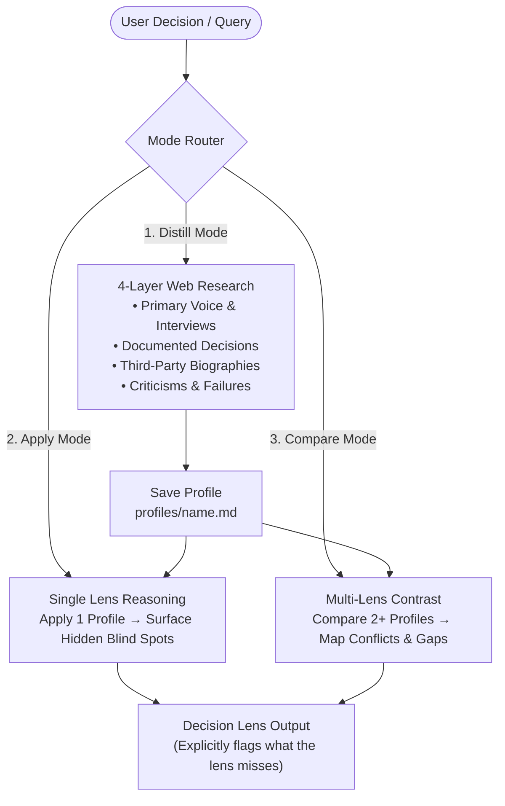

<p center>
  <a href="README.md"><b>English</b></a> | <a href="README.zh-CN.md"><b>简体中文</b></a>
</p>

<p center>
  <a href="LICENSE"></a>
  <a href="profiles/INDEX.md"></a>
  <a href="SKILL.md"></a>
  <a href="https://github.com/DOTfei/borrowed-brain-pro/actions"></a>
  <a href="https://github.com/DOTfei/borrowed-brain-pro/stargazers"></a>
</p>


> **Borrowed Brain Pro is powered by Two Core Superpowers:**
> 1. **Distill Engine**: Research and distill ANY public figure (past or present) into a reusable, structured Thinking Profile (`profiles/name.md`).
> 2. **Decision Engine**: Apply pre-built or custom profiles (single lens or multi-lens contrast) to your real decision dilemmas.

---

## Generic Prompts vs. Borrowed Brain Pro

| Approach | Prompt Example | Output Quality | Value for Real Decisions |
| :--- | :--- | :--- | :--- |
| **Generic AI Prompt** | *"Think like Warren Buffett and advise me"* | Generic motivational quotes (*"Focus on long-term value"*) | **Zero** — Unverifiable, cliché summary |
| **Borrowed Brain Pro** | *"Apply Buffett's profile to my SaaS expansion deal"* | Layered research, sourced moments & **explicit failure boundaries** | **High** — Actionable decision lens with concrete limits |

---

## How It Works: 3 Modes, 1 Skill


```mermaid
flowchart TD
    User(["User Decision / Query"]) --> Router{"Mode Router"}

    Router -->|1. Distill Mode| Distill["4-Layer Web Research\n• Primary Voice & Interviews\n• Documented Decisions\n• Third-Party Biographies\n• Criticisms & Failures"]
    Distill --> Save["Save Profile\nprofiles/name.md"]

    Router -->|2. Apply Mode| Apply["Single Lens Reasoning\nApply 1 Profile → Surface Hidden Blind Spots"]

    Router -->|3. Compare Mode| Compare["Multi-Lens Contrast\nCompare 2+ Profiles → Map Conflicts & Gaps"]

    Save --> Apply
    Save --> Compare

    Apply --> Output["Decision Lens Output\n(Explicitly flags what the lens misses)"]
    Compare --> Output
```

### Quick Commands

```bash
# 1. Distill a new figure
"Build a thinking profile for Charlie Munger"

# 2. Apply a single profile to your situation
"Using Munger's profile, should I expand into this new market?"

# 3. Compare two profiles on a dilemma
"Compare Jobs and Altman's profiles on my launch timing dilemma"
```

---

## Profile Anatomy

Every principle in every profile is structured with rigorous epistemic boundaries:

```markdown
Principle: Actively solicit disagreement rather than assuming silence means agreement ("farming for dissent").

Where it shows up: Built directly out of the Qwikster failure (2011) — Hastings learned that multiple VPs privately doubted the split but didn't say so.

Where it likely breaks down: The principle was reactive, not proactive — instituted AFTER an 800k subscriber drop and 77% stock collapse.
```

---

## 11 Pre-Built Profiles (Ready Out-of-the-Box)

| Person | Domain | Core Strength / Best For |
| :--- | :--- | :--- |
| **[Warren Buffett](profiles/warren-buffett.md)** | Investing | Opportunity evaluation, valuation discipline, knowing when to say no |
| **[Charlie Munger](profiles/charlie-munger.md)** | Multidisciplinary | Inverting complex problems, mental models, avoiding stupidity & bias |
| **[Steve Jobs](profiles/steve-jobs.md)** | Product / Vision | Feature cuts, launch timing, aggressive simplification, relentless quality |
| **[Chris Voss](profiles/chris-voss.md)** | Negotiation | Breaking deadlocks, contract negotiations, handling hostile counterparts |
| **[Richard Feynman](profiles/richard-feynman.md)** | Research / Reasoning | Auditing logic, hunting for self-deception, explaining complex ideas simply |
| **[Cal Newport](profiles/cal-newport.md)** | Productivity | Focus protection, structural fixes over willpower, deep work systems |
| **[Reed Hastings](profiles/reed-hastings.md)** | Leadership | Farming for dissent, building candor, executing major strategic pivots |
| **[Travis Kalanick](profiles/travis-kalanick.md)** | Aggressive Growth | Market entry under resistance, speed vs. compliance trade-offs |
| **[Julia Evans](profiles/julia-evans.md)** | Technical Writing | Explaining hard topics simply, writing for past self, clear documentation |
| **[Sam Altman](profiles/sam-altman.md)** | AI & Startups | Iterative deployment, speed vs. safety, framing controversial decisions |
| **[Paul Graham](profiles/paul-graham.md)** | Startups & Essays | Doing things that don't scale, founder earnestness, keeping identity small |

---

## Multi-Platform Installation Matrix

| Platform | Recommended Installation Method | One-Click Setup Instructions |
| :--- | :--- | :--- |
| **ChatGPT / Custom GPT** | **Single-File System Prompt** | Copy & paste full text of [`borrowed-brain-bundle.md`](borrowed-brain-bundle.md) into System Prompt |
| **Cursor / Windsurf AI** | **Native `.cursorrules`** | Clone repo or copy [`.cursorrules`](.cursorrules) into project root |
| **Ollama / Local LLMs** | **Modelfile / System Prompt** | Copy & paste [`borrowed-brain-bundle.md`](borrowed-brain-bundle.md) into Modelfile system field |
| **Claude / CLI** | **Git Clone (Skill)** | `git clone https://github.com/DOTfei/borrowed-brain-pro.git ~/.claude/skills/borrowed-brain-pro` |
| **Claude.ai** | **Skill / System Prompt** | Upload `SKILL.md` via Settings → Skills, or paste [`borrowed-brain-bundle.md`](borrowed-brain-bundle.md) |
| **Open WebUI** | **System Prompt** | Paste [`borrowed-brain-bundle.md`](borrowed-brain-bundle.md) into System Prompt field |

---

## Built-in Epistemic Guardrails

> [!IMPORTANT]
> - **No Fabricated Quotes**: Direct quotes stay under 15 words per source. Everything else is paraphrased.
> - **Traceable Claims**: Every claim must trace to a verified, documented public event or primary source.
> - **Public Figures Only**: Refuses to build profiles for private individuals to protect privacy.
> - **Limits Always Flagged**: Every response explicitly closes with *"Here is what this framework misses in your specific situation."*

---

## Contributing

Contributions, source improvements, and new distilled profiles are welcome! See [CONTRIBUTING.md](CONTRIBUTING.md) for guidelines.

```bash
# Automated Bundle Build (Runs automatically via GitHub Actions)
python scripts/build_bundle.py
```

---

<p center>
  <i>License: <a href="LICENSE">MIT</a> · Author & Maintainer: <a href="https://github.com/DOTfei">DOTfei</a></i>
</p>
