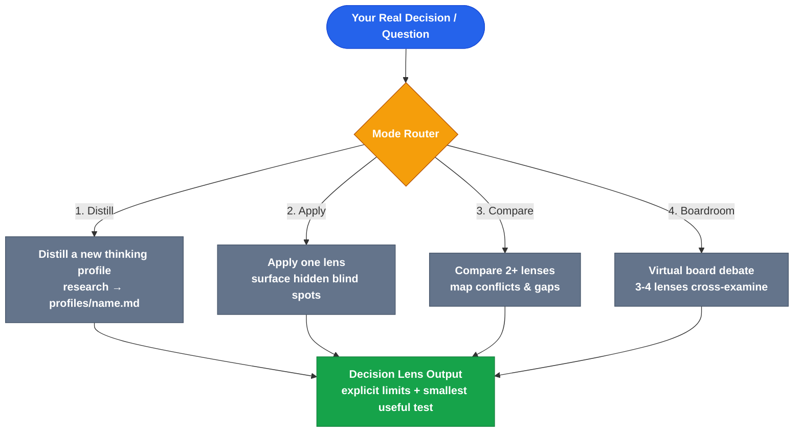
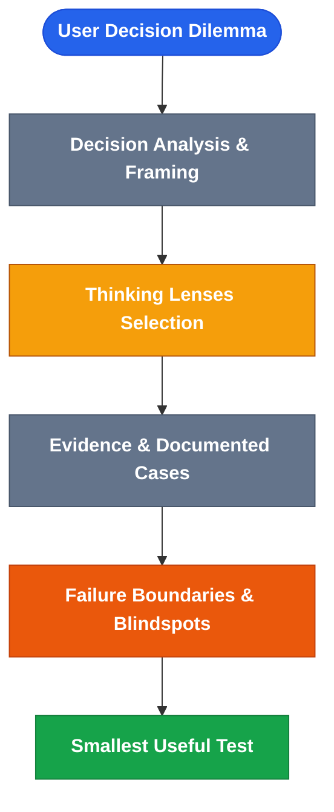

<a href="https://DOTfei.github.io/borrowed-brain-pro/"></a>

<p align="center">
  <a href="README.md"><b>English</b></a> | <a href="README.zh-CN.md"><b>简体中文</b></a>
</p>

<p align="center">
  <a href="https://DOTfei.github.io/borrowed-brain-pro/"></a>
  <a href="LICENSE"></a>
  <a href="profiles/INDEX.md"></a>
  <a href="SKILL.md"></a>
  <a href="https://github.com/DOTfei/borrowed-brain-pro/actions"></a>
  <a href="https://github.com/DOTfei/borrowed-brain-pro/stargazers"></a>
</p>

> **Borrow the thinking, not the personality.**
>
> Borrowed Brain Pro is a decision intelligence system that applies evidence-backed thinking lenses, historical failure audits, and multi-lens panels to real-world decisions. Not celebrity roleplay — structured decision support.

---

## Quickstart

```bash
# Clone into your AI agent skill folder
git clone https://github.com/DOTfei/borrowed-brain-pro.git ~/.claude/skills/borrowed-brain-pro

# Or paste borrowed-brain-bundle.md as a system prompt in ChatGPT, Claude, or any LLM
```

| Platform | Method |
| :--- | :--- |
| ChatGPT / Claude.ai | Paste [`borrowed-brain-bundle.md`](borrowed-brain-bundle.md) as system prompt |
| Cursor / Windsurf | Copy [`.cursorrules`](.cursorrules) into project root |
| Codex / Claude CLI | `git clone` into `~/.claude/skills/` |
| Ollama / Open WebUI | Paste bundle into Modelfile system field |

---

## How It Works

Four modes, one skill — every decision flows through the same structured pipeline:


```mermaid
flowchart TD
    Start(["Your Real Decision / Question"]):::start --> Router{"Mode Router"}:::decision

    Router -->|1. Distill| D1["Distill a new thinking profile\nresearch → profiles/name.md"]:::action
    Router -->|2. Apply| A1["Apply one lens\nsurface hidden blind spots"]:::action
    Router -->|3. Compare| C1["Compare 2+ lenses\nmap conflicts & gaps"]:::action
    Router -->|4. Boardroom| B1["Virtual board debate\n3-4 lenses cross-examine"]:::action

    D1 --> Output["Decision Lens Output\nexplicit limits + smallest useful test"]:::success
    A1 --> Output
    C1 --> Output
    B1 --> Output

    classDef start fill:#2563eb,stroke:#1d4ed8,color:#ffffff,font-weight:bold
    classDef decision fill:#f59e0b,stroke:#b45309,color:#ffffff,font-weight:bold
    classDef action fill:#64748b,stroke:#475569,color:#ffffff,font-weight:bold
    classDef success fill:#16a34a,stroke:#15803d,color:#ffffff,font-weight:bold
```

Every session follows the same hierarchy — decision first, lenses second, evidence third, and a test at the end:


```mermaid
flowchart TD
    Start(["User Decision Dilemma"]):::start --> S1["Decision Analysis & Framing"]:::action
    S1 --> S2["Thinking Lenses Selection"]:::decision
    S2 --> S3["Evidence & Documented Cases"]:::action
    S3 --> S4["Failure Boundaries & Blindspots"]:::warning
    S4 --> End["Smallest Useful Test"]:::success

    classDef start fill:#2563eb,stroke:#1d4ed8,color:#ffffff,font-weight:bold
    classDef decision fill:#f59e0b,stroke:#b45309,color:#ffffff,font-weight:bold
    classDef action fill:#64748b,stroke:#475569,color:#ffffff,font-weight:bold
    classDef warning fill:#ea580c,stroke:#c2410c,color:#ffffff,font-weight:bold
    classDef success fill:#16a34a,stroke:#15803d,color:#ffffff,font-weight:bold
```

Four modes, one skill:

```
"Build a thinking profile for Jensen Huang"     → Distill Mode
"Using Jobs\'s profile, what am I missing?"    → Apply Mode
"Compare Jobs and Altman on my launch timing"   → Compare Mode
"Convene the Boardroom on my pricing dilemma"   → Boardroom Mode
```

**Generic AI vs Borrowed Brain Pro:**

| | Generic prompt | Borrowed Brain Pro |
| :--- | :--- | :--- |
| Input | "Think like Buffett" | "Apply Buffett\'s profile to my SaaS deal" |
| Output | Generic motivational quotes | Sourced principles + explicit failure boundaries |
| Value | Near zero | Actionable decision lens with concrete limits |

---

## Boardroom Mode

Say `"Convene the Boardroom on [your dilemma]"` — the system auto-selects 3–4 complementary lenses and runs a structured 3-round debate:

- **Round 1** — Each lens states its opening position on your dilemma
- **Round 2** — Lenses cross-examine each other directly by name
- **Round 3** — Consensus, irreconcilable conflicts, and board blind spots
- **Output** — Action table + Smallest Useful Test

Example board for a product/startup dilemma: Jobs (simplification) × Graham (user validation) × Munger (inversion) × Hastings (fast feedback).

---

## Failure Audits

Every lens includes documented failure boundaries. Four audited case files ship with the repo:

| Case | Figure | What Failed | Rule Extracted |
| :--- | :--- | :--- | :--- |
| [Alibaba Investment](audits/munger-alibaba.md) | Munger | Overestimated platform moat | Low valuation can't save an eroding moat |
| [Qwikster Split](audits/hastings-qwikster.md) | Hastings | Conviction suppressed internal dissent | Farm for dissent before major changes |
| [NeXT Workstation](audits/jobs-next.md) | Jobs | Perfectionism ignored willingness-to-pay | Elegance can't overcome price ceiling blindness |
| [Model 3 Hell](audits/musk-model3-automation.md) | Musk | Automated before simplifying | Never automate a step that should be deleted |

Each audit includes **Self-Check Questions** so you can test whether you're repeating the same mistake.

---

## 18 Pre-Built Profiles

| Person | Best for |
| :--- | :--- |
| [Warren Buffett](profiles/warren-buffett.md) | Valuation discipline, saying no to a deal |
| [Charlie Munger](profiles/charlie-munger.md) | Inverting problems, avoiding bias |
| [Steve Jobs](profiles/steve-jobs.md) | Feature cuts, simplification, launch timing |
| [Chris Voss](profiles/chris-voss.md) | Negotiations, breaking deadlocks |
| [Richard Feynman](profiles/richard-feynman.md) | Auditing logic, hunting self-deception |
| [Cal Newport](profiles/cal-newport.md) | Focus, deep work, time allocation |
| [Reed Hastings](profiles/reed-hastings.md) | Building candor, strategic pivots |
| [Sam Altman](profiles/sam-altman.md) | Iterative shipping, speed vs. safety |
| [Paul Graham](profiles/paul-graham.md) | Early-stage validation, doing things that don't scale |
| [Elon Musk](profiles/elon-musk.md) | First principles, deleting requirements |
| [Jensen Huang](profiles/jensen-huang.md) | Platform bets, conviction under pressure |
| [Linus Torvalds](profiles/linus-torvalds.md) | Systems design, pragmatic architecture |
| [Travis Kalanick](profiles/travis-kalanick.md) | Aggressive market entry, speed vs. compliance |
| [Julia Evans](profiles/julia-evans.md) | Technical writing, explaining hard things simply |
| [Marcus Aurelius](profiles/marcus-aurelius.md) | Crisis leadership, stoic decision-making |
| [Nietzsche](profiles/friedrich-nietzsche.md) | Adversity, re-evaluating inherited assumptions |
| [Socrates](profiles/socrates.md) | Epistemic humility, auditing false certainty |
| [Laozi](profiles/laozi.md) | Wu Wei, organic emergence, non-forcing |

---

## Domain Packs

Pre-configured advisory boards for common decision types:

| Pack | Members |
| :--- | :--- |
| [Startup Founders](packs/startup-founders.md) | Jobs, Altman, Musk, Huang, Graham, Hastings |
| [Investors & Capital](packs/investors-capital.md) | Buffett, Munger, Voss |
| [Engineering](packs/engineering-science.md) | Torvalds, Musk, Feynman, Evans, Newport |
| [Crisis Leadership](packs/philosophy-crisis.md) | Aurelius, Munger, Feynman, Newport |
| [Builder Decisions](packs/builder-decision-pack.md) | Jobs, Graham, Munger, Hastings |

---

## Epistemic Guardrails

- No fabricated quotes — direct quotes capped at 15 words per source
- Every claim traceable to a verified public source
- Private individuals refused — public figures only
- Every response closes with what the lens misses in your specific situation

---

## Contributing

Contributions and new distilled profiles are welcome. See [CONTRIBUTING.md](CONTRIBUTING.md).

```bash
# Rebuild the bundle after adding profiles or audits
python scripts/build_bundle.py
```

---

<p align="center"><i>MIT License · <a href="https://github.com/DOTfei">DOTfei</a></i></p>
