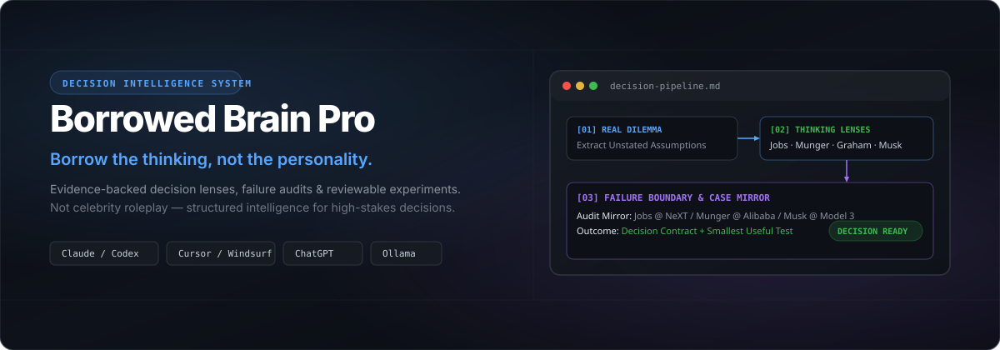
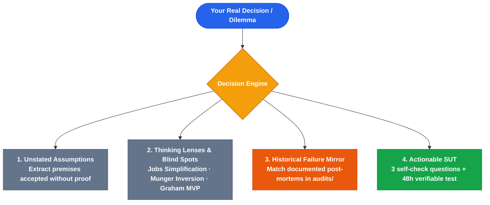

<a href="https://DOTfei.github.io/borrowed-brain-pro/"></a>

<p align="center">
  <a href="README.md"><b>English</b></a> | <a href="README.zh-CN.md"><b>简体中文</b></a>
</p>

<p align="center">
  <a href="https://DOTfei.github.io/borrowed-brain-pro/"></a>
  <a href="LICENSE"></a>
  <a href="audits/INDEX.md"></a>
  <a href="SKILL.md"></a>
  <a href="https://github.com/DOTfei/borrowed-brain-pro/actions"></a>
  <a href="https://github.com/DOTfei/borrowed-brain-pro/stargazers"></a>
</p>

> **Borrow the thinking, not the personality.**
>
> Borrowed Brain Pro is a **Decision Intelligence System** that applies evidence-backed thinking lenses, empirical failure audits, and cognitive blind spot detection to your real-world decisions.
>
> It is **NOT** celebrity roleplay, conversational impersonation, or motivational quote spam. The person is only the source of a verified mental model — **the decision is the product**.

---

## ⚡ The Core Difference

| Generic AI Prompt ("Think like Steve Jobs") | Borrowed Brain Pro (Decision Intelligence System) |
| :--- | :--- |
| **Output:** Flattering quotes (*"Focus on simplicity and passion!"*) | **Output:** Unstated assumptions + Historical failure mirror + Smallest Useful Test |
| **Flaw:** Conforms to your biases and encourages blind optimism | **Value:** Pinpoints cognitive blind spots where that exact logic historically failed |
| **Next Step:** You build for 3 more months unvalidated | **Next Step:** 1 concrete validation test executable within 48 hours |

---

## 🔬 Live Decision Scan Example

### 📥 Real Dilemma Input
> *"I've spent 2 months building my AI app. Should I spend another month perfecting the custom UI and automated agent workflows, or make it completely free for 3 months to attract 10,000 users?"*

### 📤 Borrowed Brain Pro Decision Debrief

```text
1. 🔍 Unstated Assumptions
• Assumption A: You assume users bounce because UI lacks polish, but you haven't validated core retention value.
• Assumption B: You assume free users convert to paid users, but historical SaaS free tier conversion is <2%.

2. ⚠️ Primary Blind Spot
• Over-Engineering + Premature Scale Trap (Optimizing secondary aesthetics before proving willingness-to-pay).

3. 🏛️ Historical Failure Mirror
• Case: Steve Jobs & NeXT Computer (1988) — audits/jobs-next.md
  Jobs engineered custom magnesium cubes and automated robotic factories before checking university budgets.
  Rule: Technical elegance cannot overcome a fundamental misalignment with customer economic reality.

4. 🧪 Diagnostic Questions & 48h Smallest Useful Test
• Question 1: If 5 users won't pay $10 today for the raw version, why would 10,000 free users pay later?
• Smallest Useful Test: Put up a payment link/stripe checkout for 5 real target users today before writing another line of UI code.
```

---

## 🚀 Quickstart

Install into your AI agent environment in seconds:

```bash
# Clone into your local Claude / Codex / OpenClaw skills folder
git clone https://github.com/DOTfei/borrowed-brain-pro.git ~/.claude/skills/borrowed-brain-pro

# Or paste borrowed-brain-bundle.md directly into ChatGPT / Claude as a system prompt
```

| Runtime | Integration Method |
| :--- | :--- |
| **ChatGPT / Claude.ai** | Paste [`borrowed-brain-bundle.md`](borrowed-brain-bundle.md) into System Instructions |
| **Cursor / Windsurf** | Add to project root rules or agent skills |
| **Codex / Claude CLI** | `git clone` into `~/.claude/skills/` |
| **Local LLM / Ollama** | Use [`borrowed-brain-bundle.md`](borrowed-brain-bundle.md) in Modelfile |

---

## 🛠️ How the Decision Engine Works


```mermaid
flowchart TD
    Dilemma(["Your Real Decision / Dilemma"]):::start --> Engine{"Decision Engine"}:::decision

    Engine --> S1["1. Unstated Assumptions
Extract premises accepted without proof"]:::action
    Engine --> S2["2. Thinking Lenses & Blind Spots
Jobs Simplification · Munger Inversion · Graham MVP"]:::action
    Engine --> S3["3. Historical Failure Mirror
Match documented post-mortems in audits/"]:::warning
    Engine --> S4["4. Actionable SUT
3 self-check questions + 48h verifiable test"]:::success

    classDef start fill:#2563eb,stroke:#1d4ed8,color:#ffffff,font-weight:bold
    classDef decision fill:#f59e0b,stroke:#b45309,color:#ffffff,font-weight:bold
    classDef action fill:#64748b,stroke:#475569,color:#ffffff,font-weight:bold
    classDef warning fill:#ea580c,stroke:#c2410c,color:#ffffff,font-weight:bold
    classDef success fill:#16a34a,stroke:#15803d,color:#ffffff,font-weight:bold
```

---

## 📚 Empirical Failure Library (`audits/`)

Every diagnostic maps directly to documented historical post-mortems:

- **[Jobs & NeXT Computer](audits/jobs-next.md)**: Over-engineering before verifying willingness-to-pay.
- **[Munger & Alibaba](audits/munger-alibaba.md)**: Cheapness trap & moat erosion from distribution shifts.
- **[Hastings & Qwikster](audits/hastings-qwikster.md)**: Executive echo chambers & abrupt customer friction.
- **[Musk & Model 3 Hell](audits/musk-model3-automation.md)**: Automating steps that should have been deleted.

Explore the complete index: [Failure Audits Index](audits/INDEX.md).

---

## 🏛️ Decision Lenses Catalog (`lenses/`)

- **Steve Jobs**: [Product Simplification Lens](lenses/steve-jobs-product-simplification.md) (Subtraction, UX focus, saying No)
- **Charlie Munger**: [Inversion & Cognitive Risk Lens](lenses/charlie-munger-inversion-and-mental-models.md) (Invert, eliminate failure modes)
- **Paul Graham**: [MVP & User Validation Lens](lenses/paul-graham-mvp-and-user-validation.md) (Do things that don't scale, talk to users)
- **Warren Buffett**: [Capital Allocation Lens](lenses/warren-buffett-capital-allocation.md) (Moat durability, margin of safety)
- **Reed Hastings**: [Fast Feedback & Candor Lens](lenses/reed-hastings-culture-and-fast-feedback.md) (Farming dissent, rapid iteration)
- **Sam Altman**: [Scale & Momentum Lens](lenses/sam-altman-scale-and-momentum.md) (Compound growth, execution velocity)

---

## Contributing

Add new audited failure post-mortems or refine thinking lenses:
1. Follow [Failure Audits Guide](audits/INDEX.md).
2. Run bundle compiler: `python scripts/build_bundle.py`.
3. Submit a Pull Request.

---

<p align="center"><i>MIT License · <a href="https://github.com/DOTfei">DOTfei</a></i></p>

