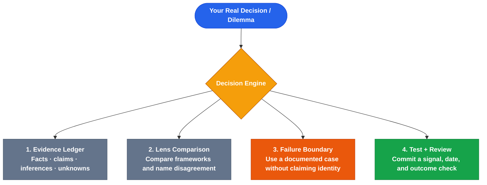

<a href="https://DOTfei.github.io/borrowed-brain-pro/"></a>

<p align="center">
  <a href="README.md"><b>English</b></a> | <a href="README.zh-CN.md"><b>简体中文</b></a>
</p>

<p align="center">
  <a href="https://DOTfei.github.io/borrowed-brain-pro/"></a>
  <a href="LICENSE"></a>
  <a href="audits/INDEX.md"></a>
  <a href="SKILL.md"></a>
  <a href="https://github.com/DOTfei/borrowed-brain-pro/actions"></a>
  <a href="https://github.com/DOTfei/borrowed-brain-pro/stargazers"></a>
</p>

> **Borrow the thinking, not the personality.**
>
> Borrowed Brain Pro is a **Decision Intelligence System** that turns a real decision into an evidence ledger, a falsifiable test, and a reviewable Decision Contract.
>
> It is **NOT** celebrity roleplay, conversational impersonation, or motivational quote spam. Historical people are only sources for thinking lenses — **the decision and its outcome are the product**.

---

## ⚡ The Core Difference

| Generic AI Prompt ("Think like Steve Jobs") | Borrowed Brain Pro (Decision Intelligence System) |
| :--- | :--- |
| **Output:** Flattering quotes (*"Focus on simplicity and passion!"*) | **Output:** Evidence boundary + assumptions + failure boundary + test |
| **Flaw:** Conforms to your biases and encourages blind optimism | **Value:** Makes the missing evidence and disconfirming signal explicit |
| **Next Step:** You build for 3 more months unvalidated | **Next Step:** Commit to a test, then return with the result |

---

## 🔬 Worked Decision Example

> **Status: Illustrative.** This example demonstrates the format. It is not a user success story, product telemetry, or proof that the recommendation was correct.

### 📥 Real Dilemma Input
> *"I've spent 2 months building my AI app. Should I spend another month perfecting the custom UI and automated agent workflows, or make it completely free for 3 months to attract 10,000 users?"*

### 📤 Borrowed Brain Pro Decision Debrief

```text
1. 🔍 Unstated Assumptions
• Assumption A: You assume users bounce because UI lacks polish, but you haven't validated core retention value.
• Assumption B: You assume free users will later convert, but you have no evidence from your target users.

2. ⚠️ Primary Risk Pattern
• Over-Engineering + Premature Scale Trap (Optimizing secondary aesthetics before proving willingness-to-pay).

3. 🏛️ Historical Failure Mirror
• Case: Steve Jobs & NeXT Computer (1988) — audits/jobs-next.md
  Jobs engineered custom magnesium cubes and automated robotic factories before checking university budgets.
  Rule: Technical elegance cannot overcome a fundamental misalignment with customer economic reality.

4. 🧪 Diagnostic Questions & Smallest Useful Test
• Question 1: If 5 users won't pay $10 today for the raw version, why would 10,000 free users pay later?
• Smallest Useful Test: Put up a payment link/stripe checkout for 5 real target users today before writing another line of UI code.
```

---

## ✅ How We Prove Value

The repository can prove the process immediately. It cannot honestly claim better decisions for everyone until real users complete the loop.

1. Start with a real decision and create a Decision Contract.
2. Separate observed facts, reported claims, inferences, and unknowns.
3. Record the critical assumption and the evidence that would change the decision.
4. Run the Smallest Useful Test and keep the original prediction unchanged.
5. Return on the review date and mark assumptions Confirmed, Disproved, or Still Unknown.
6. Publish an anonymized case only with its status: Illustrative, Observed, or Outcome-proven.

Use the decision template at templates/decision-log-template.md, the review template at templates/decision-review-template.md, and the case study template at examples/case-study-template.md. The validation plan at docs/validation-plan.md explains how to collect real user evidence without overstating it. The worked builder case at examples/real-decisions/indie-ai-writing-assistant-case.md is currently Illustrative and explicitly lists what it does not prove.

What the repository currently demonstrates:

- A portable decision-analysis protocol for major AI tools.
- Sourced profiles, lenses, failure audits, packs, and decision trees.
- A repeatable record-and-review workflow.

What remains to be validated:

- Whether independent builders return for a review.
- Whether the Smallest Useful Test changes their next action.
- Whether reviewed decisions produce better measurable outcomes than the user’s normal process.

## 🚀 Quickstart

Choose the integration that matches your AI tool:

```bash
# Claude Code
git clone https://github.com/DOTfei/borrowed-brain-pro.git ~/.claude/skills/borrowed-brain-pro

# Codex
git clone https://github.com/DOTfei/borrowed-brain-pro.git ~/.codex/skills/borrowed-brain-pro
```

| Runtime | Integration Method |
| :--- | :--- |
| **ChatGPT / Claude.ai** | Paste [`borrowed-brain-bundle.md`](borrowed-brain-bundle.md) into System Instructions |
| **Cursor / Windsurf** | Add the bundle to project rules or agent skills |
| **Claude Code** | Clone into `~/.claude/skills/` |
| **Codex** | Clone into `~/.codex/skills/` |
| **Local LLM / Ollama** | Use [`borrowed-brain-bundle.md`](borrowed-brain-bundle.md) in Modelfile |

---

## 🛠️ How the Decision Engine Works


```mermaid
flowchart TD
    Dilemma(["Your Real Decision / Dilemma"]):::start --> Engine{"Decision Engine"}:::decision

    Engine --> S1["1. Evidence Ledger<br/>Facts · claims · inferences · unknowns"]:::action
    Engine --> S2["2. Lens Comparison<br/>Compare frameworks and name disagreement"]:::action
    Engine --> S3["3. Failure Boundary<br/>Use a documented case without claiming identity"]:::warning
    Engine --> S4["4. Test + Review<br/>Commit a signal, date, and outcome check"]:::success

    classDef start fill:#2563eb,stroke:#1d4ed8,color:#ffffff,font-weight:bold
    classDef decision fill:#f59e0b,stroke:#b45309,color:#ffffff,font-weight:bold
    classDef action fill:#64748b,stroke:#475569,color:#ffffff,font-weight:bold
    classDef warning fill:#ea580c,stroke:#c2410c,color:#ffffff,font-weight:bold
    classDef success fill:#16a34a,stroke:#15803d,color:#ffffff,font-weight:bold
```

---

## 📚 Empirical Failure Library (audits/)

Decision analyses can draw on these documented historical post-mortems. They are research references, not proof that a user’s situation will end the same way:

- **[Jobs & NeXT Computer](audits/jobs-next.md)**: Over-engineering before verifying willingness-to-pay.
- **[Munger & Alibaba](audits/munger-alibaba.md)**: Cheapness trap & moat erosion from distribution shifts.
- **[Hastings & Qwikster](audits/hastings-qwikster.md)**: Executive echo chambers & abrupt customer friction.
- **[Musk & Model 3 Hell](audits/musk-model3-automation.md)**: Automating steps that should have been deleted.

Explore the complete index: [Failure Audits Index](audits/INDEX.md).

---

## 🏛️ Decision Lenses Catalog (lenses/)

Not sure where to start? Use the [Lens Selection Guide](decision-trees/lens-selection-guide.md). Builders can start with the [Builder Decision Pack](packs/builder-decision-pack.md), save the result with the [Decision Contract](templates/decision-log-template.md), and compare it with the [worked case](examples/real-decisions/indie-ai-writing-assistant-case.md).

- **Steve Jobs**: [Product Simplification Lens](lenses/steve-jobs-product-simplification.md) (Subtraction, UX focus, saying No)
- **Charlie Munger**: [Inversion & Cognitive Risk Lens](lenses/charlie-munger-inversion-and-mental-models.md) (Invert, eliminate failure modes)
- **Paul Graham**: [MVP & User Validation Lens](lenses/paul-graham-mvp-and-user-validation.md) (Do things that don't scale, talk to users)
- **Warren Buffett**: [Capital Allocation Lens](lenses/warren-buffett-capital-allocation.md) (Moat durability, margin of safety)
- **Reed Hastings**: [Fast Feedback & Candor Lens](lenses/reed-hastings-culture-and-fast-feedback.md) (Farming dissent, rapid iteration)
- **Sam Altman**: [Scale & Momentum Lens](lenses/sam-altman-scale-and-momentum.md) (Compound growth, execution velocity)

---

## Contributing

Add new audited failure post-mortems, refine thinking lenses, or contribute a real anonymized case:

1. For a case, include the pre-decision evidence ledger, test thresholds, review result, alternative explanations, and limitations. Mark it Illustrative, Observed, or Outcome-proven.
2. For research material, cite sources and state where the lens may break down.
3. Run the repository checks before opening a pull request.

For research material, the basic path is:
1. Follow [Failure Audits Guide](audits/INDEX.md).
2. Run the bundle compiler: python scripts/build_bundle.py.
3. Submit a Pull Request describing what was actually tested and what remains unknown.

---

<p align="center"><i>MIT License · <a href="https://github.com/DOTfei">DOTfei</a></i></p>
