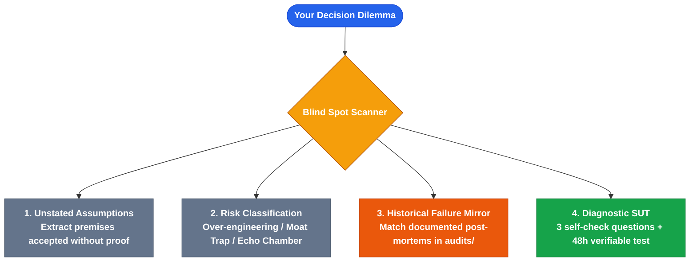

<a href="https://DOTfei.github.io/borrowed-brain-pro/"></a>

<p align="center">
  <a href="README.md"><b>English</b></a> | <a href="README.zh-CN.md"><b>简体中文</b></a>
</p>

<p align="center">
  <a href="https://DOTfei.github.io/borrowed-brain-pro/"></a>
  <a href="LICENSE"></a>
  <a href="audits/INDEX.md"></a>
  <a href="SKILL.md"></a>
  <a href="https://github.com/DOTfei/borrowed-brain-pro/actions"></a>
  <a href="https://github.com/DOTfei/borrowed-brain-pro/stargazers"></a>
</p>

> **See what you're missing before you decide.**
>
> Borrowed Brain Pro is a Cognitive Blind Spot Detector for builders, founders, and decision-makers. It does not roleplay famous people or output generic motivational quotes. It stress-tests your real decisions against documented historical failures to expose the costly assumptions you didn't know you were making.

---

## The Core Difference

| Generic AI Prompt ("Think like Steve Jobs") | Borrowed Brain Pro (Blind Spot Detector) |
| :--- | :--- |
| **Output:** Flattering quotes (*"Focus on simplicity and have passion!"*) | **Output:** 2 unstated assumptions + 1 historical failure mirror + 1 test |
| **Flaw:** Conforms to your biases and encourages blind optimism | **Value:** Uncovers why your exact logic historically failed |
| **Next Step:** You build for 3 more months unvalidated | **Next Step:** 1 Smallest Useful Test executable within 48 hours |

---

## ⚡ Live Comparison Example

### 📥 User Input
> *"I've spent 2 months building my AI app. Should I spend another month perfecting the custom UI and automated agent workflows, or make it completely free for 3 months to attract 10,000 users?"*

### 📤 Borrowed Brain Pro Scan Output

```text
1. 🔍 Unstated Assumptions
• Assumption A: You assume users are bouncing because UI lacks polish, but you haven't proven core retention.
• Assumption B: You assume free users convert to paid users, but historical SaaS conversion for free tiers is <2%.

2. ⚠️ Primary Blind Spot
• Over-Engineering + Premature Scale Trap (Optimizing secondary aesthetics before proving willingness-to-pay).

3. 🏛️ Historical Failure Mirror
• Case: Steve Jobs & NeXT Computer (1988) — audits/jobs-next.md
  Jobs engineered custom magnesium cubes and robotic assembly lines before checking university budgets.
  Rule: Technical perfection cannot overcome a fundamental misalignment with customer economic reality.

4. 🧪 Diagnostic Questions & 48h Smallest Useful Test
• Question 1: If 5 users won't pay $10 today for the raw version, why would 10,000 free users pay later?
• Smallest Useful Test: Put up a payment link/stripe checkout for 5 real target users today before writing another line of UI code.
```

---

## 🚀 Quickstart

Install as an AI Skill in your agent environment:

```bash
# Clone into your local Claude / Codex / OpenClaw skills folder
git clone https://github.com/DOTfei/borrowed-brain-pro.git ~/.claude/skills/borrowed-brain-pro

# Or paste borrowed-brain-bundle.md directly into ChatGPT / Claude as a system prompt
```

| Runtime | Integration Method |
| :--- | :--- |
| **ChatGPT / Claude.ai** | Paste [`borrowed-brain-bundle.md`](borrowed-brain-bundle.md) into System Instructions |
| **Cursor / Windsurf** | Add to project root rules or agent skills |
| **Codex / Claude CLI** | `git clone` into `~/.claude/skills/` |
| **Local LLM / Ollama** | Use [`borrowed-brain-bundle.md`](borrowed-brain-bundle.md) in Modelfile |

---

## 🔬 How the Blind Spot Engine Works


```mermaid
flowchart TD
    Dilemma(["Your Decision Dilemma"]):::start --> Scan{"Blind Spot Scanner"}:::decision

    Scan --> S1["1. Unstated Assumptions
Extract premises accepted without proof"]:::action
    Scan --> S2["2. Risk Classification
Over-engineering / Moat Trap / Echo Chamber"]:::action
    Scan --> S3["3. Historical Failure Mirror
Match documented post-mortems in audits/"]:::warning
    Scan --> S4["4. Diagnostic SUT
3 self-check questions + 48h verifiable test"]:::success

    classDef start fill:#2563eb,stroke:#1d4ed8,color:#ffffff,font-weight:bold
    classDef decision fill:#f59e0b,stroke:#b45309,color:#ffffff,font-weight:bold
    classDef action fill:#64748b,stroke:#475569,color:#ffffff,font-weight:bold
    classDef warning fill:#ea580c,stroke:#c2410c,color:#ffffff,font-weight:bold
    classDef success fill:#16a34a,stroke:#15803d,color:#ffffff,font-weight:bold
```

---

## 📚 Empirical Failure Library (`audits/`)

Every diagnostic maps directly to documented historical post-mortems:

- **[Jobs & NeXT Computer](audits/jobs-next.md)**: Over-engineering before verifying willingness-to-pay.
- **[Munger & Alibaba](audits/munger-alibaba.md)**: Cheapness trap & moat erosion from distribution shifts.
- **[Hastings & Qwikster](audits/hastings-qwikster.md)**: Executive echo chambers & abrupt customer friction.
- **[Musk & Model 3 Hell](audits/musk-model3-automation.md)**: Automating steps that should have been deleted.

Explore the complete index: [Failure Audits Index](audits/INDEX.md).

---

## Contributing

Add new audited failure post-mortems or refine thinking lenses:
1. Follow [Failure Audits Guide](audits/INDEX.md).
2. Run bundle compiler: `python scripts/build_bundle.py`.
3. Submit a Pull Request.

---

<p align="center"><i>MIT License · <a href="https://github.com/DOTfei">DOTfei</a></i></p>

