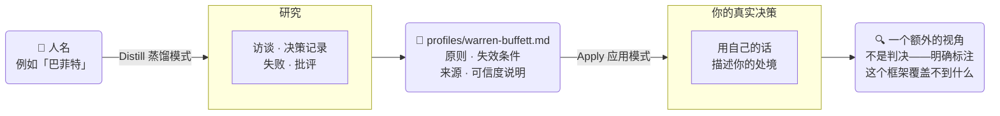

[English](README.md) | [简体中文](README.zh-CN.md)

[](LICENSE)
[](https://github.com/DOTfei/borrowed-brain-pro/stargazers)
[](SKILL.md)

**一份 AI 指令文件，把任何公众人物的思考方式蒸馏成一套可复用的框架——然后把它当作一个额外的视角，套用到你正在面对的真实决策上。**

支持 Claude（原生 Skill）、ChatGPT、Open WebUI、Hermes 等本地模型，或任何可以接受 system prompt 的 AI。

不是聊天机器人角色扮演，不是语录生成器。而是一份基于真实公开材料——访谈、决策记录、失败、批评——构建出的结构化「思维档案」，你可以拿它去照一照自己的问题：*这套框架会让我看到什么我原本忽略的东西？*

**你可以蒸馏任何有公开记录的人物**——无论在世还是历史人物。下面的 9 份档案是开箱即用的起点，但真正的能力在于：只要一句话，你就能为任何公众人物建一份新档案——Naval Ravikant、Charlie Munger、Jensen Huang、Paul Graham，任何人。

---

## Demo 演示

https://github.com/user-attachments/assets/8a81e7cb-f938-40b1-ab87-a4512b96e322

> *描述一个真实决策 → skill 读取档案索引 → 推荐最相关的视角 → 展示两个框架的冲突点*

<details>
<summary>📄 查看这段 Demo 的完整对话文字版</summary>

**第一句**
> 我在做一个 SaaS 产品，MVP 已经跑起来了，但还有不少 bug。团队想现在就发布去拿真实用户反馈，我不确定该推还是再等等。你觉得该怎么想这件事？

目前还没有保存的档案——但我可以直接帮你梳理这个问题。

"有 bug 的 MVP 要不要发布"通常取决于几个值得分开看的维度：

- **bug 是什么性质的？** 会损坏数据、中断核心流程、影响用户信任的 → 发布拦截器。边缘情况、视觉问题、可绕过的 → 通常可以带着发布。
- **你真正需要从"真实用户反馈"里拿到什么？** 如果是验证核心价值主张，次要功能的 bug 几乎不影响信号。如果是验证产品是否值得信赖，带着 bug 发布会直接损害你要测试的东西。
- **第一批用户是谁？** 友好的早期用户容忍 bug，甚至喜欢报 bug。陌生的付费用户只给你一次机会。
- **能不能缩小范围而不是解决二选一？** 发给 20 个人、用功能开关控制、不公开宣传——这能让你拿到反馈，同时不把所有第一印象都押在当前的状态上。

*如果你想，可以告诉我你想借用谁的判断框架，我帮你建一份档案并套用到这个问题上。*

---

**第二句**
> 同时用 Steve Jobs 和 Sam Altman 的档案，看看他们在哪里一致、在哪里冲突。

两份档案都还没有——现在基于实时联网研究分别构建。

**他们的共识**

两人都明确拒绝"无论如何先发布"的立场——都不是纯粹的速度优先派。

- Jobs："真正的艺术家会发布"，但前提是"达到苹果的标准"。
- Altman：早发布、快迭代，但"通常不会发布垃圾……这不是慢慢来的借口"。

两人也都独立地指向同一个战术动作：**缩小范围**，而不是解决二选一。Jobs 在 MobileMe 的复盘里提出先发布同步功能，再发邮件，再发日历——而不是一次全推。Altman 的框架从另一个方向说同样的话：让少数用户真正爱上一个窄版本，而不是让大量用户勉强接受一个宽版本。

**他们的冲突**

- **Jobs 的框架 → 倾向等待。** 他的本能是"核心对了吗"优先于日历。他的已记录失败案例（MobileMe，2008 年）正是按时发布但没准备好——他事后称之为"我们不那么光彩的时刻"。
- **Altman 的框架 → 倾向发布。** 他的已记录失败（OpenAI 在竞争压力下压缩安全测试周期）是他的原则*输给了*紧迫感，而不是他等待后悔的案例。他的本能，在理想和现实压力之间，倾向于发布。

**两个框架都覆盖不到的**

两人都不是从你的位置说话——他们都有足够的资源和声誉缓冲，一次发布失误撑得住。第一次做 SaaS MVP 的团队，一次糟糕的第一印象付出的代价可能比他们大得多。

---

**第三句**
> Jobs 的框架在我这个具体情况里漏掉了什么？

专门针对你的情况，梳理 Jobs 框架的盲区：

1. **他从来没有处于需要外部验证"这个想法值不值得做"的位置。** 他的发布决策都是执行风险问题，市场契合度早已被假设或验证。你还需要回答"用户到底要不要这个"——他的框架对这个区分几乎没有说法，因为苹果 II 之后他很少面对这个问题。

2. **他有受控的发布渠道和时机——你没有。** 苹果控制了发布的时机、媒体和叙事框架。SaaS MVP 通过开放渠道（Product Hunt、冷流量、社交媒体）发布，一次糟糕的体验可能就永久流失一个用户，没有媒体周期来缓冲。

3. **他的失败案例（MobileMe）是基础设施问题，不是迭代问题。** MobileMe 是一个完成品，一次性推给数百万付费用户，不是推给小圈子早期用户的 MVP。把他"等到对了再发"的本能直接套用，风险是把大公司的谨慎带入一个完全不同的场景。

4. **他几乎不需要靠团队士气撑过漫长的等待期。** Jobs 可以凭权力强制延期。对你的团队来说，延期有真实的士气和 runway 成本——他的框架完全没有把团队动力当作一个需要权衡的变量。

</details>

---

## 🚀 刚装好这个 skill？从这里开始

开一个新对话，直接打以下任意一句——不需要特殊语法，不需要斜杠命令：

```
我有哪些人的档案可以用？
```
```
用 Warren Buffett 的档案，看看我这个投资机会值不值得做——[描述你的情况]
```
```
帮我建一份 Naval Ravikant 的思维档案
```
```
帮我建一份 Charlie Munger 的思维档案
```
```
帮我建一份 [任何有公开记录的人物] 的思维档案
```
```
borrowed-brain-pro 是做什么的？
```

这个 skill 可以蒸馏**任何公众人物**——只要他们有访谈、决策记录或公开写作，就能建档案。内置的 9 份档案是起点，不是上限。

最后这句也完全没问题——如果你不确定该问什么，直接问这个 skill 本身，它会解释两种模式并直接给你一句能用的起手式。

---

## 它做什么

两种模式，一个 skill：

**Distill（蒸馏）模式** —— 给它一个名字，它会研究这个人并生成 `profiles/<name>.md`：核心立场、反复出现的原则（附带每条在什么条件下会失效）、默认推理顺序、取舍倾向、一个已记录的失败案例，以及一份说明材料扎实程度的可信度说明。

**Apply（应用）模式** —— 把一份已有档案套到你正面对的真实问题上，用这个视角推理你的处境——明确标注这只是"一个有局限的视角"，不是判决。



**档案路由** —— 如果你描述一个决策但没点名用谁，skill 会读 [`profiles/INDEX.md`](profiles/INDEX.md)，推荐 1–2 个最相关的档案，等你确认后才开始 Apply。

---

## 已内置 8 份档案——装完即用

这个 repo 附带 8 份真实运行 Distill 模式生成的档案，不是虚构的样例：

| 人物 | 领域 | 最适合的问题类型 |
|------|------|----------------|
| [Warren Buffett（巴菲特）](profiles/warren-buffett.md) | 投资 | 要不要押注这个机会？长期持有 vs. 卖出。估值纪律。 |
| [Steve Jobs（乔布斯）](profiles/steve-jobs.md) | 产品/创业 | 砍哪个功能？发布时机？对需求说不。 |
| [Chris Voss](profiles/chris-voss.md) | 谈判 | 合同谈判。打破僵局。应对强硬对手。 |
| [Richard Feynman（费曼）](profiles/richard-feynman.md) | 研究/推理 | 验证假设。找自我欺骗的盲点。审查自己的逻辑。 |
| [Cal Newport](profiles/cal-newport.md) | 个人效率 | 时间分配。保护深度工作。结构性修复 vs. 靠意志力。 |
| [Reed Hastings](profiles/reed-hastings.md) | 领导力/文化 | 在团队里建立坦诚文化。处理重大战略转向。 |
| [Travis Kalanick](profiles/travis-kalanick.md) | 激进增长 | 强攻充满阻力的市场还是等待？速度 vs. 合规。 |
| [Julia Evans](profiles/julia-evans.md) | 技术写作 | 把难懂的东西解释清楚。为过去的自己写作。 |

---

## 示例

以下是从 [`profiles/reed-hastings.md`](profiles/reed-hastings.md) 里摘出的真实片段：

> **原则**：主动征求异议，而不是把沉默当成同意（"farming for dissent"）。
> **体现之处**：直接源自 Qwikster 的失败案例（2011 年）——Hastings 发现多位副总裁私下都有疑虑却没说出来，其中一位告诉他，他一旦确信某件事就会"太 intense"，让人觉得反对也没用。
> **可能失效之处**：这条原则是事后补救——它是在一次导致 80 万订阅用户流失、股价暴跌 77% 的失败之后才建立起来的，不是之前。

同时载入两份档案，Apply 模式呈现真实分歧：

```
你：我们是一家快速增长的创业公司，面临压力要强攻一个监管环境
非常敌对的城市，律师说风险很高。该强推还是该等？

Claude：同时载入两个视角，呈现真实分歧：

- Kalanick 的框架 → 强推。他的逻辑明确把监管敌意当作正面信号
  ——挺过越难的仗，护城河就越深。
- Hastings 的框架 → 等待。他的原则是让良好的判断（包括律师的）
  发挥作用，而不是用个人确信压过它——他自己的失败案例
  （Qwikster）恰恰就是他的确信压过了正在提出担忧的人。

这两者之所以冲突，是因为它们对同一个信号——"来自权威的阻力"
——给出了相反方向的权重。这种张力本身就是有用的信息。
```

---

## 安装

> **简短版：克隆整个 repo（不只是 `SKILL.md`），这样 8 份内置档案也会跟着来。**

### Claude Code（命令行）——推荐

```bash
git clone https://github.com/DOTfei/borrowed-brain-pro.git ~/.claude/skills/borrowed-brain-pro
```

完成。重启 Claude Code 会话，skill 和全部 8 份档案即刻可用。如果只想在某个特定项目里使用，把路径换成该项目下的 `.claude/skills/borrowed-brain-pro/`。

之后更新：
```bash
cd ~/.claude/skills/borrowed-brain-pro && git pull
```

### Claude.ai（网页版）/ ChatGPT / 其他支持 system prompt 的 AI

使用**一键包**——把 `SKILL.md` 和全部 9 份档案合并在一个文件里。粘贴一次进 system prompt，所有档案立即可用，不需要单独上传。

1. 下载 [`claude-ai-bundle.md`](https://github.com/DOTfei/borrowed-brain-pro/raw/main/claude-ai-bundle.md)
2. 开一个新对话，把全文粘贴进 system prompt 字段
3. 直接开始——9 份档案已全部加载

**Claude.ai 通过 Skills 上传（仅 SKILL.md，不含内置档案）：**
1. 下载 [`SKILL.md`](https://github.com/DOTfei/borrowed-brain-pro/raw/main/SKILL.md)
2. 打开 **Settings → Capabilities → Skills**，上传该文件
3. 如需使用某份档案，把对应的 `profiles/<name>.md` 内容粘贴进对话开头

### Open WebUI / LM Studio / Ollama（本地模型）

把 `SKILL.md` 粘贴进 system prompt 字段。研究质量取决于你使用的模型是否有联网搜索权限——如果没有，模型会依赖训练知识，内容可能没有带实时搜索的模型那么完整或最新。

---

## 护栏（内置，不可选）

- 不编造引用；直接引用限 15 词以内、每个来源最多引一句，其余全部转述
- 档案里的每一条声称都必须能追溯到一个真实找到的来源
- 措辞统一是"根据公开材料，其做法似乎是……"——不会写成"其相信……"这种既定事实的口吻
- 拒绝为私人（非公众人物）建档——只处理有实质公开记录的人
- 争议人物：只描述其已记录的推理风格和立场，不推测未公开的私人动机

## 为什么做这个

大多数"像 X 一样思考"的提示词产出的都是千篇一律的励志海报式空话——每份档案读起来都一样，因为它们只用了这个人最光鲜的公开形象来构建。

`borrowed-brain-pro` 刻意去挖更混乱的材料——已记录的失败、批评、本人说法和外界说法对不上的地方——因为真正的决策逻辑正是在这些地方才会显现。它还强制要求档案里的每一条"原则"都要能追溯到一个具体的、有来源的事实，让档案保持扎实，而不是沦为吹捧。

## 这个 skill 不是什么

- 不是用来生成假语录或替人编话的工具
- 不能替代阅读这个人的真实著作——如果你想知道他们真正的观点，去读他们的原文；这个工具是用来找一个你可能忽略的**角度**
- 不是判决生成器——它被设计成每次应用都要以"这个视角覆盖不到什么"收尾，这是刻意的

---

欢迎贡献更好的来源检查清单和示例档案——参见 [CONTRIBUTING.md](CONTRIBUTING.md)（英文）。
