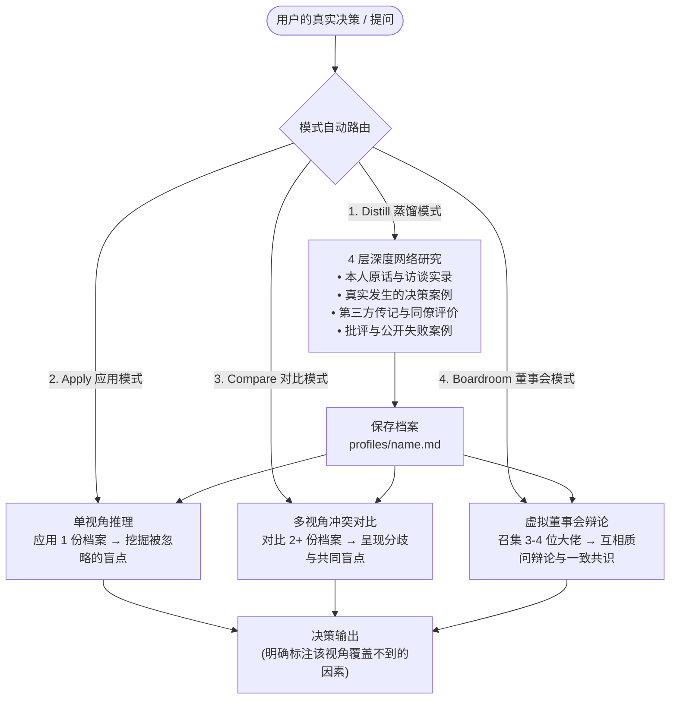
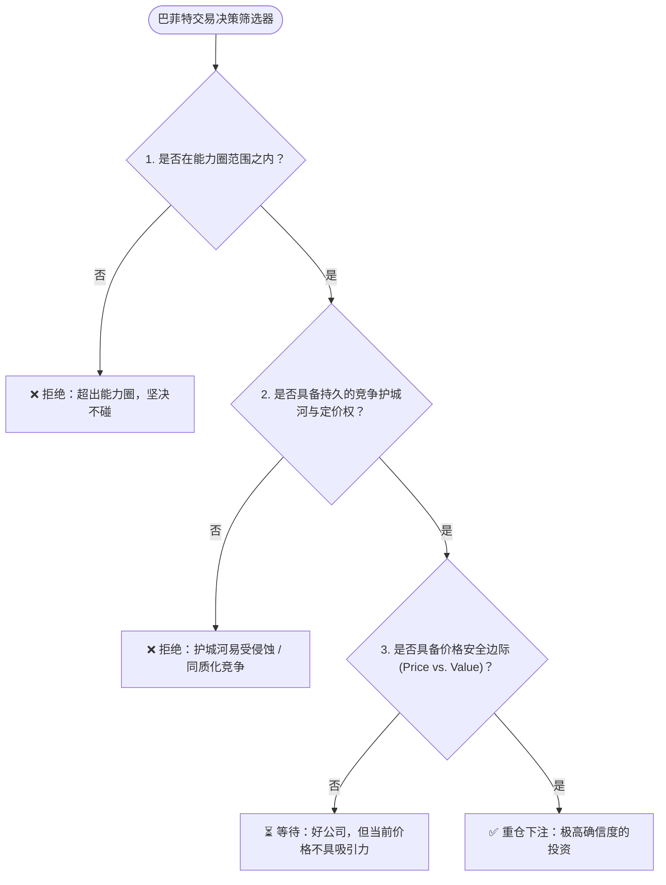

<p center>
  <a href="README.md"><b>English</b></a> | <a href="README.zh-CN.md"><b>简体中文</b></a>
</p>

<p center>
  <a href="LICENSE"></a>
  <a href="profiles/INDEX.md"></a>
  <a href="SKILL.md"></a>
  <a href="https://github.com/DOTfei/borrowed-brain-pro/actions"></a>
  <a href="https://github.com/DOTfei/borrowed-brain-pro/stargazers"></a>
</p>


> **Borrowed Brain Pro 由两大核心能力驱动：**
> 1. **大脑蒸馏引擎 (Distill Engine)**：为你指定的**任何公众人物**（无论古今中外）进行 4 层深度研究，生成结构化的思维档案 (`profiles/name.md`)。
> 2. **决策套用引擎 (Decision Engine)**：调取预置或自定义的思维档案（支持单视角推理或多视角冲突对比），套用到你正面对的真实决策难题中。

---

## 普通 Prompt vs. Borrowed Brain Pro

| 方案 | 提示词示例 | 输出质量 | 对真实决策的价值 |
| :--- | :--- | :--- | :--- |
| **普通 AI Prompt** | *“请模仿巴菲特的思维给我建议”* | 泛化的鸡汤语录（*“关注长期价值，保持耐心”*） | **零** — 无法验证的陈词滥调 |
| **Borrowed Brain Pro** | *“套用巴菲特的档案分析我的 SaaS 拓展交易”* | 分层研究、真实案例与 **明确的原则失效边界** | **极高** — 附带具体局限性的实战决策视角 |

---

## 工作原理：四大模式，一个 Skill


```mermaid
flowchart TD
    User(["用户的真实决策 / 提问"]) --> Router{"模式自动路由"}

    Router -->|1. Distill 蒸馏模式| Distill["4 层深度网络研究\n• 本人原话与访谈实录\n• 真实发生的决策案例\n• 第三方传记与同僚评价\n• 批评与公开失败案例"]
    Distill --> Save["保存档案\nprofiles/name.md"]

    Router -->|2. Apply 应用模式| Apply["单视角推理\n应用 1 份档案 → 挖掘被忽略的盲点"]

    Router -->|3. Compare 对比模式| Compare["多视角冲突对比\n对比 2+ 份档案 → 呈现分歧与共同盲点"]

    Router -->|4. Boardroom 董事会模式| Boardroom["虚拟董事会辩论\n召集 3-4 位大佬 → 互相质问辩论与一致共识"]

    Save --> Apply
    Save --> Compare
    Save --> Boardroom

    Apply --> Output["决策输出\n(明确标注该视角覆盖不到的因素)"]
    Compare --> Output
    Boardroom --> Output
```

### 常用命令速查

```bash
# 1. 蒸馏一个全新人物
"帮我建一份 Charlie Munger 的思维档案"

# 2. 将已有档案套用到你的处境
"用芒格的档案分析，我该不该扩张到这个新市场？"

# 3. 对比两位大佬在同一难题上的分歧
"对比 Jobs 和 Altman 的档案，分析我的产品发布时机难题"

# 4. 召集 4 位大佬组建虚拟董事会会诊
"召集董事会（Jobs, Munger, Altman, Hastings），帮我研判定价策略难题"
```

---

## 🏛️ 功能亮点：Boardroom 虚拟董事会会诊

只需载入 Skill，然后发送一句命令：`"召集董事会 [你的难题]"`，AI 便会自动启动 3 回合大佬质问辩论：

```markdown
🏛️ 虚拟董事会会诊报告
研判主题："我们是否应该降价抢占 SaaS 市场份额？"
出席董事：Steve Jobs, Charlie Munger, Sam Altman, Reed Hastings

第一回合：董事初始立场
- 芒格："降低利润率只会增加风险。逆向思考：为什么产品在原价下吸引力不足？"
- 乔布斯："绝不打价格战。只要降价，就等于承认产品品质不够极致。"
- 奥特曼："快速部署，动态迭代定价。先规模化用户，再考虑变现。"
- Hastings："在改变价格前，先在公司内部搜集异议。销售代表私下怎么说？"

第二回合：董事互相质问与撕扯
- 芒格 ➔ 奥特曼："你对单纯用户增长的执念忽略了基本单元经济学。"
- 乔布斯 ➔ Hastings："向销售代表妥协寻求共识只会产出中庸的产品。"

第三回合：全体共识 vs 无法调和的分歧
- 全体共识：在不削减非核心功能前，绝不单方面直接降价。
- 核心分歧：乔布斯（坚决不降价） vs 奥特曼（先扩展规模）。

董事会决议与盲点警告：
- 建议方案：保持核心套餐价格，推出功能裁剪版的入门套餐。
- 董事会共同盲点：在座董事均未运营过低利润率的 B2B 小微企业软件。
```

---

## 📉 功能亮点：惨痛败局与失败审计 (Verified Failure Audits)

普通 AI 只会重复成功金句。**Borrowed Brain Pro 专门审计血泪败局。** 我们深入剖析顶级大佬真实发生的重大危机，帮你规避毁灭性坑位：

| 败局审计文件 | 人物 | 真实惨痛事件 | 提炼出的底层戒律 |
| :--- | :--- | :--- | :--- |
| **[芒格抄底阿里之败](audits/munger-alibaba.md)** | 查理·芒格 | 1 亿美金抄底 BABA 暴跌 70% | 低估值救不了衰退的科技护城河；电商用户的忠诚度远低于实体会员店。 |
| **[Hastings 拆分 Qwikster 惨剧](audits/hastings-qwikster.md)** | Reed Hastings | 80 万用户流失，股价暴跌 77% | 绝不能为了公司内部运营方便而强加产品摩擦给用户。主动搜集异议。 |
| **[乔布斯 NeXT 硬件滑铁卢](audits/jobs-next.md)** | 乔布斯 | 售价 $12,000，8 年仅卖出 5 万台 | 对美学的极致追求无法弥补价格上限盲区；好软件能在硬件失败中存活。 |

> **发起败局审计**：只需向 AI 发送命令：`"审计芒格抄底阿里的失败案例"` 即可调取完整复盘档案。

---

## 🎒 功能亮点：预配置领域主题智囊包 (Domain Brain Packs)

不知道该选哪位大佬？一键载入专为特定岗位/场景定制的**专项专家智囊团**：

| 智囊包名称 | 适用领域 | 包含的智囊团成员 | 快捷命令 |
| :--- | :--- | :--- | :--- |
| **[创业者与 CEO 智囊包](packs/startup-founders.md)** | 产品剪裁、快速部署、规模化 | 乔布斯, 奥特曼, PG, Kalanick, Hastings | `"载入创业者智囊包，研判 [你的创业难题]"` |
| **[资本与投资者智囊包](packs/investors-capital.md)** | 资本配置、估值安全边际、谈判 | 巴菲特, 芒格, Chris Voss | `"载入投资者智囊包，研判 [你的投资交易]"` |
| **[硬核工程与思维智囊包](packs/engineering-science.md)** | 架构审查、系统简化、深度工作 | 费曼, Julia Evans, Cal Newport | `"载入工程智囊包，研判 [你的技术架构难题]"` |

---

## 📊 功能亮点：一秒看懂的 Mermaid 决策流程图 (Visual Decision Trees)

摒弃冗长文字。核心 Profile 文件均内置原生 **Mermaid 决策流程图**，在 GitHub 页面上直接渲染呈现：


```mermaid
flowchart TD
    Deal(["巴菲特交易决策筛选器"]) --> CheckCompetence{"1. 是否在能力圈范围之内？"}
    CheckCompetence -->|否| Reject1["❌ 拒绝：超出能力圈，坚决不碰"]
    CheckCompetence -->|是| CheckMoat{"2. 是否具备持久的竞争护城河与定价权？"}
    CheckMoat -->|否| Reject2["❌ 拒绝：护城河易受侵蚀 / 同质化竞争"]
    CheckMoat -->|是| CheckMargin{"3. 是否具备价格安全边际 (Price vs. Value)？"}
    CheckMargin -->|否| Wait["⏳ 等待：好公司，但当前价格不具吸引力"]
    CheckMargin -->|是| Execute["✅ 重仓下注：极高确信度的投资"]
```

---

## 档案结构拆解 (Profile Anatomy)

每一份 Profile 中的每一条原则，都具备严格的认知边界与事实锚定：

```markdown
原则 (Principle): 主动征求异议，而不是把沉默当成同意 ("farming for dissent")。

体现之处 (Where it shows up): 直接源自 Qwikster 的失败案例（2011 年）—— Hastings 发现多位 VP 私下有疑虑却不敢提。

可能失效之处 (Where it likely breaks down): 该原则是事后补救——是在一次导致 80 万订阅流失、股价暴跌 77% 的惨痛失败后才确立的。
```

---

## 已内置 11 份思维档案 (装完即用)

| 人物 | 领域 | 核心强项 / 最适合解决的问题 |
| :--- | :--- | :--- |
| **[Warren Buffett（巴菲特）](profiles/warren-buffett.md)** | 投资 | 评估下注机会、估值纪律、果断拒绝不确定交易 |
| **[Charlie Munger（查理·芒格）](profiles/charlie-munger.md)** | 多学科/投资 | 逆向思考复杂难题、多学科思维模型、避免愚蠢与心理偏见 |
| **[Steve Jobs（乔布斯）](profiles/steve-jobs.md)** | 产品 / 愿景 | 砍掉非核心功能、发布时机控制、极致简化与品质保护 |
| **[Chris Voss](profiles/chris-voss.md)** | 谈判 | 打破谈判僵局、合同谈判、应对强硬或敌对谈判对手 |
| **[Richard Feynman（费曼）](profiles/richard-feynman.md)** | 研究 / 推理 | 审查自身逻辑、防范自我欺骗、用极简语言解释复杂事物 |
| **[Cal Newport](profiles/cal-newport.md)** | 个人效率 | 保护深度工作、用结构性修复代替意志力、时间分配 |
| **[Reed Hastings](profiles/reed-hastings.md)** | 领导力 | 建立坦诚团队文化、主动征求异议、处理重大战略转向 |
| **[Travis Kalanick](profiles/travis-kalanick.md)** | 激进增长 | 强攻高阻力市场、速度与合规之间的权衡取舍 |
| **[Julia Evans](profiles/julia-evans.md)** | 技术写作 | 通俗解释硬核技术、为过去的自己写作、高效文档化 |
| **[Sam Altman](profiles/sam-altman.md)** | AI & 创业 | 迭代部署策略、速度与安全的权衡、争议性决策的框架 |
| **[Paul Graham（保罗·格雷厄姆）](profiles/paul-graham.md)** | 创业 & 随笔 | 做无法规模化的事情、创始人真诚度判断、保持轻量身份 |

---

## 多平台一键装载矩阵

| 运行平台 | 推荐装载方式 | 一键步骤 / 指令 |
| :--- | :--- | :--- |
| **ChatGPT / Custom GPT** | **单文件 System Prompt** | 直接复制 [`borrowed-brain-bundle.md`](borrowed-brain-bundle.md) 全文粘贴至 System Prompt |
| **Cursor / Windsurf AI** | **原生 `.cursorrules`** | 克隆仓库或将 [`.cursorrules`](.cursorrules) 复制到你的项目根目录 |
| **Ollama / 本地 LLM** | **Modelfile / 系统提示词** | 将 [`borrowed-brain-bundle.md`](borrowed-brain-bundle.md) 全文粘贴至 Modelfile 系统字段 |
| **Claude / CLI** | **Git Clone (原生 Skill)** | `git clone https://github.com/DOTfei/borrowed-brain-pro.git ~/.claude/skills/borrowed-brain-pro` |
| **Claude.ai** | **Skill 上传 / 提示词** | Settings → Skills 上传 `SKILL.md` 或粘贴 [`borrowed-brain-bundle.md`](borrowed-brain-bundle.md) |
| **Open WebUI** | **System Prompt** | 将 [`borrowed-brain-bundle.md`](borrowed-brain-bundle.md) 全文粘贴至 System Prompt 框 |

---

## 内置认知护栏 (Guardrails)

> [!IMPORTANT]
> - **绝不伪造引言**: 直接引用严格限制在每源 15 字以内，其余全部用客观语言重新表述。
> - **事实可追溯**: 每一条原则必须追溯至真实发生的公开事件或一手资料。
> - **仅限公众人物**: 拒绝为私人建立档案，严格保护个人隐私。
> - **明确局限性**: 每次解答结尾必附带 *“以下是该框架针对你具体处境可能覆盖不到的因素”*。

---

## 参与贡献

欢迎提交 issue、补充来源或贡献新的 Profile！详情请见 [CONTRIBUTING.md](CONTRIBUTING.md)。

```bash
# 自动化一键打包 (已配置 GitHub Actions 自动运行)
python scripts/build_bundle.py
```

---

<p center>
  <i>License: <a href="LICENSE">MIT</a> · Author & Maintainer: <a href="https://github.com/DOTfei">DOTfei</a></i>
</p>
