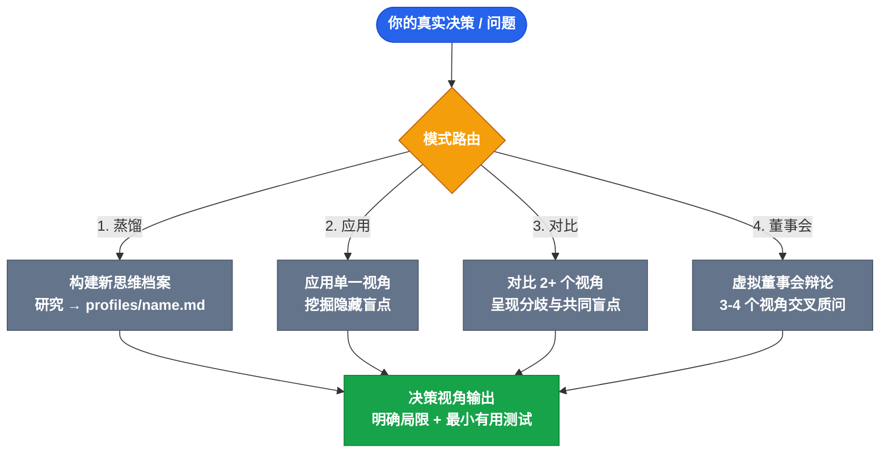
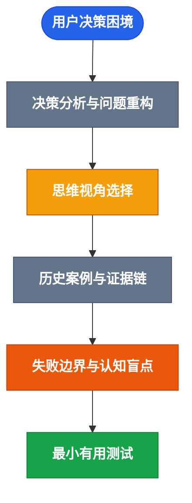

<a href="https://DOTfei.github.io/borrowed-brain-pro/"></a>

<p align="center">
  <a href="README.md"><b>English</b></a> | <a href="README.zh-CN.md"><b>简体中文</b></a>
</p>

<p align="center">
  <a href="https://DOTfei.github.io/borrowed-brain-pro/"></a>
  <a href="LICENSE"></a>
  <a href="profiles/INDEX.md"></a>
  <a href="SKILL.md"></a>
  <a href="https://github.com/DOTfei/borrowed-brain-pro/actions"></a>
  <a href="https://github.com/DOTfei/borrowed-brain-pro/stargazers"></a>
</p>

> **借用思维，而非扮演人格。**
>
> Borrowed Brain Pro 是一个决策智力系统，通过有据可查的思维视角、历史失败审计与多视角辩论面板，协助你解决真实决策难题。这不是名人角色扮演，而是结构化的决策支持工具。

---

## 快速开始

```bash
# 克隆到你的 AI agent skill 目录
git clone https://github.com/DOTfei/borrowed-brain-pro.git ~/.claude/skills/borrowed-brain-pro

# 或者直接粘贴 borrowed-brain-bundle.md 作为任意 LLM 的系统提示词
```

| 平台 | 使用方式 |
| :--- | :--- |
| ChatGPT / Claude.ai | 将 [`borrowed-brain-bundle.md`](borrowed-brain-bundle.md) 粘贴为系统提示词 |
| Cursor / Windsurf | 将 [`.cursorrules`](.cursorrules) 复制到项目根目录 |
| Codex / Claude CLI | `git clone` 到 `~/.claude/skills/` |
| Ollama / Open WebUI | 将 bundle 粘贴到 Modelfile 的 system 字段 |

---

## 工作原理

四种模式，一个 Skill — 每个决策都流经同一个结构化流程：


```mermaid
flowchart TD
    Start(["你的真实决策 / 问题"]):::start --> Router{"模式路由"}:::decision

    Router -->|1. 蒸馏| D1["构建新思维档案\n研究 → profiles/name.md"]:::action
    Router -->|2. 应用| A1["应用单一视角\n挖掘隐藏盲点"]:::action
    Router -->|3. 对比| C1["对比 2+ 个视角\n呈现分歧与共同盲点"]:::action
    Router -->|4. 董事会| B1["虚拟董事会辩论\n3-4 个视角交叉质问"]:::action

    D1 --> Output["决策视角输出\n明确局限 + 最小有用测试"]:::success
    A1 --> Output
    C1 --> Output
    B1 --> Output

    classDef start fill:#2563eb,stroke:#1d4ed8,color:#ffffff,font-weight:bold
    classDef decision fill:#f59e0b,stroke:#b45309,color:#ffffff,font-weight:bold
    classDef action fill:#64748b,stroke:#475569,color:#ffffff,font-weight:bold
    classDef success fill:#16a34a,stroke:#15803d,color:#ffffff,font-weight:bold
```

每次分析遵循同一层级结构 — 决策优先，视角其次，证据支撑，最终输出可执行测试：


```mermaid
flowchart TD
    Start(["用户决策困境"]):::start --> S1["决策分析与问题重构"]:::action
    S1 --> S2["思维视角选择"]:::decision
    S2 --> S3["历史案例与证据链"]:::action
    S3 --> S4["失败边界与认知盲点"]:::warning
    S4 --> End["最小有用测试"]:::success

    classDef start fill:#2563eb,stroke:#1d4ed8,color:#ffffff,font-weight:bold
    classDef decision fill:#f59e0b,stroke:#b45309,color:#ffffff,font-weight:bold
    classDef action fill:#64748b,stroke:#475569,color:#ffffff,font-weight:bold
    classDef warning fill:#ea580c,stroke:#c2410c,color:#ffffff,font-weight:bold
    classDef success fill:#16a34a,stroke:#15803d,color:#ffffff,font-weight:bold
```

四种模式示例：

```
"帮我构建 Jensen Huang 的思维档案"         → 蒸馏模式
"用 Jobs 的档案，分析我忽略了什么？"        → 应用模式
"对比 Jobs 和 Altman 对我的发布时机看法"   → 对比模式
"召集董事会讨论我的定价难题"               → 董事会模式
```

**普通 AI 提示词 vs. Borrowed Brain Pro：**

| | 普通提示词 | Borrowed Brain Pro |
| :--- | :--- | :--- |
| 输入 | "以巴菲特的视角思考" | "用巴菲特的档案分析我的 SaaS 交易" |
| 输出 | 泛化的鸡汤语录 | 有据可查的原则 + 明确失败边界 |
| 价值 | 几乎为零 | 附带具体局限性的实战决策视角 |

---

## 董事会模式

发送 `"召集董事会 [你的难题]"` — 系统自动选择 3–4 个互补视角，运行结构化三轮辩论：

- **第一轮** — 每个视角就你的难题陈述立场
- **第二轮** — 视角之间直接交叉质问
- **第三轮** — 共识、不可调和的分歧、以及集体盲点
- **输出** — 行动表 + 最小有用测试

针对产品/创业难题的典型董事会组合：Jobs（极简）× Graham（用户验证）× Munger（逆向思考）× Hastings（快速反馈）。

---

## 失败审计

每个视角都包含有据可查的失败边界。仓库内附四个审计案例：

| 案例 | 人物 | 失败原因 | 提炼规则 |
| :--- | :--- | :--- | :--- |
| [阿里巴巴投资](audits/munger-alibaba.md) | Munger | 高估平台护城河 | 低估值救不了侵蚀中的护城河 |
| [Qwikster 拆分](audits/hastings-qwikster.md) | Hastings | 执念压制了内部异见 | 重大决策前主动招募反对意见 |
| [NeXT 工作站](audits/jobs-next.md) | Jobs | 完美主义忽视支付意愿 | 优雅压不住价格天花板盲点 |
| [Model 3 产能地狱](audits/musk-model3-automation.md) | Musk | 在简化之前就自动化 | 永远不要自动化一个本该删掉的步骤 |

每个审计案例都附带**自我检查问题**，帮你识别自己是否正在重蹈同样的错误。

---

## 18 个预置档案

| 人物 | 最适合 |
| :--- | :--- |
| [Warren Buffett](profiles/warren-buffett.md) | 估值纪律、对交易说不 |
| [Charlie Munger](profiles/charlie-munger.md) | 逆向思考、避免认知偏误 |
| [Steve Jobs](profiles/steve-jobs.md) | 砍功能、极简、发布时机 |
| [Chris Voss](profiles/chris-voss.md) | 谈判、打破僵局 |
| [Richard Feynman](profiles/richard-feynman.md) | 审计逻辑、识别自我欺骗 |
| [Cal Newport](profiles/cal-newport.md) | 专注、深度工作、时间分配 |
| [Reed Hastings](profiles/reed-hastings.md) | 建立坦诚文化、战略转型 |
| [Sam Altman](profiles/sam-altman.md) | 迭代发布、速度与安全的平衡 |
| [Paul Graham](profiles/paul-graham.md) | 早期验证、做不可扩展的事 |
| [Elon Musk](profiles/elon-musk.md) | 第一性原理、删除需求 |
| [Jensen Huang](profiles/jensen-huang.md) | 平台押注、压力下的执行力 |
| [Linus Torvalds](profiles/linus-torvalds.md) | 系统设计、务实架构 |
| [Travis Kalanick](profiles/travis-kalanick.md) | 激进市场进入、速度与合规 |
| [Julia Evans](profiles/julia-evans.md) | 技术写作、化繁为简 |
| [Marcus Aurelius](profiles/marcus-aurelius.md) | 危机领导、斯多葛决策 |
| [Nietzsche](profiles/friedrich-nietzsche.md) | 逆境、重新审视既有假设 |
| [Socrates](profiles/socrates.md) | 认知谦逊、审计错误确定性 |
| [Laozi](profiles/laozi.md) | 无为而治、有机涌现、不强迫 |

---

## 决策包

针对常见决策类型预配置的顾问团：

| 决策包 | 成员 |
| :--- | :--- |
| [创业者](packs/startup-founders.md) | Jobs、Altman、Musk、Huang、Graham、Hastings |
| [投资与资本](packs/investors-capital.md) | Buffett、Munger、Voss |
| [工程与技术](packs/engineering-science.md) | Torvalds、Musk、Feynman、Evans、Newport |
| [危机领导](packs/philosophy-crisis.md) | Aurelius、Munger、Feynman、Newport |
| [Builder 决策](packs/builder-decision-pack.md) | Jobs、Graham、Munger、Hastings |

---

## 认知护栏

- 不捏造引用 — 直接引用每条来源不超过 15 个词
- 每个声明都可追溯至可验证的公开来源
- 拒绝私人个体 — 仅限公众人物
- 每次输出都会明确标注该视角在你具体情境下的局限性

---

## 贡献

欢迎提交新的蒸馏档案和改进。详见 [CONTRIBUTING.md](CONTRIBUTING.md)。

```bash
# 添加档案或审计后重新构建 bundle
python scripts/build_bundle.py
```

---

<p align="center"><i>MIT License · <a href="https://github.com/DOTfei">DOTfei</a></i></p>
