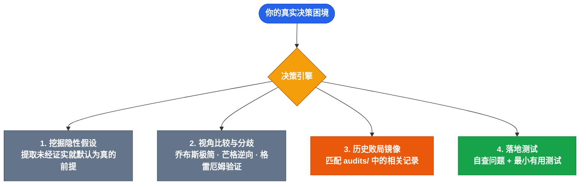

<a href="https://DOTfei.github.io/borrowed-brain-pro/"></a>

<p align="center">
  <a href="README.md"><b>English</b></a> | <a href="README.zh-CN.md"><b>简体中文</b></a>
</p>

<p align="center">
  <a href="https://DOTfei.github.io/borrowed-brain-pro/"></a>
  <a href="LICENSE"></a>
  <a href="audits/INDEX.md"></a>
  <a href="SKILL.md"></a>
  <a href="https://github.com/DOTfei/borrowed-brain-pro/actions"></a>
  <a href="https://github.com/DOTfei/borrowed-brain-pro/stargazers"></a>
</p>

> **借用思维，而非扮演人格。**
>
> Borrowed Brain Pro 是专为开发者、创业者和决策者打造的**决策智力系统（Decision Intelligence System）**：把一个真实决定整理成证据边界、可证伪测试和可复盘的 Decision Contract。
>
> 它**不是**名人角色扮演、金句生成器或虚假对话游戏。历史人物只是思维视角的资料来源，**决策及其后续结果才是产品**。

---

## ⚡ 核心区别

| 普通 AI 提示词（“模仿乔布斯思考”） | Borrowed Brain Pro（决策智力系统） |
| :--- | :--- |
| **输出：** 迎合你的名人名言（*“要追求极致，保持热爱！”*） | **输出：** 证据边界 + 关键假设 + 失败边界 + 验证测试 |
| **缺陷：** 顺从你的认知偏见，助长盲目乐观 | **价值：** 把未知证据、视角分歧和改变决定的信号写出来 |
| **后果：** 凭感觉再闷头开发 3 个月 | **行动：** 针对最大不确定性设计成本最低的有效测试（SUT），并约定复盘日期 |

---

## 🔬 可复用决策分析示例

> **状态：示例（Illustrative）。** 下面演示输出格式，不是用户成功故事、产品数据，也不能证明建议一定正确。

### 📥 你的真实决策输入
> *“我已经花了 2 个月做我的 AI 应用。我应该再花 1 个月把精美 UI 和全自动 Agent 流水线做完，还是应该直接全部免费开放 3 个月来吸引 10,000 名用户？”*

### 📤 Borrowed Brain Pro 决策研判输出

```text
1. 🔍 未验证的隐性假设
• 假设 A：你默认用户流失是因为 UI 不够精致，但实际上你从未验证过核心留存价值。
• 假设 B：你默认免费用户以后会自然转化为付费用户，但还没有来自目标用户的证据。

2. ⚠️ 核心风险模式
• 过度工程化 + 过早规模化陷阱（在证实真实支付意愿前，过早打磨次要外观与复杂链路）。

3. 🏛️ 历史翻车案例镜像
• 对标案例：史蒂夫·乔布斯 & NeXT 计算机 (1988) — audits/jobs-next.md
  当年乔布斯在没调研大学真实预算的情况下，斥巨资研发镁合金外壳与定制光驱，导致定价 6,500 美元无人问津。
  核心规则：产品工艺的优雅与技术的精妙，压不住与客户真实支付能力的脱节。

4. 🧪 自查问题与最小有用测试
• 必答自查：如果现在 5 个真实目标用户都不愿意为简陋版付 10 美元，凭什么 10,000 个免费用户以后会付钱？
• 最小有用测试（SUT）：在再写一行 UI 代码之前，今天直接做个 Stripe/收钱链接发给 5 个意向用户测试预付意愿。
```

---

## ✅ 我们如何证明它真的有用

仓库现在可以证明“流程存在”，但还不能诚实地宣称“它让所有人做出了更好的决定”。真正的证据必须来自真实用户完成一轮：

1. 用真实问题建立 Decision Contract，区分事实、转述、推断和未知。
2. 记录原始假设、目标信号、成功阈值、停止阈值和复盘日期。
3. 执行 Smallest Useful Test，保留原始预测，不事后改写。
4. 在复盘时标记假设是已确认、已证伪还是仍未知，并记录替代解释。
5. 只有在有真实决策、实际测试和复盘记录后，案例才能标记为 **Observed**；有基线、量化结果和限制条件后，才能标记为 **Outcome-proven**。

第一批验证计划在 [docs/validation-plan.md](docs/validation-plan.md)。决策记录用 [templates/decision-log-template.md](templates/decision-log-template.md)，复盘用 [templates/decision-review-template.md](templates/decision-review-template.md)，案例格式用 [examples/case-study-template.md](examples/case-study-template.md)。

---

## 🚀 极简快速开始

```bash
# Claude Code
git clone https://github.com/DOTfei/borrowed-brain-pro.git ~/.claude/skills/borrowed-brain-pro

# Codex
git clone https://github.com/DOTfei/borrowed-brain-pro.git ~/.codex/skills/borrowed-brain-pro
```

| 平台 | 接入方式 |
| :--- | :--- |
| **ChatGPT / Claude.ai** | 将 [`borrowed-brain-bundle.md`](borrowed-brain-bundle.md) 粘贴到自定义说明中 |
| **Cursor / Windsurf** | 将 bundle 放入项目规则或 agent skills |
| **Claude Code** | 克隆至 `~/.claude/skills/` |
| **Codex** | 克隆至 `~/.codex/skills/` |
| **本地大模型 / Ollama** | 在 Modelfile 系统提示词中引入 bundle |

---

## 🛠️ 决策引擎工作流


```mermaid
flowchart TD
    Dilemma(["你的真实决策困境"]):::start --> Engine{"决策引擎"}:::decision

    Engine --> S1["1. 挖掘隐性假设<br/>提取未经证实就默认为真的前提"]:::action
    Engine --> S2["2. 视角比较与分歧<br/>乔布斯极简 · 芒格逆向 · 格雷厄姆验证"]:::action
    Engine --> S3["3. 历史败局镜像<br/>匹配 audits/ 中的相关记录"]:::warning
    Engine --> S4["4. 落地测试<br/>自查问题 + 最小有用测试"]:::success

    classDef start fill:#2563eb,stroke:#1d4ed8,color:#ffffff,font-weight:bold
    classDef decision fill:#f59e0b,stroke:#b45309,color:#ffffff,font-weight:bold
    classDef action fill:#64748b,stroke:#475569,color:#ffffff,font-weight:bold
    classDef warning fill:#ea580c,stroke:#c2410c,color:#ffffff,font-weight:bold
    classDef success fill:#16a34a,stroke:#15803d,color:#ffffff,font-weight:bold
```

---

## 📚 真实历史败局案例库 (`audits/`)

决策分析可以调用以下有来源的历史失败档案。它们是边界条件和类比材料，不是用户结果的证明：

- **[乔布斯 & NeXT 计算机](audits/jobs-next.md)**：未验证付费意愿前的过度工程化。
- **[芒格 & 阿里巴巴](audits/munger-alibaba.md)**：平台渠道变迁下的护城河错觉与廉价陷阱。
- **[哈斯廷斯 & Qwikster 拆分](audits/hastings-qwikster.md)**：执念压制内部异见带来的灾难级摩擦。
- **[马斯克 & Model 3 产能地狱](audits/musk-model3-automation.md)**：自动化了一个本该直接删除的流程。

查看完整分类索引：[历史失败审计索引](audits/INDEX.md)。

---

## 🏛️ 决策思考视角库 (`lenses/`)

不知道该选哪个视角？先看[视角选择指南](decision-trees/lens-selection-guide.md)。独立开发者可以直接使用 [Builder Decision Pack](packs/builder-decision-pack.md)，并查看目前明确标注为 **Illustrative** 的[完整决策案例](examples/real-decisions/indie-ai-writing-assistant-case.md)。

- **史蒂夫·乔布斯**：[产品极简视角](lenses/steve-jobs-product-simplification.md)（做减法、拒绝杂音、聚焦核心体验）
- **查理·芒格**：[逆向思考与认知风险视角](lenses/charlie-munger-inversion-and-mental-models.md)（反向思考、排除愚蠢、避开认知偏误）
- **保罗·格雷厄姆**：[MVP 与用户验证视角](lenses/paul-graham-mvp-and-user-validation.md)（做不可扩展的事、快速接触真实用户）
- **沃伦·巴菲特**：[资本分配与护城河视角](lenses/warren-buffett-capital-allocation.md)（安全边际、机会成本、能力圈）
- **里德·哈斯廷斯**：[快速反馈与坦诚视角](lenses/reed-hastings-culture-and-fast-feedback.md)（主动招募异见、颠覆自我、高速迭代）
- **山姆·奥特曼**：[规模效应与动能视角](lenses/sam-altman-scale-and-momentum.md)（复利增长、动能优先、杠杆效应）

---

## 参与贡献

欢迎补充有来源的历史失败案例、思维视角，或经过匿名化的真实决策复盘：
1. 案例必须保留决策前证据、测试阈值、复盘结果、替代解释和限制条件，并标注 Illustrative、Observed 或 Outcome-proven。
2. 参考 [案例审计指南](audits/INDEX.md)，运行 python scripts/build_bundle.py。
3. 提交 Pull Request，并说明实际测试了什么、还不知道什么。

---

<p align="center"><i>MIT License · <a href="https://github.com/DOTfei">DOTfei</a></i></p>
