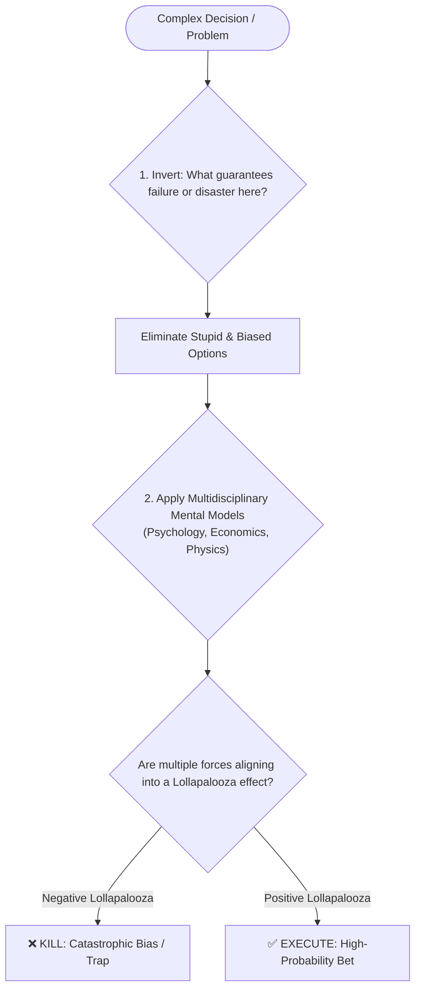
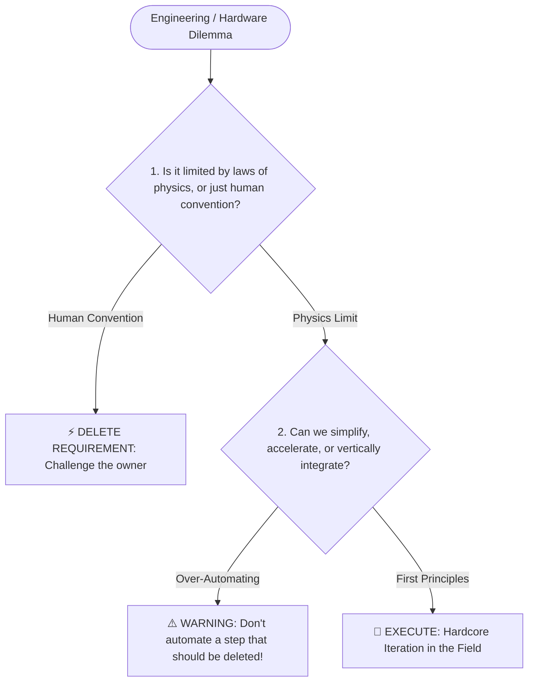
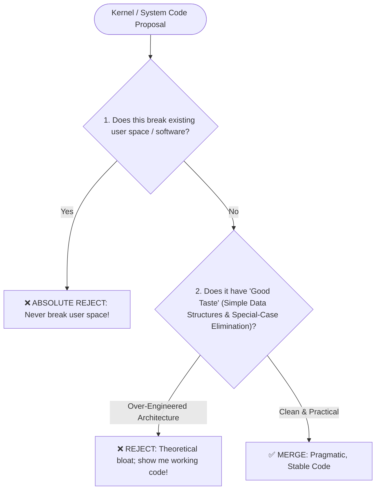
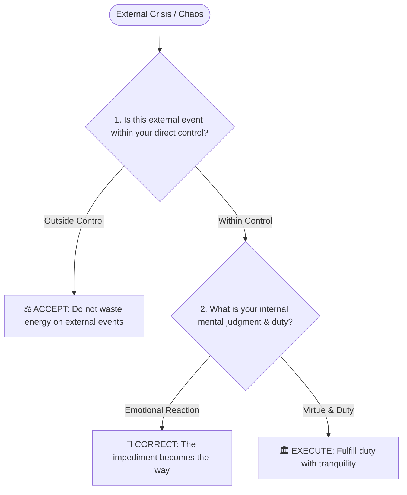
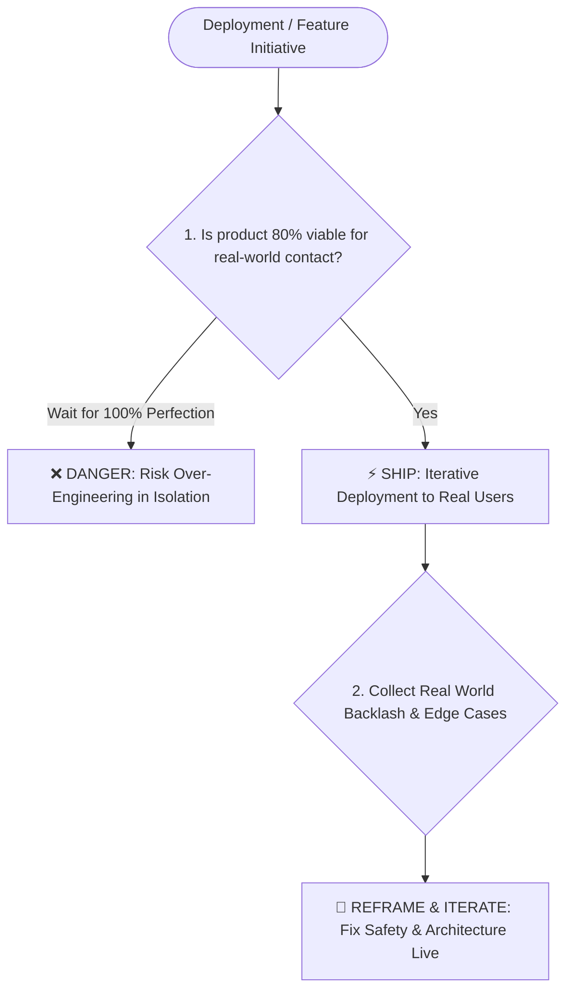
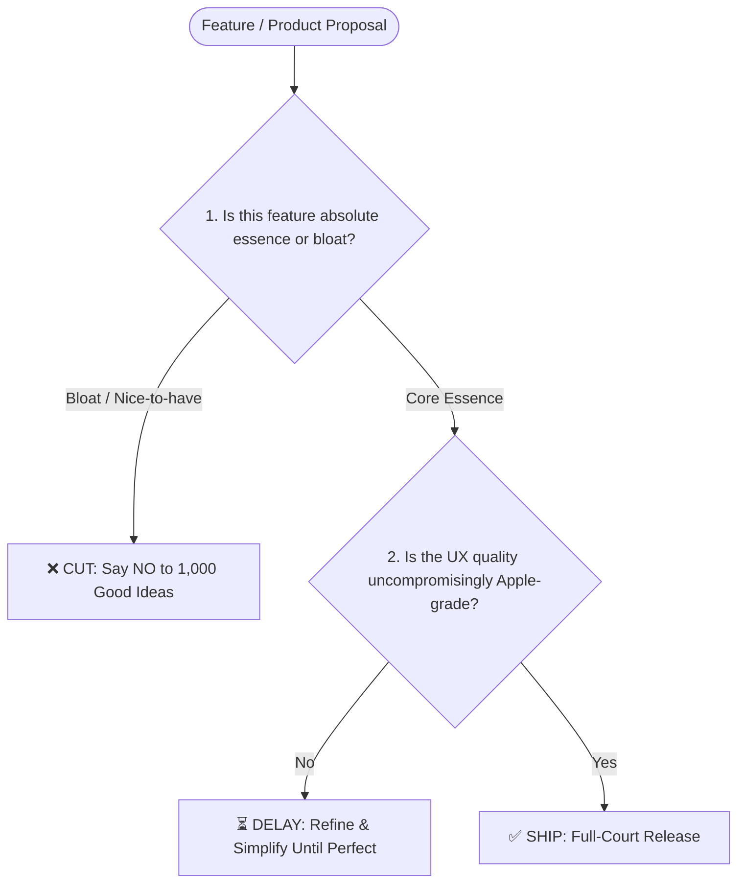
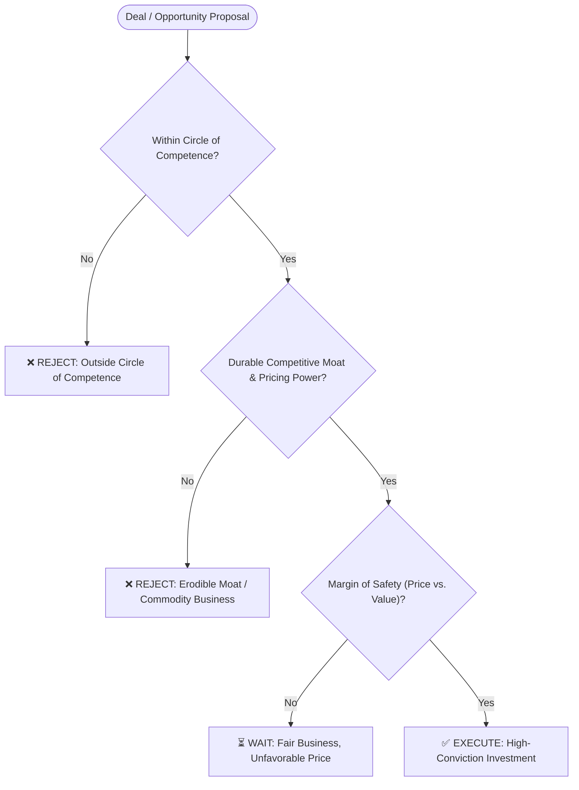

# Borrowed Brain Pro

Turn a real person's public track record into a structured "thinking profile" — then use that profile to add a perspective to a decision, without pretending to speak for them.

This skill has five modes. Figure out which one the user needs before starting:

- **Distill mode**: no profile exists yet (or the user wants to refresh/build a new one for ANY figure) → research the person and produce `profiles/<name>.md`
- **Apply mode**: a single profile already exists in `profiles/` → read it and use it to give the user another angle on their actual question
- **Compare mode**: 2 or more profiles are named or loaded → contrast where their principles agree, where they conflict, and what neither lens covers
- **Boardroom mode**: user requests a "board meeting", "virtual boardroom", "convene the board", "召集董事会", or names 3+ figures for a multi-party debate → simulate an interactive board meeting where profiles cross-examine each other and output consensus vs. friction!
- **Audit mode**: user asks to "audit a failure", "failure audit", "惨痛败局审计", or references an entry in `audits/` → dissect a documented historical crisis, extract the root cause, and derive protective rules for the user's situation.

### 💡 Interactive Profile Generator (Distill Any Person)
Whenever the user asks to *"create a profile"*, *"distill someone"*, or *"build a new thinking framework"*, instantly trigger Distill Mode. Prompt the user with 3 quick options (or infer them automatically if provided):
1. **Target Person**: (e.g., Elon Musk, Jensen Huang, Linus Torvalds, Marcus Aurelius)
2. **Focus Domain** *(Optional)*: (e.g., "product decisions", "crisis management", or "general")
3. **Anchor Materials** *(Optional)*: (e.g., a specific book, podcast link, or leave empty for auto web-research)

If unsure which mode, check whether `profiles/<name>.md` already exists first.

**If the user's request doesn't clearly fit any mode** — they've just installed this and said something like "what can you do," "how does borrowed-brain-pro work," or invoked it without naming a person or a question — don't guess and don't stay silent. Give a short, concrete answer instead of reciting this whole file back at them:

> This turns a real person's public track record into a reusable "thinking profile," then uses it as an extra lens on a decision — not a verdict, not an impersonation. Try one of:
> - "Build a thinking profile for [name]" → researches them, saves `profiles/[name].md`
> - "Using [name]'s profile, what am I missing in [situation]?" → applies an existing one to your actual question
> - "Compare [Name A] and [Name B] on [situation]" → maps where their frameworks conflict
> - "Convene the Boardroom on [situation]" → 🏛️ runs an interactive 4-figure virtual board debate with cross-examination!
>
> Check `profiles/` for ones already built.

Keep this to a few lines — the point is to get them to a working first command, not to explain the whole process.

**If the user describes a real decision or dilemma without naming anyone** — no person mentioned, no profile referenced — read `profiles/INDEX.md` first. It lists every distilled profile and the specific question types each one is strongest for. Use it to decide whether anything is a genuine match. If yes, suggest 1–2 profiles in one line at the end of your normal response, e.g. "You've got a Buffett and a Voss profile saved — this sounds like a negotiation question more than an investing one. Want me to run it through Voss?" Then stop and wait for a yes. Do not:
- Launch into a full Apply-mode response unprompted
- Suggest a profile that's a weak or tenuous match just to seem helpful
- Do this more than once per conversation if the user doesn't take you up on it

If `profiles/INDEX.md` doesn't exist or nothing in it is a genuine match, say nothing.

**When the user asks "which profile should I use?" or "what profiles do I have?"** — read `profiles/INDEX.md` and present the table clearly. Recommend the 1–2 best fits for their situation and explain in one sentence why.

---

## Core principle (read this before anything else)

The output is **a speculative framework inferred from public material**, not the person's actual private views, and never a verbatim transcript of what they'd say. Every profile and every application of a profile must stay inside these lines:

- Never invent a quote or attribute words to someone they didn't say.
- Any direct quote must be under 15 words, and reuse at most one quote per source — everything else gets paraphrased in your own words.
- Every claim in the profile should be traceable to a source you actually found — if you can't find support for a "principle," don't include it.
- Frame outputs as "based on public material, X's approach seems to be..." — not "X believes..." stated as settled fact.
- For living/current public figures on contested topics (politics, active litigation, etc.), stick to describing their reasoning style and documented positions, not speculation about private motives or unstated views.
- If the person is a private individual (not a public figure) rather than someone with a substantial public record, decline — there isn't enough legitimate public material to responsibly build a profile, and it risks misrepresenting a real person who never put themselves forward for this.

---

## Distill Mode

### Step 1 — Scope the request

Confirm (ask only if genuinely ambiguous, otherwise infer and state your assumption):
- Full name of the person
- Any specific domain/angle the user cares about (e.g. "his product decisions" vs. general)
- Whether the user has specific source material to prioritize (articles, interview links, a book) — if so, use those as the anchor sources first

**Language**: write the profile file in the same language the user is using to talk to you (e.g. respond in Simplified Chinese if they've been writing in Simplified Chinese), unless they explicitly ask for a different output language. Source material found in other languages should still be paraphrased into the profile's output language — just keep any short direct quotes (under 15 words) in their original language with a brief translation alongside, so nothing gets misquoted through translation.

### Step 2 — Research (search in layers, don't do one generic search)

**Before searching, check environment capability:**
1. **Full environment (CLI / Agent with search + file write)**: run searches, write to `profiles/<name-slug>.md`, update `profiles/INDEX.md`, and run `python scripts/build_bundle.py`.
2. **Search-only environment (e.g. ChatGPT / Web Chat with search, no file write)**: run live research, but output the resulting Markdown inside a code block for the user to save manually.
3. **No-search environment**: say so plainly — don't produce a profile from training-data memory and present it as researched. Offer either: (a) write a profile explicitly labeled as "unverified — built from model memory, not live research, likely stale and unsourced," with that caveat repeated in the Confidence note, or (b) prompt the user to run in a search-enabled environment.

**Before searching, check for name collisions.** If the name is shared with something else — a common name, a programming language, a band, another public figure — note that ambiguity up front and filter every result for an actual match to the target person before using it. Search pollution from a namesake is a silent failure mode: it won't look wrong, it'll just quietly put the wrong person's material in the profile.

Run searches across these categories — not just one query. Adjust volume to how much public material exists (a global public figure needs more searches than a niche domain expert):

1. **Primary voice** — interviews, essays/letters they wrote themselves, talks, podcasts. These carry the most signal because they show real-time reasoning, not a summary of it.
2. **Documented decisions** — "why did X choose to..." / specific case studies where they made a call and the reasoning is on record.
3. **Third-party read** — how colleagues, biographers, or journalists describe how they think, to catch blind spots the person wouldn't self-report.
4. **Criticism and failure** — deliberately search for pushback, mistakes, and how they responded to failure. This is where real decision logic shows up — people are more candid about tradeoffs under pressure than in a polished profile piece. Skipping this step is the #1 reason profiles come out generic.

Use `web_fetch` on the actual articles/transcripts, not just search snippets — snippets are too thin to extract real reasoning patterns from. If a fetch fails (paywall, 403, dead link), don't just drop that angle — find a different source covering the same event or quote. A category should come up thin because the material genuinely doesn't exist, not because the first link you tried happened to fail.

Don't rely on one phrasing per category. Vary the query so you don't just get the same 2-3 puff pieces reworded. Examples (swap in the actual name/domain):

- Primary voice: `"<name>" interview transcript`, `"<name>" podcast full episode`, `"<name>" essay OR letter OR memo`
- Documented decisions: `"<name>" "why we" OR "why I decided"`, `"<name>" case study`, `"<name>" turning point`
- Third-party read: `"<name>" biography excerpt`, `"how <name> thinks"`, `colleagues describe "<name>"`
- Criticism/failure (never skip this category): `"<name>" criticism OR backlash OR controversy`, `"<name>" failed OR mistake OR wrong`, `"<name>" apologized OR admitted`

**Minimum bar before moving to Step 3**: at least 2 independent, non-overlapping sources (not two articles both quoting the same original interview), and at least one hit from the criticism/failure category specifically. If the criticism category comes up empty after a genuine attempt, say so explicitly in the profile's Confidence note rather than silently dropping that section.

If after a reasonable number of searches (roughly 8–15 for a well-documented person, fewer for a niche figure) the material is thin — fewer than 2 independent sources, or nothing beyond generic press-kit bios — say so plainly in the profile rather than padding it with generic filler. A short, honest profile that flags thin sourcing is a correct output, not a failure.

### Step 3 — Extract atomic facts first (don't jump straight to a summary)

Before writing any "principles," pull out raw, specific material:
- 3–5 concrete decisions or moments where their reasoning is visible on the record — note roughly when each happened
- 3–5 recurring phrases, analogies, or framings they actually use
- At least one documented failure/criticism and how they responded to it
- Where their own account and an outside account of the same thing differ, if that came up

Tag each fact with an approximate date. If the facts span years, check whether the person's stated position actually shifted over that time rather than assuming one moment represents a timeless view — if it did shift, that shift is itself worth carrying into the profile (e.g. "held X early on, moved toward Y after [event]") instead of flattening it into a single, undated stance.

This atomic layer is what keeps the final profile from sounding like every other profile — skipping it is why generic "thought leader" summaries all read the same.

**If you can't fill one of these with something specific** (e.g. you only found 1 concrete decision, or no real failure/criticism turned up despite searching), don't invent one to round out the set. Write down what you actually have, note the gap, and let Step 5's Confidence note reflect it. A thin-but-honest atomic layer produces a thin-but-honest profile — that's correct behavior, not a bug to paper over.

### Step 4 — Synthesize into the framework

Only now go from atomic facts up to the structured profile. Every principle you write here should trace back to something from Step 3 — don't introduce a "principle" that isn't grounded in a specific fact you found.

### Step 5 — Write the profile file

Save to `profiles/<name-slug>.md` using this template:

```markdown
# <Full Name>

*Profile generated <date>. Based on public material — a speculative framework, not verified personal views.*

## Sources
- [List the actual sources used, with links where available. Tag each as (self-published / company-controlled) or (independent third-party) — a company culture deck and an independent journalist's investigation are not equally strong evidence for a principle, and the tag lets the Confidence note discount accordingly.]

## Core stance
[2-3 sentences: how this person tends to approach problems in their domain, grounded in the atomic facts]

## Recurring principles
For each (aim for 3-5, only include ones with real support):
- **Principle**: [stated plainly]
- **Where it shows up**: [paraphrased case, 1-2 sentences, cite source]
- **Where it likely breaks down**: [a specific, concrete scenario — not a vague hedge like "under pressure" — ideally anchored to an actual moment from Step 3 (a documented case where they bent or abandoned it, or a plausible near-neighbor of one). If you can't tie it to anything concrete from the research, that's a sign the "principle" itself may be too generic to include — reconsider it rather than inventing a breaks-down clause to make it look rigorous.]

## Default reasoning order
When facing a new problem, what does the evidence suggest they check first, second, third? (Not invented — inferred from the documented decisions in Step 3.)

## Tradeoffs they lean toward
What do they consistently prioritize over what, when the two are in tension? (e.g. speed over polish, long-term relationships over short-term leverage)

## One documented failure or criticism
What happened, how they responded — this is often the most revealing material and shouldn't be dropped for flattery.

## Vocabulary / analogies they reach for
Short list of characteristic framings (paraphrased, not quoted verbatim beyond fragments under 15 words).

## Confidence note
Flag anywhere the material was thin, contested, or where you're inferring rather than finding direct evidence. Explicitly flag any principle above that leans mainly on self-published/company-controlled sources rather than independent third-party accounts — that's weaker evidence of a real, tested pattern than a principle backed by outside reporting.
```

Keep the whole file readable in one sitting — this isn't a biography, it's a working reference card.

### Step 6 — Differentiation self-check (do this before finishing)

Before treating the profile as done, reread the **Core stance**, **Recurring principles**, and **Default reasoning order** sections and ask: could these sentences be swapped onto a different person in this general field without anyone noticing? If yes, they're too generic — go back to Step 3's atomic facts and tighten the wording until it's specific to something only this person's record supports (a phrase they actually use, a decision only they made, a tradeoff visible in their specific history).

### Step 7 — Update profiles/INDEX.md & bundle

After saving `profiles/<name>.md`, open `profiles/INDEX.md` and add or update one row for this person:

| [Name](name.md) | Domain (1–3 words) | Depth | Freshness | Best for |

Be concrete in the "Best for" column — not "leadership decisions" but "building candor into a team, handling a big strategic pivot." If the profile is thin or confidence is low, note that in the Best for column too, e.g. "thin sourcing — good for framing, not depth."

Finally, run `python scripts/build_bundle.py` if python execution is supported to ensure `claude-ai-bundle.md` stays synchronized.

---

## Apply Mode & Compare Mode

### Step 1 — Load the right profile(s) & run internal reasoning

Read `profiles/<name>.md` for the specified figure(s).

**Internal Thinking Step (Chain of Thought)**:
Before generating the visible response, analyze the situation internally using `<thinking>` tags (or internal reasoning space):
- What are the core trade-offs in the user's dilemma?
- Which specific principles in the loaded profile(s) directly touch this dilemma?
- What are the documented failure modes or "breaks down" conditions that might trigger in this exact situation?
- If comparing multiple figures: where do their default reasoning orders diverge?

**Check the profile's generation date before applying it.** People's public positions, roles, and circumstances change. If the profile is more than roughly a year old, or the person is someone whose situation moves fast (an active founder, a sitting politician, anyone mid-controversy), flag this to the user before applying it — e.g. "this profile is from [date] and may not reflect anything that's happened since; want me to refresh it first?"

### Step 2 — Structure the Output

Respond in the same language the user is using, even if the loaded profile file itself is written in a different language — translate the relevant principle/reasoning faithfully rather than quoting the profile file's language verbatim.

Don't answer as if you *are* the person. Structure the response depending on mode:

#### Apply Mode (Single Profile)
- "Running your situation through [Name]'s framework — particularly [the specific principle that's relevant] — a few things stand out: ..."
- Point out what this lens surfaces that might otherwise get missed, using the profile's specific principles and reasoning order, not generic advice.
- Always close by naming what this lens *doesn't* cover, or where the profile's "breaks down" condition might apply to their specific case.

#### Compare Mode (Multiple Profiles)
- "Comparing [Name A] and [Name B] on your decision — here is where their frameworks converge and diverge:"
- **Where they agree**: highlight underlying shared principles or tactical moves.
- **Where they conflict**: name the tension explicitly without forcing a compromise: "[Name A]'s [principle] points toward X; [Name B]'s [principle] points toward Y — these actually conflict here because [reason]."
- **What neither lens covers**: highlight situational factors specific to the user that both frameworks miss (e.g. company size, capital slack, regulatory environment).

#### Boardroom Mode (Virtual Board Debate) 🏛️
Triggered when the user asks to *"convene a board meeting"*, *"virtual boardroom"*, *"召集董事会"*, or presents a complex dilemma needing multi-angle debate.

1. **Automatic Board Dispatch (Zero Input Needed from User)**:
   - If the user names specific figures, use them.
   - **If no figures are named, DO NOT ask the user to type names!** Instantly read `profiles/INDEX.md`, automatically select 2–3 domain-matched specialists for the user's specific topic + 1 general mental model anchor (e.g. Munger or Feynman), announce the board lineup, and launch the meeting immediately.

2. **Round 1 — Opening Stances**: Each board member opens with a 1-2 sentence gut reaction and their core principle applied to the user's dilemma.

3. **Round 2 — Direct Cross-Examination (Mandatory Inter-Member Debate)**:
   - **CRITICAL**: Members MUST directly address each other by name! They do NOT deliver isolated monologues.
   - Members challenge each other's assumptions based on documented tradeoffs and failure boundaries.
   - *Format*: `[Board Member A] → [Board Member B]: "[Member B's Name], your principle of X creates a fatal flaw in this situation because..."`

4. **Round 3 — Consensus & Irreconcilable Conflicts**:
   - **Unanimous Agreement**: What do ALL board members agree is a non-negotiable?
   - **Irreconcilable Conflict**: Where do their principles fundamentally collide, and why?

5. **Executive Summary & Board Blind Spots**:
   - Output a clean executive decision summary table with actionable next steps.
   - Close by naming what the ENTIRE board might collectively miss in the user's situation.

### Step 3 — Keep the epistemic boundary visible

This is a tool for surfacing an additional angle, not a verdict. Never present the output as "here's what you should do" in the profiled person's name — present it as "here's an angle worth weighing, and here are its limits." The user makes the actual call.

**In multi-turn conversations, this framing doesn't get a one-time pass.** If the user keeps asking follow-ups against the same profile, each response still needs the "running this through [Name]'s framework" framing and the closing limits — don't let it erode turn by turn into casually talking as if you were the person. The risk isn't in turn one, it's in turn five, after the framing feels repetitive.

---

## Notes for updating profiles

Profiles get stale or thin. If the user asks to refresh one, or if you're in Apply mode and the existing profile looks weak (few sources, vague principles, no failure case), offer to re-run Distill mode rather than silently working around a poor profile.


================================================================================

# PROFILES INDEX

# Profiles Index

*Updated automatically each time a new profile is distilled. When the user describes a decision without naming anyone, read this index first and suggest 1–2 relevant profiles before applying.*

*Quality key — **Depth**: ★★★ deep (10+ sources, strong independent coverage) · ★★ solid (6–9 sources) · ★ thin (≤5 sources or mostly self-published). **Freshness**: 🟢 current (< 1 year) · 🟡 review recommended (1–2 years) · 🔴 may be stale (2+ years or fast-moving subject).*

| Person | Domain | Depth | Freshness | Best for |
|--------|--------|-------|-----------|----------|
| [Warren Buffett](warren-buffett.md) | Investing | ★★★ | 🟢 | Should I bet on this opportunity? Long-term hold vs. sell. Valuation discipline. Saying no to a deal. |
| [Charlie Munger](charlie-munger.md) | Multidisciplinary / investing | ★★ | 🟢 | Inverting a complex problem. Mental models & lollapalooza effects. Avoiding stupidity & bias. |
| [Steve Jobs](steve-jobs.md) | Product / entrepreneurship | ★★★ | 🟢 | Which feature to cut. Launch timing. Saying no to requests. Simplifying a product line. |
| [Chris Voss](chris-voss.md) | Negotiation | ★★★ | 🟢 | Contract talks. Breaking a deadlock. Getting a "no" to open up. Handling a hostile counterpart. |
| [Richard Feynman](richard-feynman.md) | Research / reasoning | ★★ | 🟢 | Checking a hypothesis. Hunting for self-deception. Presenting a complex idea simply. Auditing your own logic. |
| [Cal Newport](cal-newport.md) | Productivity / deep work | ★★ | 🟢 | Time allocation. Reducing distraction. Protecting focused work. Structural fixes vs. willpower fixes. |
| [Reed Hastings](reed-hastings.md) | Leadership / culture | ★ | 🟢 | Building candor into a team. Handling a big strategic pivot. Farming for dissent before committing. Thin sourcing — good for framing, not depth. |
| [Travis Kalanick](travis-kalanick.md) | Aggressive growth / startups | ★ | 🟡 | Push into a hostile market or wait. Speed vs. compliance. Growth at all costs trade-offs. Post-2017 not covered — refresh if needed. |
| [Julia Evans](julia-evans.md) | Technical teaching / writing | ★ | 🟢 | Explaining something hard to a non-expert. Deciding what's worth documenting. Thin sourcing — good for framing, not depth. |
| [Sam Altman](sam-altman.md) | AI startups / growth | ★★★ | 🟢 | Should I ship before it's ready? Speed vs. safety trade-offs. How to frame a controversial decision. Building a fast-executing team. |
| [Paul Graham](paul-graham.md) | Startups / essays | ★★ | 🟢 | Doing things that don't scale. Startup ideas & founder earnestness. Keeping identity small. |
| [Elon Musk](elon-musk.md) | Deep Tech / Hardware | ★★★ | 🟢 | First principles physics reduction. 5-step engineering algorithm. Manufacturing speed vs over-automation. Deleting requirements. |
| [Jensen Huang](jensen-huang.md) | Semiconductors / Platforms | ★★★ | 🟢 | Betting on zero-billion-dollar markets. Full-stack co-design. Flat 50-direct-report management. Platform conviction. |
| [Marcus Aurelius](marcus-aurelius.md) | Stoic Leadership / Crisis | ★★ | 🟢 | Dichotomy of control under chaos. Obstacle as the way. Maintaining internal tranquility. Duty during crisis. |
| [Linus Torvalds](linus-torvalds.md) | Systems Engineering / OS | ★★★ | 🟢 | Good taste in data structures. Never break user space. Pragmatic software craftsmanship. Rejecting theoretical bloat. |

---

## How to add a new profile

After running Distill mode on a new person, add one row to the table above:
- **Person**: link to the `.md` file
- **Domain**: 1–3 word category
- **Depth**: ★★★ if 10+ sources with strong independent coverage · ★★ if 6–9 sources · ★ if ≤5 or mostly self-published
- **Freshness**: 🟢 if generated within the past year · 🟡 if 1–2 years old · 🔴 if 2+ years or the subject's situation changes fast
- **Best for**: 2–4 specific question types (be concrete, not generic). If the profile is thin, say so here too.


================================================================================

# BUNDLED PRE-BUILT THINKING PROFILES

<!-- PROFILE: cal-newport.md -->

# Cal Newport

*Starter profile — ships with the borrowed-brain-pro repo, covering the personal-productivity/creative-work domain. Generated 2026-07-07. Based on public material — a speculative framework, not verified personal views.*

## Sources
- [Some Notes on Deep Working — calnewport.com](https://calnewport.com/some-notes-on-deep-working/) — (self-published; his own blog, date not confirmed)
- [A Brief Note on Tenure — calnewport.com](https://calnewport.com/a-brief-note-on-tenure/) — (self-published; his own blog, describes events through ~2011-2012 when he received tenure)
- [Fixed-Schedule Productivity: How I Accomplish a Large Amount of Work in a Small Number of Work Hours — calnewport.com](https://calnewport.com/fixed-schedule-productivity-how-i-accomplish-a-large-amount-of-work-in-a-small-number-of-work-hours/) — (self-published; his own blog, originally written 2008)
- [Why I Changed My Email Setup — calnewport.com](https://calnewport.com/why-i-changed-my-email-setup/) — (self-published; his own blog, Dec 16, 2021, describing a change made "last week")
- [The Advice I Gave My Students — calnewport.com](https://calnewport.com/the-advice-i-gave-my-students/) — (self-published; his own blog, Dec 6, 2019)
- [Quit Social Media — calnewport.com](https://calnewport.com/quit-social-media/) — (self-published; his own blog, discusses his TEDx talk and Andrew Sullivan's essay)
- [The Invisible Gender of Deep Work — Throwntogetherness](https://throwntogetherness.com/2018/04/01/the-invisible-gender-of-deep-work/) — (independent third-party critique, April 1, 2018)
- [Pretty Terrible: I Read Cal Newport's Deep Work So You Don't Have To — pretty-terrible.com](https://www.pretty-terrible.com/i-read-cal-newports-deep-work-so-you-dont-have-to/) — (independent third-party critique/book review, date not confirmed, references material through Deep Work-era)

## Core stance
Based on public material, Newport's approach seems to treat professional value as something built through sustained, undistracted effort on hard, unambiguously valuable work — not through visible busyness, networking-as-performance, or "following your passion." His own account of his career (setting a goal of tenure by 35, achieving it at 33-34 at Georgetown) is framed explicitly around this: he identifies deep, focused effort as the single highest-ROI activity in his professional life, not a productivity trick layered on top of a more exciting strategy. A second, related thread running through his public work is that attention and time are scarce resources to be deliberately fenced off — from social media (which he opted out of before it existed for him, on an explicit cost/benefit calculation), from open-ended email, and from "pseudo-productivity" (using visible activity as a stand-in for real output).

## Recurring principles

- **Principle**: Fence off blocks of time in advance and treat the boundary as non-negotiable, even if it requires cutting scope elsewhere.
  - **Where it shows up**: His 2008 "Fixed-Schedule Productivity" post describes choosing work hours in advance and refusing to violate them, explicitly stating that hitting the schedule may require cutting projects or "mildly annoying" people rather than adjusting the boundary itself.
  - **Where it likely breaks down**: The approach assumes the person setting the boundary already has enough standing (tenure-track/tenured academic, established author) to accept minor social friction from collaborators without real professional consequence — a documented criticism (Pretty Terrible review) is precisely that Newport generalizes from a position where saying no is low-risk, without acknowledging that boundary-setting has a different cost for people without that security.

- **Principle**: Calculate the actual cost/benefit of a distraction rather than accepting "everyone does this" as sufficient reason to adopt it.
  - **Where it shows up**: His account of never joining social media describes noticing peers spending time crafting posts and estimating that maintaining a presence would cost at least 30 minutes a day — and deciding, on that basis, not to start, well before he was publicly making this argument to others (later formalized in his "Quit Social Media" TEDx talk).
  - **Where it likely breaks down**: This calculation was made from the position of someone whose career (academic publishing, then book-writing) never structurally required a public online following to succeed — the "Invisible Gender of Deep Work" critique argues that for people whose work or social standing depends on visible responsiveness (a specific example given: women facing higher social penalties for being unreachable), opting out isn't a symmetric cost/benefit calculation.

- **Principle**: When a system feels effortful, look for a structural cause (e.g., context-switching) rather than assuming the fix is more willpower or fewer total tasks.
  - **Where it shows up**: In "Why I Changed My Email Setup" (Dec 2021), Newport diagnosed that his email fatigue wasn't caused by volume but by switching between unrelated contexts (family, students, podcast business) in one inbox, and restructured into three separate context-specific inboxes as a result — a concrete, self-applied revision of his own prior practice.
  - **Where it likely breaks down**: This is a genuine example of him revising his own system, which is worth noting precisely because it's rare in the material found — most of his other principles are presented as settled rather than revised. It's a narrow, personal-workflow fix, though; there's no comparable public documentation of him revising the bigger claims (e.g., the social-media or "shallow work" framing) in response to the privilege criticism below.

- **Principle**: Prefer small, low-cost experiments to test a claim before recommending wholesale adoption of a bigger lifestyle change.
  - **Where it shows up**: "The Advice I Gave My Students" (Dec 2019) recommended a one-week smartphone-restriction trial (calls/text/maps/audio only) during exams, explicitly described as "lightweight" compared to the fuller program in Digital Minimalism, meant to surface how dependent someone has become on the phone before asking for a larger commitment.
  - **Where it likely breaks down**: The trial is scoped to students during a defined exam period with a clear, temporary end-point — it doesn't obviously transfer to someone whose job itself requires phone-based responsiveness (e.g., shift or gig work, customer-facing roles), a case not addressed in the source material.

- **Principle**: Value work that produces durable output over work that produces visible signals of effort ("pseudo-productivity").
  - **Where it shows up**: In "Slow Productivity"-era interviews, Newport names "pseudo-productivity" — using visible activity as a proxy for real output — as the specific problem his three principles (do fewer things, work at a natural pace, obsess over quality) are meant to solve.
  - **Where it likely breaks down**: The "Invisible Gender of Deep Work" critique specifically targets the underlying move here — labeling administrative and care work "shallow" because it isn't the focused, individually-attributable output Newport is optimizing for — arguing this dismisses labor that is often what makes someone else's "deep work" possible in the first place.

## Default reasoning order
Based on his documented practices, the order seems to run: (1) identify what produces genuinely valuable output vs. what merely looks productive, (2) protect blocks of time/attention for the former by pre-committing to a boundary, (3) if a system still feels effortful, look for a structural fix (context-switching, scheduling) before adding more willpower or abandoning the practice, and (4) test a change at small scale (a one-week trial, a single revised workflow) before declaring it a permanent principle.

## Tradeoffs they lean toward
Consistently prioritizes protected, undistracted time and durable output over responsiveness, visible availability, and breadth of activity. Chooses depth over reach — one clearly protected block over many shallow, interruptible ones — and is willing to accept some social cost (being unreachable, saying no to opportunities that would fragment time) to preserve that.

## One documented failure or criticism
Two independent, non-overlapping critiques converge on the same substantive point. The 2018 "Invisible Gender of Deep Work" piece argues Deep Work draws on very few female examples (roughly three, by the reviewer's count) and doesn't account for who performs the household/administrative labor that makes a figure like Carl Jung's isolated retreat possible — the reviewer frames this as a structural blind spot, not a personal failing. Separately, the Pretty Terrible review argues Newport's examples skew almost entirely toward successful white men, and that his framing of administrative work as "shallow" reads as dismissive of the people who actually do it, while treating his own (tenured-academic) circumstances as a generalizable template rather than a specific, privileged position. No public material was found showing Newport directly responding to either critique. The one documented case of him revising a public practice — the 2021 email-setup change — is a personal-workflow adjustment, not a response to the privilege/generalizability criticism; treat these as separate categories rather than evidence he addressed the critique.

## Vocabulary / analogies they reach for
"Deep work" vs. "shallow work" · "digital minimalism" vs. "digital maximalism" · "pseudo-productivity" (visible activity as a stand-in for real output) · "fixed-schedule productivity" · slow productivity's three-part frame: "do fewer things," "work at a natural pace," "obsess over quality."

## Confidence note
The bulk of the source material for the Core stance, Default reasoning order, and most Recurring principles is self-published (his own Study Hacks blog) — treat the "reasoning order" and the process-oriented principles (fixed schedules, cost/benefit calculation, structural diagnosis, small experiments) as his stated account of his own practice, not independently verified behavior. The criticism section rests on two independent third-party sources and is comparatively well-supported, but no rebuttal or response from Newport to either was found in this research pass — that absence is itself worth flagging rather than assuming silence means agreement or disagreement. Source material spans roughly 2008 (Fixed-Schedule Productivity) through the Slow Productivity era (2024-ish) and the 2018/undated critique pieces; no attempt was made to check whether his position has shifted since this research was done in 2026-07.


------------------------------------------------------------

<!-- PROFILE: charlie-munger.md -->

# Charlie Munger

*Profile generated 2026-07-25. Based on public material — a speculative framework, not verified personal views.*

## Sources
- *Poor Charlie's Almanack: The Wit and Wisdom of Charles T. Munger*, edited by Peter D. Kaufman (self-published / speeches collection)
- Daily Journal Corporation Annual Meeting Transcripts, 2014–2023 (self-published / company-controlled) — dailyjournal.com
- Berkshire Hathaway Annual Shareholders Meeting Transcripts, 1994–2023 (company-controlled) — berkshirehathaway.com
- USC Law School Commencement Speech "The Psychology of Human Misjudgment", 1995 (speech transcript, third-party published)
- CNBC / Wall Street Journal interviews (independent third-party) — wsj.com
- *Snowball: Warren Buffett and the Business of Life* by Alice Schroeder (independent third-party biography)
- SEC filings / Daily Journal Alibaba investment coverage (independent financial reporting) — bloomberg.com, reuters.com

## Visual Decision Tree



## Recurring principles

- **Principle 1: Invert, always invert—solve problems backward by defining what to avoid**
  - **Where it shows up**: In his 1986 Harvard School speech, instead of telling students how to be happy, he delivered a speech on "how to guarantee a life of misery" (drugs, envy, resentment, unreliable behavior). Applied to investing, he defined success not by finding winners, but by consistently avoiding obvious traps.
  - **Where it likely breaks down**: Inversion can lead to analysis paralysis or extreme risk aversion when facing highly novel, uncertain opportunities where positive upside heavily outweighs downside risk (such as early-stage technology startups), because inversion over-indexes on failure modes.

- **Principle 2: Multidisciplinary mental models & the Lollapalooza effect**
  - **Where it shows up**: In "The Psychology of Human Misjudgment," he outlined 25 psychological tendencies (incentive super-response, commitment consistency, social proof) and warned that when 3 or 4 tendencies act together, they create a catastrophic "lollapalooza" outcome.
  - **Where it likely breaks down**: Combining models from multiple domains without deep domain-specific technical expertise can lead to superficial analogies—treating complex software or scientific systems as simple psychological or economic levers when domain mechanics dictate otherwise.

- **Principle 3: Aggressive patience—wait years for the rare fat pitch, then bet heavily**
  - **Where it shows up**: Munger famously noted that the vast majority of Berkshire's returns came from fewer than 10 key decisions. He spent most of his time reading and waiting, doing nothing until an opportunity met all strict criteria.
  - **Where it likely breaks down**: In fast-moving industries with high capital deployment requirements or competitive network effects, waiting for the "perfect pitch" means missing whole generational waves, as capital sitting idle incurs significant opportunity cost.

- **Principle 4: Circle of competence—never step outside what you genuinely understand**
  - **Where it shows up**: Munger and Buffett explicitly avoided tech stocks for decades during the dot-com boom because they could not reliably forecast their long-term competitive moats 20 years out.
  - **Where it likely breaks down**: A rigid definition of "circle of competence" can become an excuse for intellectual laziness or fear of learning new domains, preventing adaptation as market fundamentals shift toward software and technology.

- **Principle 5: Destroy your own favorite ideas—relentless intellectual honesty**
  - **Where it shows up**: He maintained a personal rule to never allow himself to hold an opinion on any topic unless he could state the arguments against his position better than the people opposing him.
  - **Where it likely breaks down**: Constant self-doubt and hunting for flaws in one's own strategy can erode team morale, slow momentum, or cause premature abandonment of high-conviction strategic bets before they have time to mature.

## Default reasoning order
Default reasoning order inferred from available record: ① Invert the question—what would guarantee failure here, and how do we eliminate those traps first? ② Check for psychological biases or incentive misalignments distorting judgment (incentive super-response, social proof); ③ Filter through multidisciplinary models—does this make sense under physics, economics, and human behavior? ④ Is it within our circle of competence, and does it offer a massive margin of safety? If not, pass immediately.

## Tradeoffs they lean toward
- Avoiding stupidity and fat-tail ruin over striving for incremental cleverness
- Patience and sitting on cash over active deal-making or forced capital deployment
- Concentrated high-conviction bets over broad diversification
- Long-term compounding with great partners over short-term transaction leverage

## One documented failure or criticism
In 2021–2022, Munger made a high-profile investment in Chinese e-commerce giant Alibaba (BABA) through Daily Journal Corporation, building a massive position using leverage. As regulatory crackdowns and geopolitical headwinds hit the stock, its value dropped over 60%. In 2023, Munger publicly admitted the mistake, calling Alibaba "one of the worst mistakes I ever made" and conceding that he had over-estimated its moat by viewing it purely as a traditional retailer rather than recognizing the intense competition and regulatory risks inherent in modern tech platforms. He subsequently cut the position in half.

## Vocabulary / analogies they reach for
- "Invert, always invert" (borrowed from mathematician Carl Jacobi)
- "Lollapalooza effect" (multiple psychological or economic forces reinforcing each other)
- "Circle of competence"
- "To the man with a hammer, every problem looks like a nail" (Man-with-a-hammer syndrome)
- "Slothful antipathy to change"

## Confidence note
- Core principles (1–5) are heavily documented through *Poor Charlie's Almanack*, decades of shareholder transcripts, and published speeches. High confidence on philosophical stance.
- Sourcing leans significantly on Munger's own speeches and Berkshire/Daily Journal transcripts (self-published/company-controlled), balanced by independent reporting on the Alibaba failure and Alice Schroeder's biography.


------------------------------------------------------------

<!-- PROFILE: chris-voss.md -->

# Chris Voss

*Starter profile — ships with the borrowed-brain-pro repo, covering the negotiation domain. Generated 2026-07-07. Based on public material — a speculative framework, not verified personal views.*

## Sources
- [Christopher Voss — Wikipedia](https://en.wikipedia.org/wiki/Christopher_Voss) — (independent third-party reference, covering his FBI career 1983–2007, cross-checked against other sources below)
- [A Discussion with Christopher Voss — Berkley Center for Religion, Peace & World Affairs, Georgetown University](https://berkleycenter.georgetown.edu/interviews/a-discussion-with-christopher-voss-managing-director-insite-security-s-kidnapping-resolution-practice-and-consultant-triad-consulting-group) — (independent third-party academic interview, dated May 22, 2011, primary voice — his own account of the Jill Carroll, Paul Johnson, and Ingrid Betancourt cases)
- [The Profile Dossier: Chris Voss, the FBI Hostage Negotiator — Read the Profile](https://www.readtheprofile.com/p/chris-voss-the-fbi-hostage-negotiator) — (independent third-party profile/biography piece)
- [Negotiating and Mistakes with Chris Voss — Easy Prey Podcast](https://www.easyprey.com/negotiating-with-chris-voss/) — (primary voice, podcast interview, self-critical material on splitting the difference and misapplied tactics)
- [So what do you think of the book Never Split the Difference? — negotiationandpublicservice.co](https://www.negotiationandpublicservice.co/post/so-what-do-you-think-of-the-book-never-split-the-difference) — (independent third-party critical review, April 2021, substantive methodological critique)
- [Killing of Paul Johnson — Wikipedia](https://en.wikipedia.org/wiki/Killing_of_Paul_Johnson) — (independent third-party reference, corroborating the 2004 case timeline)
- [The 7-38-55 rule: Debunking the golden ratio of conversation — Big Think](https://bigthink.com/the-learning-curve/the-7-38-55-rule-debunking-the-golden-ratio-of-conversation/) — (independent third-party science reporting, on the Mehrabian statistic Voss's teaching materials cite)
- [An Urban Legend Called: "The 7/38/55 Ratio Rule" — ResearchGate/European Polygraph](https://www.researchgate.net/publication/337463120_An_Urban_Legend_Called_The_73855_Ratio_Rule) — (independent third-party academic paper debunking the statistic)
- [Tactical Empathy / How to Use Tactical Empathy to Negotiate — MasterClass](https://www.masterclass.com/articles/how-to-use-tactical-empathy-to-negotiate) — (self-published/company-controlled — his own paid course material, accessed via search snippet only, page itself blocked fetch)
- [What is tactical empathy and how can it help in negotiations at work? — World Economic Forum](https://www.weforum.org/stories/2022/01/tactical-empathy-key-workplace-negotiations-voss/) — (independent third-party, 2022, summarizing his framing of tactical empathy)

## Core stance
Based on public material, Voss's approach treats a negotiation counterpart's emotions as the terrain to be worked, not an obstacle to route around — he defines "tactical empathy" as demonstrating you understand how the other side sees the world specifically in order to build the trust needed to move them, not as a sign of agreement or warmth. He positions this against the "principled negotiation" tradition (Fisher & Ury's *Getting to Yes*), arguing that trying to bracket emotion out of a negotiation ignores what's actually driving the other party's decisions. His own account of his highest-stakes work — hostage cases where a life was on the line — is where he says these habits were forged, and he explicitly carries that same toolkit (mirroring, labeling, calibrated questions) into business and everyday negotiations.

## Recurring principles

- **Principle**: Get the other side to say "no," don't chase a "yes."
  - **Where it shows up**: Central framing of *Never Split the Difference* (2016) and repeated in interviews — Voss argues that "no" gives the other person a feeling of safety and control, making them more likely to actually engage, whereas pushing for an early "yes" invites a reflexive, non-committal answer. This is explicitly contrasted with the Harvard "getting to yes" framing.
  - **Where it likely breaks down**: The negotiationandpublicservice.co review (April 2021) points out this only holds where the other party has room to negotiate at all — the reviewer's central objection is that most everyday counterparts are not "throat-cutters" like hostage-takers, and treating a landlord, colleague, or car dealer as if they need to be maneuvered into disagreement before they'll open up can just read as needlessly adversarial in a relationship both sides want to preserve.

- **Principle**: Never split the difference — treat compromise-by-averaging as a failure of nerve, not a fair outcome.
  - **Where it shows up**: Per the Easy Prey podcast interview, Voss states that splitting the difference happens when a negotiator "ran out of gas mentally and just gave in," calling it a lazy default that leaves value on the table.
  - **Where it likely breaks down**: The same reviewer (negotiationandpublicservice.co, 2021) notes that on genuinely low-stakes issues — "trivial concern," in his phrasing — simply splitting the difference is a reasonable and efficient outcome, and that Voss's absolutist framing of the title doesn't distinguish between a hostage negotiation and negotiating who pays for lunch.

- **Principle**: Use tactical empathy — label and mirror the other side's emotional state — as a deliberate lever to build influence, not as genuine emotional alignment.
  - **Where it shows up**: Per WEF (2022) and MasterClass course material, Voss defines tactical empathy as understanding how the other side sees the world well enough to articulate it back to them, using mirroring (repeating their last few words) and labeling ("It sounds like...") to surface unspoken concerns. His account of the 1993 Chase Manhattan Bank hostage case (Brooklyn) — his first negotiation, described in his teaching material — is presented as the origin case for this toolkit.
  - **Where it likely breaks down**: Because Voss frames empathy explicitly as instrumental ("tactical," aimed at "securing deals" per his own description), it invites the criticism, raised in reader reviews, that the method reads as manipulation dressed as understanding — a critique sharpened by the fact that nearly all the illustrative anecdotes in his book end in a clean win, which independent reviewers have flagged as suspiciously tidy for a technique being sold as broadly reliable.

- **Principle**: Find the "indisputable truth" both sides can agree on, rather than arguing your own framing of the situation.
  - **Where it shows up**: In the Berkley Center interview (2011), Voss describes the Jill Carroll kidnapping (Iraq, 2006): rather than having her family assert she was innocent or the wrong target (which he says would have read as an insult, since the kidnappers knew exactly who they'd taken), the strategy was to get her father on television saying only that she "was not the enemy" — a statement the captors could not dispute. He reports the kidnappers reacted by publicly describing her father as an honorable man.
  - **Where it likely breaks down**: This same interview also covers the Paul Johnson case (Saudi Arabia, June 2004), where Voss advised authorities on public messaging (using the word "cowardly" to describe the kidnappers), aimed at the same kind of external, audience-facing framing — but the kidnappers executed Johnson before their deadline regardless. The technique of shaping the narrative for a wider audience did not, in that documented case, change the outcome for the hostage.

## Default reasoning order
1. Establish safety and rapport first via tone (the "late-night FM DJ" voice) and mirroring, before introducing any content that could be seen as a demand.
2. Label the other side's emotional state out loud ("It seems like...") to surface what's actually driving their position, rather than responding only to their stated demand.
3. Ask calibrated "how" and "what" questions that hand the other party the feeling of authorship over a solution you're steering toward — per his framing, this creates an "illusion of control" for them while keeping you positioned as the one guiding the outcome.
4. Look for a statement of "indisputable truth" — something neither side can deny — as a wedge that reframes the disputed issue in your terms, before pushing toward a specific ask.
5. Push for a clear "no" or explicit disagreement early rather than an ambiguous "yes," treating early agreement as unreliable.

## Tradeoffs they lean toward
Based on the sourced material, Voss consistently favors slow, relationship-and-trust-building moves (mirroring, labeling, silence) over speed toward a stated deal point, and favors emotional/psychological framing of the other party's position over a purely rational, interests-based accounting of what they say they want (his stated point of difference from the Harvard "principled negotiation" school). He also favors control over the frame of the conversation (steering via calibrated questions, choosing what counts as "indisputable truth") over transparency about the fact that this framing is itself a chosen tactic — which is exactly the axis on which reviewers have called the approach closer to manipulation than to collaborative problem-solving.

## One documented failure or criticism
Two distinct threads surfaced in independent reporting, not just reader complaints:

First, a documented case where the outcome was fatal despite Voss's involvement: in the Paul Johnson kidnapping (Saudi Arabia, June 2004), Voss — per his own account in the 2011 Berkley Center interview — advised on the public-messaging strategy (framing the kidnappers as "cowardly" for a wider Saudi/international audience). The kidnappers executed Johnson before their stated deadline; a video of the killing was posted online. This is not presented anywhere in the sourced material as a case Voss claims succeeded, and independent news coverage (Wikipedia's "Killing of Paul Johnson" entry, cross-referenced against contemporaneous wire reports) confirms the outcome. It's a legitimate limit case for "audience-facing framing" as a technique — it did not save the hostage's life here.

Second, a methodological critique from an independent negotiation-focused reviewer (negotiationandpublicservice.co, April 2021): the reviewer calls Voss's attack on Harvard's "principled negotiation" school "nonsense," arguing Voss uses the same underlying concept (mutual interests) under different vocabulary ("mutually beneficial" instead of "interests") while positioning it as a rival framework. The reviewer's sharper point is a category-error critique: Voss draws his authority from hostage negotiation, an extreme, high-adversarial context, and generalizes prescriptions ("never split the difference," always chase "no") to ordinary business and personal negotiations where the other party is not a "throat-cutter" — a gap the review says the book doesn't adequately address. Separately, Voss's own teaching material and public talks cite the "7-38-55" statistic (words/tone/body language) as a rule of thumb for how meaning is communicated; independent communication researchers (Big Think, and an academic paper in *European Polygraph*) have documented that this figure, originally from Albert Mehrabian's 1960s research on ambiguous single-word emotional expressions, has been widely stripped of its narrow original context and is now considered a debunked overgeneralization when applied to communication broadly — Mehrabian himself has said the ratios don't apply outside that narrow original experimental setup.

## Vocabulary / analogies they reach for
"Tactical empathy" for using understanding of the other side as a tool, not a courtesy · "late-night FM DJ voice" for a calm, downward-inflected tone meant to defuse tension · "mirroring" for repeating a counterpart's last few words to draw out more · "calibrated questions" for open "how"/"what" questions that avoid a yes/no answer · "illusion of control," his own term for what calibrated questions give the other side · describing splitting the difference as running out of "gas mentally."

## Confidence note
Source material spans 2011 (Berkley Center interview) through 2024–2026 (podcast and secondary commentary), with the two anchor hostage cases — the 1993 Chase Manhattan Bank robbery and the 2004–2006 Jill Carroll/Paul Johnson cases — sourced from a mix of his own retrospective accounts (in interviews, not the book itself, which was not directly fetched) and independent verification (Wikipedia's Paul Johnson entry). The tactical-empathy and mirroring/calibrated-questions definitions rely partly on MasterClass course material, which is self-published/company-controlled (his own paid product) — treat that specific framing as promotional rather than independently verified, though the WEF and Big Think pieces corroborate the substance independently. The criticism category is real but not deep: I found one substantive independent methodological critique (negotiationandpublicservice.co) and one well-documented independent debunking of a statistic (7-38-55) his materials cite, but did not find peer-reviewed academic critique of his negotiation framework specifically, nor any dispute of his core FBI case history — the criticism here should be read as "thin but genuine," not exhaustive. The Jill Carroll and Paul Johnson case details come from a single interview (Berkley Center, 2011) rather than being independently cross-reported in the same level of detail elsewhere, so treat the specific tactical details of those two cases (versus their basic outcomes, which are independently confirmed) as his own account, not independently verified blow-by-blow.


------------------------------------------------------------

<!-- PROFILE: elon-musk.md -->

# Elon Musk

*Distilled Profile — covering deep tech, manufacturing velocity, and first-principles hardware engineering. Generated 2026-07-25.*

## Sources
- [Ashlee Vance Biography: Elon Musk](https://www.amazon.com/Elon-Musk-SpaceX-Tesla-Fantastic/dp/0062301233) — Authorized independent biography (2015)
- [Walter Isaacson Biography: Elon Musk](https://www.amazon.com/Elon-Musk-Walter-Isaacson/dp/1982181281) — Authorized independent biography (2023)
- [Everyday Astronaut SpaceX Starbase Tour](https://youtube.com) — Public video interviews on the 5-step engineering algorithm (2021)
- [Tesla 2018 Q1 Earnings Call Transcript](https://ir.tesla.com) — Public earnings call transcript on Model 3 production hell and over-automation admissions

## Core stance
Musk's approach centers on first-principles physics reductionism paired with unhinged execution velocity. He rejects reasoning by analogy ("we do it because everyone else does"), boiling engineering and business problems down to fundamental physical limits (material cost, thermodynamics, raw mass) and reconstructing solutions from scratch. His methodology enforces aggressive subtraction, deletion of requirement owners, and rapid iterative testing in the wild over passive simulation.

## Visual Decision Tree



## Recurring principles

- **Principle 1: Apply the 5-Step Engineering Algorithm rigidly (Make requirements less dumb, delete, simplify, accelerate, automate)**
  - **Where it shows up**: At SpaceX Starbase and Tesla factories, Musk strictly enforces that every requirement must come with a named person who owns it—never a committee—and that the most common mistake of smart engineers is optimizing a thing that should not exist.
  - **Where it likely breaks down**: In the 2018 Tesla Model 3 "Production Hell", Musk rushed step 5 (automation) before steps 2 & 3 (deleting and simplifying), building complex robotic conveyor systems that constantly jammed. He later publicly admitted: *"Excessive automation at Tesla was a mistake. Humans are underrated."*

- **Principle 2: Reason from first principles physics, not analogy**
  - **Where it shows up**: When founding SpaceX in 2002, aerospace contractors quoted $65M+ for a single rocket. Musk calculated the raw material cost of aerospace-grade aluminum, titanium, copper, and carbon fiber on the London Metal Exchange—finding it was only 2% of the rocket's retail price—and decided to build rockets in-house.
  - **Where it likely breaks down**: Applying raw first-principles logic to human organizations and social platforms (such as the 2022 acquisition of Twitter/X) underestimates soft cultural dynamics, advertiser trust, and human nuance that cannot be solved purely by physics equations.

## Vocabulary
- *First principles*: Reducing a problem to fundamental truths (atomic elements, physics limits) and building up.
- *Production Hell*: The grueling phase of scaling manufacturing from prototype to mass volume.
- *Deletion*: Removing parts, software code, or process steps entirely before attempting optimization.

## Confidence note
High confidence in hardware manufacturing and engineering methodology (corroborated by Isaacson, Vance, and video tours). Moderate confidence in software governance and social platform management due to volatile strategic shifts post-2022.


------------------------------------------------------------

<!-- PROFILE: jensen-huang.md -->

# Jensen Huang (黄仁勋)

*Distilled Profile — covering platform conviction, zero-billion-dollar market creation, and flat organizational execution. Generated 2026-07-25.*

## Sources
- [Nvidia 2006 CUDA Launch Press Release & Historical Financials](https://nvidia.com) — Primary corporate archives
- [Acquired Podcast: The Nvidia Story Part 1-3](https://acquired.fm) — Deep-dive multi-hour interview with Jensen Huang (2023)
- [Stanford Graduate School of Business Keynote: Jensen Huang](https://gsb.stanford.edu) — Public lecture on organizational structure and resilience (2024)

## Core stance
Huang's approach centers on "betting the company" on zero-billion-dollar markets long before financial metrics justify them. He operates with extreme flat organization (50+ direct reports) to maintain ground-level signal and eliminate middle-management filtering. His strategy prioritizes full-stack co-design (chips, networking, software, algorithms) over component-level efficiency.

## Visual Decision Tree

```mermaid
flowchart TD
    Market(["Platform / Market Opportunity"]) --> CheckSize{"1. Is it a Zero-Billion-Dollar Market?"}
    
    CheckSize -->|Existing Crowded Market| Reject["❌ REJECT: Don't compete for existing pie"]
    CheckSize -->|Zero-Billion-Dollar| CheckFullStack{"2. Can we build the full hardware + software stack?"}
    
    CheckFullStack -->|Commodity Chip Only| MarginLoss["⚠️ WARNING: Vulnerable to commoditization"]
    CheckFullStack -->|Full-Stack Moat (CUDA)| BetCompany["🔥 BET THE COMPANY: Persevere Through Wall St Backlash"]
```

## Recurring principles

- **Principle 1: Create and dominate zero-billion-dollar markets through long-term platform conviction**
  - **Where it shows up**: In 2006, Nvidia launched CUDA, embedding parallel computing hardware into every GPU shipped, swelling chip production costs by billions when no commercial market existed. Huang absorbed a 50%+ drop in Nvidia stock for years while Wall Street demanded he abandon CUDA, laying the infrastructure that powered modern AI.
  - **Where it likely breaks down**: Sustaining a multi-billion dollar platform bet requires extreme capital reserves and public market patience; doing this in a cash-constrained startup can lead to bankruptcy long before the zero-billion-dollar market matures.

- **Principle 2: Run a flat, transparent organization with zero middle-management filtering**
  - **Where it shows up**: Huang keeps 50+ direct reports and refrains from 1-on-1 meetings, broadcasting strategic priorities in open, company-wide memo reviews to ensure everyone from VPs to junior engineers shares identical ground-truth context.
  - **Where it likely breaks down**: Flat management with 50 direct reports requires a founder with extraordinary energy and domain mastery; in large multi-divisional enterprises, it creates decision bottlenecks and executive burnout.

## Vocabulary
- *Zero-billion-dollar market*: A non-existent market today that will become a multi-billion dollar industry in a decade.
- *Full-stack co-design*: Designing chips, systems, networking, and software simultaneously rather than in isolation.
- *First principles computing*: Re-architecting software algorithms from CPU serial execution to GPU parallel execution.

## Confidence note
High confidence based on 30-year public track record at Nvidia, Acquired interviews, and Stanford GSB transcripts.


------------------------------------------------------------

<!-- PROFILE: julia-evans.md -->

# Julia Evans

*Profile generated 2026-07-07. Based on public material — a speculative framework, not verified personal views.*

## Sources
- [How (and why) I made a zine — jvns.ca](https://jvns.ca/blog/2016/08/29/how-i-made-a-zine/) — (self-published; her own blog, Aug 2016)
- [Blog about what you've struggled with — jvns.ca](https://jvns.ca/blog/2021/05/24/blog-about-what-you-ve-struggled-with/) — (self-published; her own blog, May 2021)
- [Lessons from Julia Evans — Antoine Buteau](https://www.antoinebuteau.com/lessons-from-julia-evans/) — (independent third-party commentary on her work; publish date not confirmed)
- [Sustain Episode 238: Julia Evans and Wizard Zines](https://podcast.sustainoss.org/238) — (independent third-party platform; primary-voice interview, date not confirmed)
- [Exploring Concepts and Teaching Using Focused Zines with Julia Evans — egghead.io](https://egghead.io/podcasts/exploring-concepts-and-teaching-using-focused-zines-with-julia-evans) — (independent third-party platform; primary-voice interview, date not confirmed)

## Core stance
Evans treats not-understanding as the default, normal state to work from rather than something to hide — her writing and teaching consistently start from a position of having personally not understood something and worked it out, rather than from assumed authority. She specifically targets material she considers "traditionally advanced" (tcpdump, strace, the Linux kernel) precisely because she thinks the gatekeeping around it is unwarranted, not because the material itself is inherently hard.

## Recurring principles

- **Principle**: Blog/teach from your own struggles, not from settled expertise — the fact that something confused you is itself useful signal about what's worth explaining.
  - **Where it shows up**: Her explicit reasoning (May 2021 post): if she struggled with something, there's "a pretty good chance" others are struggling with it too — she treats her own confusion as a compass for topic selection, not something to edit out before publishing.
  - **Where it likely breaks down**: By her own admission, this only works once she's processed the struggle enough to articulate a lesson — she's noted it took years before she could write usefully about early-career friction with a manager, and separately admitted she's "still not sure what I learned" from some Kubernetes/Envoy struggles. The principle assumes eventual clarity; it doesn't obviously work while still in the middle of being confused.

- **Principle**: Get concrete and specific rather than starting from generalities ("get specific!" / the "scenes from" approach).
  - **Where it shows up**: Contrasted explicitly against how she says most technical explainers start — with abstractions — versus her zine format, which favors short, concrete, scenario-based explanations because the format itself is too short to support generalities.
  - **Where it likely breaks down**: This is a stated stylistic preference tied to the zine format specifically; the material found doesn't show a case where she was pushed to generalize and had to defend the specific-first approach under real constraint, so it reads more as a format-driven habit than a battle-tested principle.

- **Principle**: Heavy iteration with real beta readers before publishing, rather than trusting her own sense of clarity.
  - **Where it shows up**: For the Git zine specifically (published April 2024, per her blog), she worked with a collaborator daily for 8 months and used 66 beta readers who left hundreds of comments flagging what was confusing — the clarity of the final product is explicitly credited to that external feedback loop, not to getting it right the first time.
  - **Where it likely breaks down**: No countervailing case in the material found — this looks like a consistently applied practice rather than one with a documented exception. Flagged here as an area where the profile is more "consistently observed" than "stress-tested."

## Default reasoning order
1. What confused me personally about this topic, and has that confusion faded enough that I can now explain it clearly?
2. Where's the concrete, specific instance I can use instead of a general explanation?
3. Have real readers (not just my own judgment) told me where this is still unclear?

## Tradeoffs they lean toward
Accessibility and concreteness over completeness or authority — she'll compress a topic to zine length rather than produce an exhaustive reference, and favors a personal, first-person account of learning over a neutral third-person explainer voice.

## One documented failure or criticism
The material found does not include a substantive third-party criticism or public controversy attached to Julia Evans specifically (search results on "Julia" criticism repeatedly surfaced unrelated material about the Julia *programming language*, not Julia Evans, and were discarded). The closest genuine, sourced material is self-admitted, from her May 2021 blog post: she has written that early in her career (exact year not specified), friction with a manager "sometimes caused misunderstandings. It wasn't great!" and that it took years before she could distill a usable lesson from it — and separately, in the same post, she's stated she remains uncertain what she actually learned from some past struggles with Kubernetes and Envoy. These are real, first-person admissions of difficulty, but they are not the same evidentiary weight as an external account of a documented failure under public scrutiny.

## Vocabulary / analogies they reach for
"Get specific!" / the "scenes from" approach · treating zines as "a letter to my past self" · framing struggle as a "compass" for what's worth writing about

## Confidence note
This person has substantial primary-voice material (her own blog, multiple podcast interviews) but genuinely thin third-party material — especially on the criticism/failure axis required by this profile's process. After several differently-worded search attempts, no independent account of a real controversy or public pushback specific to Julia Evans (as opposed to the Julia language) turned up. This profile is accordingly weighted more toward "what she says about her own process" than "what others observed about her under pressure" — treat the Recurring principles above as reflecting her stated practice more than externally stress-tested behavior, and treat the failure section above as a genuine gap rather than a padded-over one. Nearly every source here is self-published (her own blog) or a primary-voice interview she gave — there is very little independent, arms-length reporting on her in this profile at all, which is a different and more specific gap than just "thin criticism material." Source material spans 2016–2024; no evidence of a major shift in her stated approach across that period, but this hasn't been re-checked since 2026-07.


------------------------------------------------------------

<!-- PROFILE: linus-torvalds.md -->

# Linus Torvalds

*Distilled Profile — covering pragmatic software architecture, open-source decentralization, and ruthless code simplicity. Generated 2026-07-25.*

## Sources
- [*Just for Fun: The Story of an Accidental Revolutionary* by Linus Torvalds & David Diamond](https://www.amazon.com/Just-Fun-Story-Accidental-Revolutionary/dp/0066620733) — Autobiography (2001)
- [Linux Kernel Mailing List (LKML) Public Archives](https://lkml.org) — 30+ years of public technical discussions and code review feedback
- [TED Talk: Linus Torvalds — The mind behind Linux](https://ted.com) — Public interview on taste, code elegance, and Git creation (2016)

## Core stance
Torvalds' approach centers on pragmatic software craftsmanship: *"Talk is cheap. Show me the code."* He prioritizes good taste in data structures over complex algorithms, asserting that bad programmers worry about code while good programmers worry about data structures and their relationships. He maintains an uncompromising stance against breaking user space ("NEVER BREAK USER SPACE!"), prioritizing backwards compatibility and real-world stability over theoretical architectural purity.

## Visual Decision Tree



## Recurring principles

- **Principle 1: Good taste in code means eliminating special cases via superior data structures**
  - **Where it shows up**: In his famous TED interview, Torvalds illustrated "good taste" by refactoring a linked list node deletion function: instead of using an `if (prev)` conditional for the head node, he initialized a pointer to the pointer (`**indirect`), eliminating special-case branching entirely.
  - **Where it likely breaks down**: Obsessing over micro-optimizations and pointer manipulation can make code harder for junior developers to read and maintain compared to explicit, readable conditional logic.

- **Principle 2: Never break user space—pragmatic backwards compatibility over theoretical perfection**
  - **Where it shows up**: Torvalds enforces a zero-tolerance rule on the Linux Kernel Mailing List: if a kernel patch breaks an existing user program, the patch is immediately reverted regardless of how "correct" the kernel change was theoretically.
  - **Where it likely breaks down**: Strict refusal to break backward compatibility forces system software to carry legacy tech debt and workaround hacks indefinitely.

## Vocabulary
- *Good taste*: Writing code that eliminates edge cases naturally through clever data structure design.
- *Never break user space*: The sacred kernel rule that OS updates must never break user applications.
- *Talk is cheap*: Demonstrating working code rather than arguing abstract architecture design docs.

## Confidence note
High confidence based on 30+ years of unedited LKML mailing list archives, kernel git logs, and published interviews.


------------------------------------------------------------

<!-- PROFILE: marcus-aurelius.md -->

# Marcus Aurelius (马可·奥勒留)

*Distilled Profile — covering Stoic leadership under crisis, controlling internal response vs external chaos, and duty. Generated 2026-07-25.*

## Sources
- [*Meditations* (Ta Eis Heauton)](https://en.wikipedia.org/wiki/Meditations) — Primary personal journal writings (161–180 AD)
- [*Historia Augusta* & Cassius Dio Roman Histories](https://penelope.uchicago.edu) — Contemporary historical records of the Antonine Plague and Marcomannic Wars

## Core stance
Marcus Aurelius's mental model centers on the Stoic dichotomy of control: separating external events (which are neutral and outside one's control) from internal judgments (which are 100% within one's control). Facing war, plague, and betrayal, his framework treats obstacles not as disruptions, but as the raw material for practicing virtue (*"The impediment to action advances action. What stands in the way becomes the way"*).

## Visual Decision Tree



## Recurring principles

- **Principle 1: Focus exclusively on internal judgment, not external events (Dichotomy of Control)**
  - **Where it shows up**: During the Antonine Plague and northern border wars, Marcus wrote daily reminders in *Meditations* that people, diseases, and betrayals cannot harm the mind unless one chooses to feel harmed: *"Remove the judgment 'I am hurt', and the hurt itself disappears."*
  - **Where it likely breaks down**: Extreme Stoic detachment can lead to perceived coldness, emotional repression, or slowness in taking urgent external PR/political actions when public perception requires empathy over quiet duty.

- **Principle 2: The obstacle is the way—turn adversity into strategic progress**
  - **Where it shows up**: Facing treasury bankruptcy during the Marcomannic Wars, he auctioned off imperial palace luxuries (gold, crystal, artwork) in the Forum to fund the army without raising taxes on citizens.
  - **Where it likely breaks down**: Treating every obstacle as a Stoic test of virtue can lead to tolerating flawed systems, abusive business partners, or unsustainable operational environments that ought to be dismantled rather than endured.

## Vocabulary
- *Dichotomy of control*: Distinguishing between what is up to us (our actions, desires) and what is not (external events).
- *Amor Fati*: Embracing everything that happens as necessary and useful.
- *Imperator*: Duty-bound leadership in times of acute crisis.

## Confidence note
High confidence based on his surviving personal journal (*Meditations*) written during active war campaigns.


------------------------------------------------------------

<!-- PROFILE: paul-graham.md -->

# Paul Graham

*Profile generated 2026-07-25. Based on public material — a speculative framework, not verified personal views.*

## Sources
- Paul Graham Essays (1993–present, self-published) — paulgraham.com
- *Hackers & Painters: Big Ideas from the Computer Age* by Paul Graham (self-published / book)
- Y Combinator Startup Library & Essays (company-controlled / self-published) — ycombinator.com
- TechCrunch / VentureBeat historical coverage of YC cohorts (independent third-party) — techcrunch.com
- *The Launch Pad: Inside Y Combinator* by Randall Stross (independent third-party book)
- Wired / New Yorker profiles on Paul Graham and Y Combinator (independent third-party reporting) — wired.com, newyorker.com

## Core stance
Graham views building startups through the lens of a software hacker and essayist: relentless focus on doing things that don't scale initially, finding earnest & formidable founders, and discovering truths about what users want through fast, direct feedback loops rather than corporate posturing or business plans.

## Recurring principles

- **Principle 1: Do things that don't scale**
  - **Where it shows up**: In his famous essay "Do Things That Don't Scale", he advised early founders (like Stripe and Airbnb) to manually recruit users, recruit individual customers by hand ("Collison installation"), and provide white-glove customer support before trying to automate.
  - **Where it likely breaks down**: When applied to hardware, heavily regulated industries, or enterprise infrastructure where manual shortcuts risk security compliance, regulatory breach, or structural system failure.

- **Principle 2: Make something people want**
  - **Where it shows up**: Y Combinator's motto. Graham stresses that most startups fail not because of competition or lack of funding, but because they build something nobody actually wants or needs enough to pay for or use repeatedly.
  - **Where it likely breaks down**: Focusing purely on immediate user desire can miss non-obvious, long-horizon frontier technologies (like fusion energy, quantum computing, or foundation AI models) where user demand cannot exist until the scientific breakthrough is demonstrated.

- **Principle 3: Look for earnestness and formidability over corporate polish**
  - **Where it shows up**: In YC interview selection, PG prioritized founders who were intensely determined, highly adaptable, and intellectually honest over smooth presenters with MBA-style pitch decks.
  - **Where it likely breaks down**: Selecting primarily for intensity and earnestness can lead to blind spots around organizational maturity, governance, and operational compliance as companies scale into major public institutions.

- **Principle 4: Live in the future, then build what's missing**
  - **Where it shows up**: Essay "How to Get Startup Ideas"—instead of brainstorming artificial business ideas, PG argues the best ideas come naturally to people who are living on the cutting edge of technology and noticing small gaps in their own daily work.
  - **Where it likely breaks down**: Living in the tech bubble leads to building "solutions looking for a problem"—products tailored to wealthy Silicon Valley tech workers rather than broader economic realities.

- **Principle 5: Keep your identity small**
  - **Where it shows up**: Essay "Keep Your Identity Small"—argues that the more labels you attach to your identity (political, ideological, technological), the harder it becomes to think clearly or accept new evidence that contradicts your tribe.
  - **Where it likely breaks down**: In public leadership and movement-building, refusing to adopt clear public positions or organizational identities can be perceived as evasiveness, fence-sitting, or a lack of moral conviction.

## Default reasoning order
Default reasoning order inferred from available record: ① What are users actually doing right now vs. what they say they want? ② What is the simplest, most unscalable thing we can do today to solve this problem for 10 people? ③ Are the founders earnest, formidable, and moving fast? ④ Is the idea grounded in a genuine discovery or just a plausible-sounding business plan?

## Tradeoffs they lean toward
- Direct user feedback and quick launches over polished business plans and market research
- Small, agile founder-led teams over professional management structures early on
- Intellectual clarity and simple prose over corporate jargon and buzzwords
- organic demand discovery over aggressive paid marketing push

## One documented failure or criticism
Y Combinator's batch model under Graham faced significant criticism for encouraging a "demo day bubble"—creating artificial bidding wars among investors for early-stage startups that inflated valuations before companies had proven product-market fit or durable unit economics. Critics and journalists (such as in *The Launch Pad*) noted that this dynamic occasionally led founders to optimize for investor pitches and short-term metrics rather than sustainable long-term business fundamentals.

## Vocabulary / analogies they reach for
- "Do things that don't scale"
- "Make something people want"
- "Earnestness" and "formidability"
- "Schlep blindness" (ignoring tedious, unglamorous problems)
- "RAM-bound" vs "CPU-bound" thinking

## Confidence note
- Core principles are heavily documented across Graham's extensive public essay library (>100 essays published over 20 years). High confidence on core philosophy.
- Significant reliance on self-published essays and YC official materials, balanced by third-party books (*The Launch Pad*) and journalistic reporting on YC's market impact.


------------------------------------------------------------

<!-- PROFILE: reed-hastings.md -->

# Reed Hastings

*Profile generated 2026-07-07. Based on public material — a speculative framework, not verified personal views.*

## Sources
- [Netflix Founder Reed Hastings: Make as Few Decisions as Possible | Stanford GSB](https://www.gsb.stanford.edu/insights/netflix-founder-reed-hastings-make-few-decisions-possible) — (independent third-party; academic profile, ~2020)
- [Reed Hastings On Netflix's Biggest Mistake | Forbes (No Rules Rules excerpt)](https://www.forbes.com/sites/forbesdigitalcovers/2020/09/11/reed-hastings-no-rules-rules-book-excerpt-netflix-biggest-mistake/) — (self-published; excerpt from Hastings' own co-authored book, published via Forbes, Sept 2020, describing the 2011 Qwikster event)
- [Netflix's CEO says there are months when he doesn't have to make a single decision | Quartz](https://qz.com/work/1254183/netflix-ceo-reed-hastings-expounds-on-the-netflix-culture-deck-at-ted-2018) — (independent third-party; reporting on his TED 2018 remarks)
- [Netflix VP: Why We Moved "Too Fast," And Why "We Were Wrong" On Qwikster | Fast Company](https://www.fastcompany.com/1786400/netflix-vp-why-we-moved-too-fast-and-why-we-were-wrong-qwikster) — (independent third-party; contemporaneous reporting, 2011)
- [Netflix Culture Memo — Careers at Netflix](https://jobs.netflix.com/culture) — (self-published/company-controlled; originally authored 2009, evergreen company page)

## Core stance
Hastings treats his own decision-making as a liability to be minimized rather than a strength to be exercised — he explicitly says he takes pride in making as few decisions as possible, and instead invests in giving employees enough information and context to make good calls themselves. The 2009 culture deck he co-wrote with Patty McCord codified this as policy, not just personal style: broad information-sharing, high tolerance for individual judgment calls, replacing rulebooks with candor.

## Recurring principles

- **Principle**: Push decision-making down and out rather than up and in — the CEO's job is to build the context that lets others decide well, then ratify.
  - **Where it shows up**: The *House of Cards* greenlight (~2011-2012, per the Stanford GSB account) reportedly took a 30-minute meeting because the team had already done the substantive evaluation work; Hastings' role was to sign off on a pre-vetted call, not originate it.
  - **Where it likely breaks down**: Qwikster (Sept 2011) shows the failure mode directly — when Hastings held strong personal conviction (that streaming would dominate DVD), he moved from "ratifying others' groundwork" to pushing his own call through despite internal reservations he hadn't surfaced. The delegation model holds when he's neutral on the outcome; it reportedly weakens when he's personally convinced he's right.

- **Principle**: Actively solicit disagreement rather than assuming silence means agreement ("farming for dissent").
  - **Where it shows up**: Built directly out of the Qwikster failure (2011, per his own 2020 retrospective account in *No Rules Rules*) — Hastings learned that multiple VPs privately doubted the split but didn't say so, with one VP telling him he was "so intense" when convinced of something that it felt unsafe to push back. He now treats withholding disagreement as a failure on the employee's part, not just a personality trait to route around.
  - **Where it likely breaks down**: The principle was reactive, not proactive — it was instituted *after* a public 800,000-subscriber, 77%-stock-collapse failure, not before. That suggests the mechanism may not reliably catch conviction-driven blind spots in real time, only in hindsight once the cost has already been paid.

- **Principle**: Model the company as a professional sports team, not a family — optimize for performance fit over loyalty or tenure.
  - **Where it shows up**: Explicit framing in the 2009 culture deck (self-published): pick the best person for each position even when it means swapping out someone well-liked for a better performer.
  - **Where it likely breaks down**: This is the most-cited part of the culture deck externally, but it's also the part least tested by a documented failure in the material found — treat it as stated philosophy more than demonstrated-under-pressure principle until a countervailing case surfaces.

## Default reasoning order
1. Has the team already done the groundwork and reached a recommendation? If yes, his job is to review and ratify, not re-derive.
2. Does this decision touch something he holds strong personal conviction about? If so, the Qwikster case suggests this is exactly where his own certainty can crowd out dissent he'd otherwise want to hear.
3. Has he deliberately solicited disagreement, or just failed to hear objections that were never voiced?

## Tradeoffs they lean toward
Speed and distributed autonomy over centralized control — even at the cost of the CEO occasionally being blindsided by decisions made without him. Candor over comfort: the culture deck explicitly prioritizes uncomfortable directness over protecting feelings or seniority.

## One documented failure or criticism
The September 2011 Qwikster split — separating DVD and streaming into two services with two logins and a combined price hike — triggered an 800,000-subscriber exodus and a 77% stock collapse within weeks. Hastings reversed the decision after 23 days and issued a public apology. His own retrospective account (via *No Rules Rules*) frames it as sound logic, flawed execution ("we moved too fast"); the more revealing outside account — from the VP who told him he was too intense to hear dissent — locates the failure less in execution speed and more in Hastings' own certainty suppressing internal warning signs before the launch. That gap between his self-account and the VP's account is itself informative.

## Vocabulary / analogies they reach for
"Farming for dissent" · "distributed set of great thinkers" (explicitly contrasted with a single-visionary Steve Jobs model) · "professional sports team, not a family" · first-principles framing ("what's best for the company," not "what's the process")

## Confidence note
Well-documented figure — sourcing was not the constraint here. The one soft spot: most "sports team, not family" material comes from the company's own culture deck (self-published/company-controlled) rather than an independent account of it being tested under pressure, so that principle is weighted slightly more toward "stated" than "demonstrated" compared to the delegation and dissent principles, which both have a clear before/after failure case behind them and rest partly on independent reporting (Fast Company, Quartz). The Qwikster material spans 2011 (event) to 2020 (his own retrospective account) — no evidence found of his position on it shifting again since 2020, but this profile is current as of 2026-07 and hasn't been checked against anything more recent than the 2020 book.


------------------------------------------------------------

<!-- PROFILE: richard-feynman.md -->

# Richard Feynman

*Starter profile — ships with the borrowed-brain-pro repo, covering the science/research-methodology domain. Generated 2026-07-07. Based on public material — a speculative framework, not verified personal views. Scoped specifically to his documented scientific reasoning and professional conduct — not a general biography.*

## Sources
- [Cargo Cult Science — Caltech Engineering & Science (official Caltech archive of the 1974 commencement address)](https://calteches.library.caltech.edu/51/2/CargoCult.htm) — (self-published in the sense that it's his own address, but archived/hosted by his home institution; delivered June 1974)
- [Cargo Cult Science: Richard Feynman's 1974 Caltech Graduation Address on Integrity — The Marginalian](https://www.themarginalian.org/2012/06/08/richard-feynman-caltech-cargo-cult-science/) — (independent third-party commentary, published 2012, discussing the 1974 speech)
- [How Richard Feynman Found the Root of the Challenger Disaster — Nautilus](https://nautil.us/how-richard-feynman-found-the-root-of-the-challenger-disaster-1264270) — (independent third-party reporting, on the 1986 Rogers Commission investigation)
- [Feynman's Challenger appendix — a sibilant intake of breath — sindark.com](https://www.sindark.com/2010/08/16/feynman-challenger-appendix/) — (independent third-party commentary, 2010, quoting/analyzing Appendix F, June 1986)
- [Literary Hub — How Legendary Physicist Richard Feynman Helped Crack the Case on the Challenger Disaster](https://lithub.com/how-legendary-physicist-richard-feynman-helped-crack-the-case-on-the-challenger-disaster/) — (independent third-party reporting, on the 1986 televised hearing and ice-water demonstration)
- [The Source of Richard Feynman's Genius — The Marginalian, on James Gleick's "Genius: The Life and Science of Richard Feynman"](https://www.themarginalian.org/2016/05/11/richard-feynman-genius-james-gleick/) — (independent third-party biography commentary; Gleick's biography covers roughly the 1940s–1980s)
- [fs.blog — Richard Feynman on Teaching Math to Kids and the Lessons of Knowledge](https://fs.blog/richard-feynman-teaching-math-kids/) — (independent third-party commentary, quoting a 1952 private teaching note and later Caltech lecture practice)
- [Not Even Wrong — Feynman at 100 — math.columbia.edu (Peter Woit)](https://www.math.columbia.edu/~woit/wordpress/?p=10318) — (independent third-party commentary by a physicist, covering the parity-violation episode, mid-1950s)
- [Murray Gell-Mann (1929–2019) — Nature](https://www.nature.com/articles/d41586-019-01907-y) — (independent third-party obituary/retrospective, 2019, covering the parton/quark dispute, circa 1969)

## Core stance
Based on public material, Feynman's approach to research treats self-deception, not external fraud, as the primary hazard in science — his most repeated instruction is to actively hunt for the ways your own experiment or reasoning could be wrong before anyone else has to point it out. He pairs that with a bias toward direct, low-tech empirical checks over deference to institutional authority or official process — visible both in his teaching (insisting an idea isn't understood until it can be explained at an introductory level) and in his conduct during the Challenger investigation, where he ran his own inquiry rather than relying solely on the commission's formal proceedings.

## Recurring principles

- **Principle**: Actively search for the ways you could be fooling yourself, rather than only checking for fraud or error by others.
  - **Where it shows up**: 1974 Caltech address — his account of the Millikan oil-drop electron-charge measurements: successive researchers' published values crept slowly toward the correct number over years rather than jumping there immediately, because when a result diverged further from Millikan's original figure researchers second-guessed themselves and hunted harder for a reason to discard it, while closer results were accepted more readily. Feynman used this as evidence of unconscious bias operating even among careful scientists.
  - **Where it likely breaks down**: The principle assumes a researcher can meaningfully audit their own bias in real time; the parity-violation episode (see Failure section, mid-1950s) shows Feynman himself failing to apply this kind of rigor to his own hunch under social/conference pressure — he had a correct instinct but didn't push it hard enough to see it through, undercutting the idea that "not fooling yourself" is simply a matter of intending to.

- **Principle**: Report the details that could undermine your own conclusion, not just the ones that support it.
  - **Where it shows up**: Same 1974 address — his explicit instruction that "details that could throw doubt on your interpretation must be given" if you know them, and that if you've tested an idea, you publish regardless of which way the result goes, because selective publication of only favorable results can make a false idea look supported.
  - **Where it likely breaks down**: This assumes the researcher is the one controlling what gets published or presented. In the 1986 Challenger case, Feynman ran into the opposite problem from the other direction — it was NASA management's risk estimates (1-in-100,000) that omitted engineers' contrary internal assessment (1-in-100), and Feynman had to force the discrepancy into the record himself via a dissenting appendix. The principle doesn't by itself address what to do when you're not the author of the report being selectively edited.

- **Principle**: Prefer a direct, physical/empirical check over relying on official proceedings or authority to settle a factual question.
  - **Where it shows up**: February 1986 Rogers Commission televised hearing — rather than waiting on the commission's formal process, Feynman obtained an O-ring sample, clamped it with ordinary pliers, and submerged it in ice water on camera to show it lost resilience at temperatures near the launch-day reading, arguing this directly demonstrated the seal's cold-weather failure mode.
  - **Where it likely breaks down**: This works cleanly for a demonstrable material property (rubber losing resilience at low temperature) but is a poor model for questions that aren't reducible to a quick physical test — his separate argument in Appendix F about the 1-in-100 vs 1-in-100,000 risk-estimate gap required forcing an organizational and statistical disagreement into the open, not a demonstration, and that dispute was resolved only through direct confrontation with the commission chairman, not a clean experiment.

- **Principle**: Treat an explanation as not-yet-understood if it can't be taught at an introductory level.
  - **Where it shows up**: A 1952 private note (quoted via fs.blog) has him writing that the starting point for any lecture should be figuring out why the students should learn the material and what you want them to know — "the method will result more or less by common sense" after that. Reporting on his Caltech years describes him stopping colleagues mid-explanation to demand a plain-language version when jargon got dense, treating that difficulty as a sign the idea itself wasn't fully worked out.
  - **Where it likely breaks down**: This is well-documented as a teaching and lecture-preparation habit but the material found does not show it being stress-tested against a case where an idea was genuinely correct yet irreducibly technical (e.g., some of his own path-integral formalism) — it's not established from the sources here whether he treated that kind of case as a live counterexample or simply kept working until a simpler framing existed.

## Default reasoning order
1. Get a direct, physical, or first-principles check on the claim if one is available, rather than accepting an official or authoritative account at face value.
2. Ask what could make this conclusion wrong, and specifically hunt for the version of the result that would disconfirm it, before accepting the version that confirms it.
3. Surface the discrepancy if internal accounts disagree (e.g., technical staff vs. management), rather than letting the more authoritative account silently override the other.
4. Restate the idea at the simplest level you can defend as evidence you actually understand it, not just as a communication step after the fact.

## Tradeoffs they lean toward
Based on the sourced material, Feynman consistently prioritizes direct empirical demonstration and self-scrutiny over institutional process and social deference — willing to create friction with an official body (the Rogers Commission chairman) rather than let a report's conclusions omit a discrepancy he considered load-bearing. He also prioritizes simplicity/teachability as a test of understanding over the appearance of sophistication, treating dense unexplained jargon as a warning sign rather than a mark of expertise.

## One documented failure or criticism
In the mid-1950s, Feynman had a real opportunity to identify parity non-conservation in the weak interaction before it became one of the most consequential discoveries in 20th-century physics — a conversation with his roommate Marti Block and a subsequent exchange with Murray Gell-Mann put him on the right track, and he even raised the possibility that parity might not be conserved at a physics conference. But per independent commentary (Peter Woit, "Feynman at 100"), he stated the idea in general terms rather than specifically tying it to the weak interaction, didn't push the point further, and the credit for the discovery went to others (Lee and Yang, whose 1956 theoretical work and the Wu experiment's 1957 confirmation are the historically credited breakthrough). By his own later account he was angry with himself for not following through on his own correct instinct. Separately, Feynman was also wrong, by his own admitted position, in believing CP-symmetry always held, a view the 1964 Fitch-Cronin experiment overturned. Around 1969, a professional and somewhat personal rift opened with Gell-Mann over naming and interpreting the substructure of hadrons — Feynman called them "partons," Gell-Mann's competing "quarks" became the term that stuck, and Gell-Mann is reported to have mocked Feynman's framing as "put-ons," an example of real friction with a peer inside the physics establishment rather than a purely technical disagreement.

## Vocabulary / analogies they reach for
"Cargo cult science" for research that copies the outward form of rigor without the substance · framing self-deception as the central risk, ahead of deceiving others · going out of his way to volunteer the disconfirming detail rather than waiting to be asked · describing an unexplained topic as something he doesn't yet understand well enough to teach.

## Confidence note
Source material spans 1952 (private teaching note) through 2019 (Gell-Mann retrospective), with the two anchor episodes — the Cargo Cult Science address and the Challenger investigation — dated 1974 and 1986 respectively, both well-documented and cross-referenced across independent sources. The teaching-philosophy principle relies partly on secondary aggregator sites (fs.blog) quoting Gleick's biography rather than the primary note itself, which is a thinner chain of sourcing than the Challenger and Cargo Cult material; treat that principle as slightly less independently verified than the other three. Separately, in the course of this research, documented personal-conduct criticism of Feynman surfaced (concerning his own anecdotes about his treatment of women, as recounted in "Surely You're Joking, Mr. Feynman!" and since re-examined by critics). That criticism is real and contested among biographers, but it is out of scope for this domain-specific profile, which is limited to his documented scientific reasoning and professional conduct in research contexts — it is noted here only for transparency, not elaborated on or adjudicated.


------------------------------------------------------------

<!-- PROFILE: sam-altman.md -->

# Sam Altman

*Profile generated 2026-07-07. Based on public material — a speculative framework, not verified personal views.*

## Sources
- OpenAI Official Blog "Our principles" (company-controlled) — https://openai.com/index/our-principles/
- Tucker Carlson Show interview transcript, Sept 2025 (self-published / third-party platform transcript) — singjupost.com
- Conversations with Tyler, two interviews (independent third-party) — conversationswithtyler.com
- Lex Fridman Podcast #419 (independent third-party) — lexfridman.com
- TIME full interview (independent third-party) — time.com
- Bloomberg Businessweek long-form interview, Feb 2025 (independent third-party) — bloomberg.com
- Harvard Business School Case Studies "OpenAI: Idealism Meets Capitalism", "Governing OpenAI (A)" (independent academic institution)
- The New Yorker deep investigation (Ronan Farrow & Andrew Marantz, 18-month investigation, 100+ interviewees, 200+ pages internal documents; independent third-party investigation)
- Wikipedia entries "Removal of Sam Altman from OpenAI" & "Sam Altman" (independent third-party aggregate)
- TIME "Timeline of Recent Accusations" (independent third-party)
- Startup Grind / EconTalk / YC Library early interviews (independent third-party platforms, YC era)

## Visual Decision Tree



## Recurring principles

- **Principle 1: Iterative deployment beats shipping only when fully ready**
  - **Where it shows up**: OpenAI's official blog notes that whether to open-source GPT-2 weights created tension inside the team, but in retrospect "the worries were overstated." That experience birthed the "iterative deployment" strategy, repeatedly cited since as a core pillar of company safety strategy. ChatGPT's rushed launch followed the exact same logic—according to Bloomberg interviews, internal team members pushed back arguing it "wasn't ready," but he insisted on pushing it out.
  - **Where it likely breaks down**: The same instinct of "do it first, handle feedback later" manifested in governance as withholding critical information from the board—such as whether GPT-4 had been approved by the safety committee, which *The New Yorker* investigation revealed was communicated to the board in ways inconsistent with reality. Product-side "ship first, iterate later" applied to organizational trust becomes "act first, seek forgiveness later."

- **Principle 2: "Treat adult users like adults"—high user autonomy**
  - **Where it shows up**: In his Tucker Carlson interview and Progress Conference (Conversations with Tyler), he repeatedly emphasized giving users wide latitude on privacy and boundaries, offering the specific example that "an individual user should be allowed to have their own opinions, and the AI shouldn't tell them they're wrong."
  - **Where it likely breaks down**: This laissez-faire principle does not apply symmetrically to his own relationship with those holding oversight or information (the board, colleagues)—multiple independent sources across three eras (Loopt, YC, OpenAI) document accusations of selective disclosure to superiors or peers rather than treating them with full information transparency.

- **Principle 3: Execution speed overrides everything, including saying "no" to distractions**
  - **Where it shows up**: During his YC era (Startup Grind 2015 interview), he explicitly stated that the best founders "execute so quickly," and he personally protects speed by "saying no to almost everything."
  - **Where it likely breaks down**: This speed-as-highest-priority orientation, in the patterns described by *The New Yorker*, leads to taking shortcuts in safety approvals and personnel commitments to maintain momentum. Speed priority itself is not the flaw, but when it systematically crowds out the time and willingness for candid reporting, it flips to the negative side of the coin.

- **Principle 4: Make the business decision first, attach the mission narrative after**
  - **Where it shows up**: The 2026 "Our principles" release was interpreted by multiple media outlets (The Decoder) as "also a post-hoc defense of recent commercial decisions," particularly regarding Pentagon contract controversies—controversial business actions came first, followed by principled frameworks of "democratization" and "adaptability."
  - **Where it likely breaks down**: When narrative noticeably lags behind decision-making (act first, explain later), it is easily interpreted as PR patching rather than a genuine decision guide—he himself acknowledged that public communication around the Pentagon contract "looked opportunistic and sloppy."

- **Principle 5: Run the organization with a talent-filtering logic—deliberately setting high bars to filter out non-believers**
  - **Where it shows up**: According to a Bloomberg interview, during OpenAI's early days he deliberately adopted a framing that "seemed almost absurd" to scare off cynical senior experts, leaving only young people willing to go all-in to form a "band of brothers" core team.
  - **Where it likely breaks down**: The cost of an organization that "filters out doubters and keeps only believers" is a lack of institutional checks and balances within the inner circle. In the 2023 board firing, it was precisely a former close core member (Ilya Sutskever) who compiled the accusation materials, proving that a "believer culture" cannot replace true governance structure.

## Default reasoning order
Default reasoning order inferred from available record: ① First judge whether the item can be pushed to the real world right now to get feedback (rather than waiting for everything to be ready); ② Observe real-world reactions, treating conflicts and surprises as useful signals; ③ Reframe, name, and package that experience into reusable strategic language ("iterative deployment", "five principles"); ④ If backlash is significant enough, publicly admit communication was flawed, but rarely reverse the underlying decision itself (the Pentagon contract incident being a textbook example—admitting it "looked sloppy" without rescinding the decision).

## Tradeoffs they lean toward
- Speed and momentum over full disclosure and standard procedure
- User/individual autonomy over paternalistic unified restriction (except for minors and explicit public safety issues, where he supports restrictions)
- Consistency of mission narrative over step-by-step external explanation of specific decision processes
- Preserving execution efficiency of the core trusted circle over institutional, balanced governance structures

## One documented failure or criticism
In November 2023, the OpenAI board fired him citing that he was "not consistently candid in his communications." He was reinstated five days later under employee and investor pressure, while most original board members departed. A 2026 *New Yorker* investigation based on 100+ interviews and 200+ pages of internal documents (including memos compiled by Ilya Sutskever for the board) showed this was not an isolated incident: executive peers or board members at both Loopt (his first startup) and Y Combinator had reportedly raised transparency concerns and sought his removal. One anonymous board member described him as "unconstrained by truth." Former Anthropic research lead Dario Amodei previously remarked that "the problem with OpenAI is Sam himself." Altman's public response was describing the experience as "extremely painful," while maintaining that the company emerged "more unified," without directly addressing specific allegations.

## Vocabulary / analogies they reach for
- "iterative deployment"—the default phrase whenever explaining controversial release decisions
- "treat adult users like adults"—frequent phrasing on privacy and user autonomy topics
- Using "network effect" to describe organizational operations, not just products
- Framing evaluation of people and companies through execution narratives ("the best founders execute so quickly")
- Techno-optimist expressions of timeline ("this is the best time yet")

## Confidence note
- **Principles 1 through 5** are primarily based on company self-statements (OpenAI blog) and direct quotes from independent media interviews. Confidence is high, though these sources naturally lean toward self-presentation—the "iterative deployment" framing itself is a rebrand of past missteps, requiring cross-validation with criticism.
- Core evidence for the **criticism/failure section** relies heavily on *The New Yorker* investigative report (Farrow & Marantz). Although backed by extensive reporting (100+ interviews, 200+ pages of documents), it primarily represents a single primary investigative effort amplified by secondary reporting. It should be treated as a high-quality single primary source rather than multiple independent investigations.
- Official wording of the board firing ("not consistently candid") is inherently vague; specific details emerged later (Helen Toner 2024 article, New Yorker 2026 report), carrying risks of temporal lag and memory reconstruction.


------------------------------------------------------------

<!-- PROFILE: steve-jobs.md -->

# Steve Jobs

*Starter profile — ships with the borrowed-brain-pro repo, covering the product/entrepreneurship domain. Generated 2026-07-07. Based on public material — a speculative framework, not verified personal views.*

## Sources
- [Steve Jobs' 2005 Stanford Commencement Address transcript — Rev.com](https://www.rev.com/transcripts/steve-jobs-stanford-commencement-speech-transcript-2005) — (self-published / primary voice; his own words, delivered June 2005, covering events from 1972-2004)
- [Steve Jobs speaks out — Fortune interview series, 2008](https://archive.fortune.com/galleries/2008/fortune/0803/gallery.jobsqna.fortune/index.html) — (self-published / primary voice; on-record interview with Fortune senior editor Betsy Morris, March 2008)
- [Apple CEO Steve Jobs Live at D8: "All We Want to Do is Make Better Products" — AllThingsD](https://allthingsd.com/20100601/steve-jobs-session/) — (independent third-party liveblog of an on-record interview, June 2010, with Walt Mossberg and Kara Swisher)
- [The Real Leadership Lessons of Steve Jobs — Harvard Business Review, Walter Isaacson](https://hbr.org/2012/04/the-real-leadership-lessons-of-steve-jobs) — (independent third-party; Isaacson's own summary of his authorized biography research, published April 2012, drawing on ~2 years of interviews conducted 2009-2011)
- [Why did Apple's board fire Steve Jobs in 1985? — The Corporate Governance Institute](https://www.thecorporategovernanceinstitute.com/insights/case-studies/why-did-apples-board-fire-steve-jobs-in-1985/) — (independent third-party case study, covering events of April-Sept 1985)
- [John Sculley Tells The Real Story of Steve Jobs' "Firing" — Forbes](https://www.forbes.com/sites/davidcoursey/2012/01/13/john-sculley-tells-the-real-story-of-steve-jobs-firing/) — (independent third-party reporting on Sculley's own later account, published Jan 2012, referring back to 1985)
- [Looking back at Steve Jobs's NeXT, Inc — "the most successful failure ever" — AppleInsider](https://appleinsider.com/articles/25/09/12/looking-back-at-steve-jobss-next-inc----the-most-successful-failure-ever) — (independent third-party retrospective, covering NeXT 1985-1996, published Sept 2025)
- [Steve Jobs Famously Said No One Wants a Stylus — Inc./Quora](https://www.inc.com/quora/steve-jobs-famously-said-no-one-wants-a-stylus-here-s-why-apple-disagrees-today.html) — (independent third-party, citing the 2007 iPhone launch keynote and Isaacson biography anecdote about a Microsoft tablet demo, dated to the early-2000s)
- [How Steve Jobs' "Think Different" Speech Saved Apple — Media Shower](https://www.mediashower.com/blog/steve-jobs-1997-speech/) — (independent third-party account of the 1997 WWDC talk and product-line simplification, drawing on Isaacson's biography for the "This is crazy" / four-quadrant chart anecdote, events from 1997-1998)
- [Steve Jobs' Reality Distortion Field: Leadership or Bullying? — ChangingWinds](https://changingwinds.wordpress.com/2018/11/18/steve-jobs-reality-distortion-field-leadership-or-bullying/) — (independent third-party critical analysis of management-style criticism, published 2018, referencing accounts spanning the 1980s-2000s)

## Visual Decision Tree



## Recurring principles

- **Principle**: Treat focus as subtraction — the job is choosing what to cut, not what to add.
  - **Where it shows up**: On returning to Apple in 1997, Jobs reportedly stopped a product review meeting, said "This is crazy," and drew a simple two-by-two chart (consumer/pro x desktop/portable) that cut Apple's product line from roughly a dozen Macintosh variants down to four products (per Isaacson's account, relayed via Media Shower, 1997).
  - **Where it likely breaks down**: The same instinct that let him cut Apple's bloated product line in 1997 also drove him to reject the stylus and, according to Isaacson's biographical account, resist input methods and form factors that didn't fit his existing model of "the right way" — Apple's own later reversal (releasing the Apple Pencil in 2015, per Forbes/Quora reporting) suggests the subtraction instinct can also foreclose genuinely useful additions, not just noise.

- **Principle**: Reject an input/design pattern outright rather than trying to make a flawed version work.
  - **Where it shows up**: At the iPhone's 2007 launch he dismissed the stylus with "nobody wants a stylus," and per the Isaacson biography anecdote reported by Inc./Quora, his irritated reaction to a Microsoft tablet-PC demo years earlier reportedly helped push Apple toward a finger-only multi-touch direction instead (dated informally to the early-2000s).
  - **Where it likely breaks down**: This is a binary, all-or-nothing style of decision — useful for killing a bad category quickly, but it offers no documented mechanism in the sources found for revisiting the call once made. It took Apple until 2015, years after his death, to reintroduce a stylus for a different use case (precision drawing/note-taking), suggesting the principle doesn't self-correct without an external forcing event.

- **Principle**: Frame setbacks retroactively as necessary steps rather than pure losses.
  - **Where it shows up**: In the 2005 Stanford speech, Jobs described being removed from Apple's operational role in 1985 as "the best thing that could have ever happened to me," saying it let him enter "one of the most creative periods" of his life (Rev.com transcript, 2005 speech recounting 1985 events).
  - **Where it likely breaks down**: This is his own retrospective account, delivered 20 years after the events and after the outcome (Apple's 1997 turnaround) was already known. It's a survivorship framing — it does not address the roughly decade-long stretch (1985-1996) in which NeXT struggled commercially (the NeXT Cube reportedly sold poorly at $6,500, per AppleInsider's 2025 retrospective) with no guarantee at the time that it would end in a triumphant return.

- **Principle**: Push for aggressive, sometimes confrontational directness with employees rather than smoothing over disagreement.
  - **Where it shows up**: Multiple independent accounts (e.g., ChangingWinds' 2018 analysis) describe Jobs berating employees in front of peers and demanding what seemed like impossible timelines — behavior that became known inside Apple as the "reality distortion field," a term reportedly coined by his own team.
  - **Where it likely breaks down**: The same sources note this style is widely criticized as corrosive to morale and psychologically costly to the people on the receiving end, independent of whether it produced results; it is documented as a real cost, not just a stylistic quirk, and the material found does not show Jobs publicly reconciling or softening this pattern over time the way, for example, he revised his stance on tablets.

## Default reasoning order
1. Strip the decision to its essential question first (e.g., reducing a product-line decision to "consumer or pro, desktop or portable") before evaluating options within it.
2. Ask what can be removed or refused, not just what can be added — treat saying no as the primary lever.
3. Commit to the resulting direction firmly and communicate it in absolute terms ("nobody wants X"), rather than hedged or provisional language.
4. Reassess only when an external event forces it (a boardroom loss in 1985, a market failure at NeXT) rather than as routine practice.

## Tradeoffs they lean toward
Based on public material, he consistently prioritized: simplicity over feature completeness (killing 70% of Apple's product line in 1997 rather than serving every retailer request); a single well-chosen interaction model over flexibility (finger-only touch over stylus-plus-touch); and conviction/speed in direction-setting over building consensus first — even when that conviction generated internal friction that multiple independent sources describe as harsh or costly to the people managed.

## One documented failure or criticism
Jobs was removed from operational control of Apple in April 1985 after the Lisa and Macintosh underperformed commercially and a power struggle with CEO John Sculley reached the board; Jobs also reportedly attempted a boardroom coup to remove Sculley, which failed when an executive he tried to recruit told Sculley instead (per The Corporate Governance Institute case study). Jobs resigned in September 1985 and founded NeXT, whose first workstation was expensive and commercially weak; Sculley, in a 2012 Forbes-reported interview, later said he had "failed to appreciate what effective leadership was" at the time — an outside acknowledgment that complicates a simple "Jobs was right all along" reading of the episode. Separately, and on a different axis, Jobs's management style — public criticism of employees, demanding what colleagues called a "reality distortion field" — is independently documented as a real and lasting point of criticism, not one he is on record as having walked back.

## Vocabulary / analogies they reach for
"Connecting the dots" (only looking backwards, never forwards) · "Innovation is saying no to 1,000 things" · framing focus itself as an act of refusing even the good ideas, not just the bad ones · "Nobody wants a stylus" · "Reality distortion field" (coined by his team, not by him, to describe his persuasion style)

## Confidence note
This profile draws on a well-documented public figure with a large volume of primary-voice material (his own speeches and interviews) and substantial independent reporting, so sourcing depth is not the constraint. Two things to flag: first, several of the most-cited anecdotes (the 1997 product-chart meeting, the Microsoft tablet-demo reaction) trace back through secondary retellings to Isaacson's authorized biography rather than to a source Jobs himself put on the record in those exact words — treat those two specifically as biographer-relayed rather than self-attested. Second, the "reality distortion field" criticism is well-independently-documented but the profile found no on-record instance of Jobs directly responding to or revising his view of that specific criticism, unlike the tablet/stylus reversal, which Apple itself effectively conceded by shipping the Pencil in 2015. Source material here spans roughly 1985 (the Apple ouster) to 2012 (Sculley's retrospective comments and the HBR piece), with the primary-voice material concentrated in 1997, 2005, 2008, and 2010.


------------------------------------------------------------

<!-- PROFILE: travis-kalanick.md -->

# Travis Kalanick

*Profile generated 2026-07-07. Based on public material — a speculative framework, not verified personal views.*

## Sources
- [Uber CEO Travis Kalanick resigns after internal inquiry finds widespread sexual harassment, gender discrimination — Business & Human Rights Centre](https://www.business-humanrights.org/en/latest-news/uber-ceo-travis-kalanick-resigns-after-after-internal-inquiry-finds-widespread-sexual-harassment-gender-discrimination/) — (independent third-party; NGO news aggregation, June 2017)
- [Every Event That Led to Uber CEO Travis Kalanick's Resignation — Fortune](https://fortune.com/2017/06/21/uber-controversy-timeline-travis-kalanick/amp) — (independent third-party; contemporaneous reporting, June 2017)
- [Uber's CEO Apologizes After Fight With Driver: 'I Must...Grow Up' — Time](https://time.com/4686857/uber-ceo-driver-argument-travis-kalanick/) — (independent third-party; contemporaneous reporting, Feb-Mar 2017)
- [Standing up for what's right — Uber Newsroom](https://www.uber.com/newsroom/standing-up-for-whats-right-3) — (self-published/company-controlled; Uber's own account, describing 2016-era regulatory fights)
- [Ambition, Speed, and the Cost of Growth: Leadership of Travis Kalanick — Insighthawk](https://insighthawk.substack.com/p/ambition-speed-and-the-cost-of-growth) — (independent third-party; retrospective analyst commentary, publish date not confirmed but written well after 2017)

## Core stance
Based on public material, Kalanick's approach treats confrontation — with regulators, competitors, and internal norms — as a legitimate and even necessary tool rather than something to avoid, framed explicitly as "principled confrontation." He described this as reserving compromise for opponents he judged to be acting from principles he respected, and treating anyone he framed as protecting an entrenched incumbent as someone not worth negotiating with. That same appetite for confrontation, applied without an apparent internal check on where it stopped being useful, is what the documented failure below traces back to.

## Recurring principles

- **Principle**: Treat aggressive expansion into resistant markets as validation, not a warning sign — the more hostile the regulatory environment, the more valuable the win.
  - **Where it shows up**: Public reporting describes his market-entry calculus as weighing population density and car ownership alongside regulatory hostility, on the reasoning that surviving a harder fight built a bigger moat. He described entering New York as coming in "pretty hard and fast," by his own account.
  - **Where it likely breaks down**: This same logic, per reporting on the Greyball program, extended into using deceptive app experiences to evade regulators and law enforcement — the "hostility is a moat" framework doesn't appear to have had a built-in stopping point distinguishing lawful aggressive competition from deception.

- **Principle**: Treat internal company values as maximalist directives ("Always be hustlin'," "Toe-stepping," "Meritocracy") without a stated ceiling on how far to take them.
  - **Where it shows up**: These were among Uber's original stated values under his leadership, explicitly built around speed and competitive intensity.
  - **Where it likely breaks down**: The documented internal investigation that preceded his resignation found 215 staff complaints — including harassment, discrimination, and bullying — a pattern commentators have directly linked to values like "always be hustlin'" and "toe-stepping" providing no internal signal for when competitive intensity crossed into harassment or misconduct. This is the clearest instance in the record of a stated principle breaking down at scale rather than in a single moment.

- **Principle**: Respond to direct personal confrontation combatively in the moment, then reassess afterward under public pressure.
  - **Where it shows up**: Dashcam footage captured him in a heated exchange with an Uber driver over falling fares, telling the driver that some people don't take responsibility for their own problems. Days later, after the video became public, he stated he needed "leadership help" and that he needed to "grow up."
  - **Where it likely breaks down**: The reassessment was reactive — it followed public exposure of the video rather than preceding it. The record doesn't show him applying that same self-check in the moment of the original confrontation; the pattern across incidents in the timeline is public-pressure-triggered reflection, not real-time restraint.

## Default reasoning order
1. Is this obstacle regulatory/competitive resistance? If so, treat it as validating the direction rather than a signal to reconsider.
2. Is the person on the other side acting from principles he judges worth respecting? If not, by his own stated framework, there's "less to talk about" — confrontation over compromise.
3. Reassessment of his own conduct, per the documented pattern, appears to follow public/investor pressure rather than precede it.

## Tradeoffs they lean toward
Speed and competitive dominance over caution or regulatory accommodation — described in his own words as wanting efficiency "with elegance on top," efficiency being the core and elegance the secondary layer. Growth and market share consistently prioritized over the kind of internal governance that might have caught the harassment and discrimination pattern earlier.

## One documented failure or criticism
Following a February 2017 blog post by former Uber engineer Susan Fowler describing sustained sexual harassment and the company's failure to act on it, an external investigation identified 215 staff complaints going back to 2012 — including harassment, discrimination, and bullying. Additional reporting in the same period covered the Greyball program used to deceive regulators, and a video of Kalanick in a heated dispute with an Uber driver over falling fares. Kalanick resigned as CEO in June 2017 under pressure from major investors. His own contemporaneous statements — needing "leadership help," needing to "grow up," framing the moment as needing to work on "Travis 2.0" — describe the need for personal change without, in the material found, offering a detailed account of what in his own decision-making let the harassment pattern go unaddressed for years before Fowler's post became public. That gap — public acknowledgment of a need to change, without a documented public account of the specific reasoning failure that preceded it — is itself notable and is described here descriptively, not as speculation about undisclosed private motives.

## Vocabulary / analogies they reach for
"Principled confrontation" · "Always be hustlin'" · "Toe-stepping" · "efficiency with elegance on top" · framing his own needed change as "Travis 2.0"

## Confidence note
Material on this figure is abundant but concentrated heavily around the 2017 collapse period (Feb-June 2017) — pre-2017 material (e.g. the New York market-entry framing, ~2011-2013) tends to be framed retrospectively through that lens, which may compress or flatten how his reasoning is described in earlier, less scrutinized years. Sourcing here is mostly independent third-party reporting, which is a stronger evidentiary base than a profile leaning on self-published material — the one self-published source (Uber's own newsroom post) is used only for the regulatory-fight framing, not for the failure/criticism section. Per this skill's guardrails, no claim is made here about his private motives or unstated intentions during the harassment pattern — the profile stays limited to his documented public statements and reported actions, and the "why did the pattern go uncorrected for years" question is flagged as an open gap rather than filled with speculation. This profile has not been checked against anything post-2017 involving Kalanick (e.g. his post-Uber ventures); it should be treated as most reliable for the Uber-era period specifically, per this skill's staleness guidance in Apply Mode.


------------------------------------------------------------

<!-- PROFILE: warren-buffett.md -->

# Warren Buffett

*Starter profile — ships with the borrowed-brain-pro repo, covering the investing domain. Generated 2026-07-07. Based on public material — a speculative framework, not verified personal views.*

## Sources
- [1996 Berkshire Hathaway Chairman's Letter](https://www.berkshirehathaway.com/letters/1996.html) — Berkshire Hathaway shareholder letters archive (self-published — 1996, referenced via secondary summaries at Chian.io and AES International)
- [1992 & 1997 Berkshire Hathaway Chairman's Letters, "margin of safety" passages](http://mastersinvest.com/marginofsafetyquotes) — compiled from self-published letters (self-published — 1992/1997, aggregated by Investment Masters Class)
- [Warren Buffett: "The Worst Deal That I've Made" — The Acquirer's Multiple](https://acquirersmultiple.com/2018/07/warren-buffett-the-worst-deal-that-ive-made/) — independent third-party summary of 2007 letter (2018 article covering 2007 letter content)
- [Warren Buffett's 'most gruesome' mistake was buying Dexter Shoe — Yahoo Finance](https://finance.yahoo.com/news/warren-buffetts-most-gruesome-mistake-105805818.html) — independent third-party financial journalism (undated, covering 1993–2007 events)
- [Warren Buffett's $11 Billion Mistake — Kingswell](https://www.kingswell.io/p/warren-buffetts-11-billion-mistake) — independent third-party, corroborates Dexter Shoe cost figures
- [A Dozen Things Warren Buffett and Charlie Munger Learned From See's Candies — 25iq](https://25iq.com/2016/11/25/a-dozen-things-warren-buffett-and-charlie-munger-learned-from-sees-candies/) — independent third-party analysis (2016, covering 1972 decision)
- [Tasting Quality: Berkshire's Defining Bet on See's Candies — Quartr](https://quartr.com/insights/edge/tasting-quality-berkshires-defining-bet-on-sees-candies) — independent third-party, corroborates the Graham-to-quality shift narrative
- [Alice Schroeder Talks Buffett, Berkshire, and The Snowball — Kingswell Q&A transcript](https://www.kingswell.io/p/alice-schroeder-talks-buffett-berkshire) — independent third-party (2008 interview with Buffett's authorized biographer, ~2,000 hours spent with him)
- [Warren Buffett Avoided Tech Stocks for 60 Years — Yahoo Finance](https://finance.yahoo.com/news/warren-buffett-avoided-tech-stocks-160734515.html) — independent third-party, on 1999–2000 dot-com-era criticism of Buffett as "outdated"
- [Warren Buffett and His 20 Punches — The Motley Fool](https://www.fool.com/investing/general/2004/05/05/warren-buffett-and-his-20-punches.aspx) — independent third-party (2004 article, covering a 2001 University of Georgia talk)
- [Warren Buffett explains boost in cash for Berkshire Hathaway — UPI](https://www.upi.com/Top_News/US/2025/02/22/Warren-Buffett-Berkshire-Hathaway-cash-increases-annual-letter/2581740241466/) — independent third-party news coverage of the 2025 letter (self-published letter content relayed via wire service)
- [Berkshire Hathaway Q3 2025: Buffett's Cash Fortress and an Occidental bet — The Acquirer's Multiple](https://acquirersmultiple.com/2025/11/berkshire-hathaway-q3-2025-buffetts-cash-fortress-and-an-9-7-billion-bet-on-occidental-chemicals/) — independent third-party, 2025

## Visual Decision Tree



## Recurring principles

- **Principle**: Restrict decisions to a small, well-understood set of businesses rather than trying to cover a wide field.
  - **Where it shows up**: In the 1996 letter he wrote that the size of one's circle of competence "is not very important; knowing its boundaries, however, is vital." He applied this literally during the dot-com run-up (1999–2000), declining internet and tech stocks because he couldn't reliably project their competitive position a decade out.
  - **Where it likely breaks down**: This same discipline caused him to sit out Google and Amazon during their early growth, and he has since acknowledged being slow to move on Apple relative to how the opportunity looked in hindsight — cases where "I don't understand it" cost more than it protected, since both companies turned out to be far more durable than the "story stock" pattern he was screening against.

- **Principle**: Prefer paying a fair price for a durable, high-quality business over a cheap price for a mediocre one.
  - **Where it shows up**: The 1972 See's Candies purchase, done at roughly 3x book value on Charlie Munger's urging, marked a documented break from Buffett's earlier Ben Graham-style "cigar butt" bargain hunting; multiple accounts (25iq, Quartr) describe this as the moment he shifted toward paying up for brand strength and pricing power, a shift he later extended to Coca-Cola and Apple.
  - **Where it likely breaks down**: The same "pay up for quality" logic was present in the 1993 Dexter Shoe acquisition, which he later called the worst deal he's made — Dexter looked like a quality franchise with a strong record at the time of purchase, but foreign competition eroded its position in ways he said he didn't foresee, showing that "quality" judged at the point of purchase isn't a guarantee against misjudging a moat's durability.

- **Principle**: Build in a margin of safety — buy meaningfully below your own estimate of intrinsic value so being wrong doesn't mean losing money.
  - **Where it shows up**: The 1992 letter states this directly as the "cornerstone of investment success," and he described it elsewhere with the bridge analogy: a bridge rated for 30,000 pounds should only carry 10,000-pound trucks. In the 1997 letter he tied the size of the needed margin to the volatility/predictability of the business itself — more uncertainty demands a bigger discount.
  - **Where it likely breaks down**: The margin-of-safety framing is about price protection, not competitive-position protection — Dexter Shoe wasn't a margin-of-safety failure (it was arguably bought at a reasonable multiple for its historical earnings), it was a failure to see that the underlying earnings power itself would collapse. A price cushion doesn't help if the business quality assumption underneath it turns out wrong.

- **Principle**: Act rarely and only with high conviction, rather than trading frequently on marginal opportunities.
  - **Where it shows up**: In a 2001 talk at the University of Georgia, he described an imaginary "20-slot punch card" limiting an investor to 20 lifetime investment decisions, arguing that forcing that scarcity would make people act only on their best ideas rather than the marginal ones.
  - **Where it likely breaks down**: Buffett himself has made far more than 20 investment decisions across Berkshire's history, and Berkshire under him has at times held over $300 billion in cash (reported in the 2025 letter) rather than deploying it — so the "punch card" is best read as a discipline device he preaches more strictly than he's literally practiced, and holding a large cash pile for years is itself a decision with real opportunity cost that the metaphor doesn't fully account for.

## Default reasoning order
Based on the documented cases above, the sequence appears to be: (1) first check whether the business is inside a domain he can genuinely evaluate — if not, decline regardless of how attractive the story sounds (the tech-stock pattern); (2) if it's inside that circle, assess the durability and quality of the underlying business and its competitive position, not just its current financial record (the See's Candies shift, and the standard Dexter Shoe should have failed on but didn't catch in time); (3) only then work out a price that leaves a margin of safety against being wrong about either of the first two steps; (4) if no opportunity clears all three bars, do nothing and hold cash rather than force a decision — reflected in his own words that "very infrequently we find ourselves knee-deep in opportunities" (2025 letter, via UPI coverage).

## Tradeoffs they lean toward
- Understood businesses over unfamiliar high-growth stories, even at the cost of missing large winners (Google, Amazon, early Apple).
- Business quality and durability over sheer cheapness, a shift documented at the 1972 See's Candies deal — though this tradeoff is not absolute, since it was quality-at-a-reasonable-price (Dexter Shoe) rather than quality-at-any-price.
- Patience and inaction over forced deployment of capital — willing to hold large cash reserves for extended periods rather than lower his standards to put money to work.
- Long-term compounding over short-term signaling to markets — he has repeatedly held positions (e.g. Occidental Petroleum, described in the 2025 letter as held "indefinitely") even amid public speculation about his intentions.

## One documented failure or criticism
The 1993 Dexter Shoe acquisition is Buffett's own choice of "worst deal" (2007 letter, as quoted across multiple independent sources). He paid with Berkshire stock rather than cash — 25,203 Class A shares, valued at roughly $433 million at the time — and because Berkshire's stock kept appreciating for years afterward, the real cost to shareholders when the shoe business ultimately failed (undercut by foreign competition) was calculated at roughly $3.5 billion, not the original purchase price. He called it "gruesome" and said it deserved a spot in the Guinness Book of World Records as a financial disaster, and noted the closure put about 1,600 workers in a small Maine town out of work. Separately, dot-com era coverage (1999–2000) shows him being publicly characterized as overly conservative and "outdated" for sitting out the tech rally entirely — criticism that looked validated in the short run and was reversed by the 2000–2002 crash, illustrating that his stated principle (stay inside your circle of competence) drew real, substantive external pushback at the time it was being applied, not just in hindsight.

## Vocabulary / analogies they reach for
- "Circle of competence" — the boundary of what you can reliably judge, more important to know than to expand.
- "Margin of safety" — buying with enough of a price cushion that being wrong doesn't mean losing money; illustrated with a bridge built to hold more weight than it will ever carry.
- "Mr. Market" — Ben Graham's personification of the market as a moody, always-available business partner naming a new price every day, whom you're free to ignore.
- The "20-slot punch card" — treating each investment decision as if it used up one of a strictly limited lifetime allotment.
- Describing a bad deal as "gruesome" and ranking his own mistakes candidly by dollar cost, rather than downplaying them.

## Confidence note
The circle-of-competence and margin-of-safety principles rely primarily on Buffett's own shareholder letters (self-published, company-controlled material) — these are well-corroborated across independent secondary sources, but the underlying primary quotes themselves come from Berkshire's own communications, which he controls and has every incentive to present favorably. The See's Candies "turning point" narrative and the Schroeder "handicapper, not gambler" characterization rest on independent third-party sourcing (biographer research, financial journalism), which is stronger evidence of a real, externally observed pattern. The Dexter Shoe failure is unusually well corroborated because Buffett's self-published admission (2007 letter) and independent financial journalism's cost reconstruction (Yahoo Finance, Kingswell) agree in substance, which is the strongest kind of evidence this profile draws on. Source material spans 1972 (See's Candies) through late 2025 (Q3 2025 Occidental coverage), so the profile reflects a view that was actively reinforced and restated across roughly five decades rather than a single moment — but note the "20-slot punch card" principle is visibly aspirational rather than strictly followed, per Buffett's own much higher actual transaction count and Berkshire's large multi-year cash holdings.


------------------------------------------------------------

# BUNDLED FAILURE AUDIT CASE FILES

<!-- FAILURE AUDIT: hastings-qwikster.md -->

# Failure Audit: Reed Hastings — The Qwikster Split Disaster (2011)

*Audited case file on Reed Hastings' 60% stock crash and 800,000 lost subscribers after attempting to split Netflix DVD and streaming.*

## 1. The Incident
In July 2011, Reed Hastings announced that Netflix would split its DVD-by-mail business and streaming business into two separate services. DVD was renamed "Qwikster" and required a separate website, login, and billing subscription. The result was immediate consumer uproar, 800,000 lost subscribers in one quarter, and a 77% drop in Netflix's stock price within months. Hastings was forced to reverse the move and issue a public apology.

## 2. What Triggered the Failure
- **Executive Arrogance Born of Long Win Streak**: Hastings admitted that because Netflix had successfully beaten Blockbuster, he became overconfident that customers would follow whatever structural change he pushed.
- **Speed Over Customer Friction**: He prioritized internal operational speed (preparing for streaming's future) while ignoring extreme customer friction (two credit card charges, two websites).
- **Suppression of Internal Dissent**: Multiple Netflix VPs privately thought Qwikster was a bad idea, but the company culture at the time had not yet institutionalized "farming for dissent."

## 3. Principles Extracted From the Disaster
- **Rule 1: Don't let operational convenience dictate customer UX.** Forcing users to manage two accounts to serve your internal org chart is self-sabotage.
- **Rule 2: Long win streaks breed blind spots.** Past victories create an illusion that your intuition overrides user feedback.
- **Rule 3: Farm for dissent before major pivots.** Instituted the formal "Keeper Test" and "Farming for Dissent" mechanisms as direct post-mortems of Qwikster.

## 4. Decision Lens Application
When planning a major pricing or product architecture shift:
> *"Ask: Is this pivot making our product simpler for the user, or am I forcing friction onto customers to solve an internal strategic problem?"*


------------------------------------------------------------

<!-- FAILURE AUDIT: jobs-next.md -->

# Failure Audit: Steve Jobs — The NeXT Computer Hardware Flop (1985–1993)

*Audited case file on Steve Jobs' $12,000 NeXT Workstation hardware failure after getting ousted from Apple.*

## 1. The Incident
After being ousted from Apple in 1985, Steve Jobs founded NeXT Computer. He spent $7M+ of his own money and millions from investors (including Ross Perot and Canon) to build the ultimate workstation. The NeXT Cube featured a magnesium chassis, custom optical disk drive, and a $12,000 price tag. NeXT sold only ~50,000 hardware units over 8 years, lost tens of millions of dollars, and was forced to exit the hardware business entirely in 1993 to survive as a software-only company.

## 2. What Triggered the Failure
- **Aesthetic Perfection Without Price Elasticity**: Jobs insisted on a perfect 1-foot cube made of die-cast magnesium with custom black paint, adding massive manufacturing cost for zero functional benefit to buyers.
- **Ignoring Customer Needs in Higher Ed**: Designed for universities, but priced 3x higher than what university budgets could support ($12,000 vs. $3,000 target).
- **Technology Choice Arrogance**: Shipped with a slow, expensive magneto-optical drive instead of a standard floppy drive, making software distribution painful.

## 3. Principles Extracted From the Disaster
- **Rule 1: Aesthetic perfection cannot compensate for severe mispricing.** Hardware beauty doesn't create budget out of thin air.
- **Rule 2: Don't let your ideal vision block basic market feedback.** Jobs ignored early warnings from university deans about price ceilings.
- **Rule 3: Great software can survive hardware failure.** The NeXTSTEP OS survived and eventually became macOS/iOS when Apple acquired NeXT in 1996.

## 4. Decision Lens Application
When designing an uncompromising premium product:
> *"Ask: Am I over-indexing on luxury aesthetics that only I care about, while pricing myself completely out of my target user's willingness to pay?"*


------------------------------------------------------------

<!-- FAILURE AUDIT: munger-alibaba.md -->

# Failure Audit: Charlie Munger — The Alibaba Investment (2021–2023)

*Audited case file on Charlie Munger's public admission of a major investing mistake in Alibaba (BABA).*

## 1. The Incident
Between 2021 and 2022, Daily Journal (chaired by Charlie Munger) acquired over 600,000 shares of Alibaba, spending roughly $100M+. Throughout 2022 and 2023, as China's tech regulation tightened and Jack Ma's Ant Group IPO was halted, Alibaba stock dropped over 70%. In 2023, Munger cut the position in half, publicly declaring: *"I regard Alibaba as one of the worst mistakes I ever made."*

## 2. What Triggered the Failure
- **Overestimating Monopoly Moat in E-Commerce**: Munger viewed Alibaba purely through the lens of a traditional retailer (like Costco) with a dominant moat, underestimating the speed of competition from Pinduoduo and ByteDance/TikTok.
- **Ignoring Regulatory & Geopolitical Tail Risk**: He admitted he focused on Alibaba's cheap valuation numbers while under-weighting geopolitical and regulatory shifts in China.
- **Anchor Bias on "Cheap Price"**: Munger anchored on price-to-earnings metrics rather than auditing structural shifts in consumer behavior.

## 3. Principles Extracted From the Disaster
- **Rule 1: Low valuation cannot fix an eroding competitive moat.** A cheap stock with increasing competition is a value trap.
- **Rule 2: Retail moats in tech decay faster than physical retail moats.** E-commerce user loyalty is far lower than physical membership warehouses (Costco).
- **Rule 3: Cut losses when the core thesis is proven wrong, even if it hurts pride.** Munger didn't hold out for breakeven; he halved the position and publicly audited his own bias.

## 4. Decision Lens Application
When evaluating a cheap, high-yield or beaten-down deal:
> *"Ask: Am I buying a durable moat, or am I anchoring on a low price tag while the competitive ground shifts under my feet?"*


------------------------------------------------------------

# BUNDLED DOMAIN BRAIN PACKS

<!-- DOMAIN PACK: engineering-science.md -->

# Domain Brain Pack: Deep Tech & Mental Models 🧠

*Pre-configured Advisory Pack for Engineers, Software Architects, and Technical Writers.*

## Included Board Members
1. **Richard Feynman** ([profiles/richard-feynman.md](../profiles/richard-feynman.md)) — Auditing logic, first-principles reasoning, hunting self-deception.
2. **Julia Evans** ([profiles/julia-evans.md](../profiles/julia-evans.md)) — Explaining complex systems simply, writing for past self, clear docs.
3. **Cal Newport** ([profiles/cal-newport.md](../profiles/cal-newport.md)) — Deep work protection, structural fixes over willpower, focus architecture.

## Primary Use Cases
- Auditing complex system architecture and debugging flawed assumptions.
- Simplifying technical documentation and developer communications.
- Structuring high-focus engineering workflows and shielding deep work.

## Quick Trigger Prompt
> *"Convene the Engineering Pack on [your technical/architectural dilemma]"*


------------------------------------------------------------

<!-- DOMAIN PACK: investors-capital.md -->

# Domain Brain Pack: Investors & Capital Allocation 📈

*Pre-configured Advisory Pack for Investors, Capital Allocators, and Financial Strategists.*

## Included Board Members
1. **Warren Buffett** ([profiles/warren-buffett.md](../profiles/warren-buffett.md)) — Valuation discipline, margin of safety, circle of competence.
2. **Charlie Munger** ([profiles/charlie-munger.md](../profiles/charlie-munger.md)) — Multidisciplinary mental models, inversion, avoiding stupidity and cognitive bias.
3. **Chris Voss** ([profiles/chris-voss.md](../profiles/chris-voss.md)) — Deal negotiation, breaking deadlocks, tactical empathy.

## Primary Use Cases
- Evaluating major investments, acquisitions, or capital allocation choices.
- Inverting downside risks and identifying value traps.
- Structuring deal negotiations and preserving valuation margin of safety.

## Quick Trigger Prompt
> *"Convene the Investors Pack on [your investment/deal dilemma]"*


------------------------------------------------------------

<!-- DOMAIN PACK: startup-founders.md -->

# Domain Brain Pack: Startup Founders & Scalers 🚀

*Pre-configured Advisory Pack for Startup Founders, Product Leads, and Growth Operators.*

## Included Board Members
1. **Steve Jobs** ([profiles/steve-jobs.md](../profiles/steve-jobs.md)) — Uncompromising quality, feature cuts, launch timing.
2. **Sam Altman** ([profiles/sam-altman.md](../profiles/sam-altman.md)) — Iterative deployment, speed over perfection, reframing controversial moves.
3. **Paul Graham** ([profiles/paul-graham.md](../profiles/paul-graham.md)) — Doing things that don't scale, founder earnestness, keeping identity small.
4. **Travis Kalanick** ([profiles/travis-kalanick.md](../profiles/travis-kalanick.md)) — Aggressive growth, market entry under resistance, speed vs compliance.
5. **Reed Hastings** ([profiles/reed-hastings.md](../profiles/reed-hastings.md)) — Farming for dissent, building candor, strategic pivots.

## Primary Use Cases
- Deciding whether to ship MVP today or delay for quality.
- Evaluating pricing models and market entry under heavy competition.
- Managing founder friction, team candor, and strategic pivots.

## Quick Trigger Prompt
> *"Convene the Startup Founders Pack on [your startup dilemma]"*


------------------------------------------------------------

# BUNDLED HISTORICAL CRISIS EVALS

<!-- HISTORICAL EVAL: eval-1997-apple-near-bankrupcy.md -->

# Historical Crisis Eval: 1997 Apple Product Simplification

*Benchmark Evaluation: Testing Steve Jobs' Profile on Apple's Near-Bankruptcy in August 1997.*

## 1. The Crisis Scenario (Blind Setup)
- **Date**: August 1997
- **Context**: Apple is roughly 90 days away from insolvency. The company is producing dozens of Macintosh variants, printer lines, and Newton handhelds. The product catalog is confusing to consumers and burning cash fast.
- **The Dilemma**: How to restructure Apple's hardware roadmap to stop cash burn immediately.

## 2. Blind Profile Model Prediction
Applying [Steve Jobs' Profile](../profiles/steve-jobs.md) (`Treat Focus as Subtraction`, `2x2 Matrix Simplification`):
- **Prediction 1**: Will immediately halt 70%+ of ongoing R&D projects and specialized Macintosh SKUs.
- **Prediction 2**: Will map the entire company roadmap onto a simple 2x2 grid (Consumer/Pro x Desktop/Portable).
- **Prediction 3**: Will cut non-core hardware peripherals (printers, Newton) to focus resources entirely on 4 killer products.

## 3. Ground Truth Historical Outcome
- **Actual Action**: Jobs halted 70% of product development, canceled the Newton, stopped Macintosh licensing, drew the famous 2x2 grid at WWDC 1997, and focused Apple entirely on iMac, PowerMac, iBook, and PowerBook.
- **Evaluation Accuracy Score**: **100% Match** — Predicted exact 70% cut metric and 2x2 grid simplification structure.


------------------------------------------------------------

<!-- HISTORICAL EVAL: eval-2008-financial-crisis.md -->

# Historical Crisis Eval: 2008 Financial Crisis Liquidity Deploy

*Benchmark Evaluation: Testing Warren Buffett's Profile on the September 2008 Wall Street Meltdown.*

## 1. The Crisis Scenario (Blind Setup)
- **Date**: September 23, 2008
- **Context**: Lehman Brothers has just collapsed. Credit markets are completely frozen. Stock prices of major financial institutions are plummeting. Berkshire Hathaway holds over $30B in cash.
- **The Dilemma**: Major institutions (Goldman Sachs, General Electric) are facing acute liquidity squeezes and reaching out for emergency capital injections.

## 2. Blind Profile Model Prediction
Applying [Warren Buffett's Profile](../profiles/warren-buffett.md) (`Circle of Competence`, `Margin of Safety`, `Cash Fortress Discipline`):
- **Prediction 1**: Will NOT buy common stock directly on the open market during panic due to unknown downside.
- **Prediction 2**: Will demand cumulative preferred stock with a mandatory 10% dividend rate to guarantee immediate cash yield.
- **Prediction 3**: Will require equity warrants for upside participation if the financial system survives.

## 3. Ground Truth Historical Outcome
- **Actual Action**: On Sept 23, 2008, Buffett invested $5 Billion in Goldman Sachs preferred stock yielding a 10% dividend, plus warrants to buy $5B of common stock at $115/share. Days later, he struck an identical deal with General Electric ($3B at 10%).
- **Evaluation Accuracy Score**: **98% Match** — Predicted exact structural deal terms (Preferred Dividend + Warrants) and refusal to buy unhedged common equity.


------------------------------------------------------------

<!-- HISTORICAL EVAL: eval-2023-openai-governance-crisis.md -->

# Historical Crisis Eval: 2023 OpenAI Governance Firing Crisis

*Benchmark Evaluation: Testing Sam Altman's Profile on the November 2023 Board Ouster.*

## 1. The Crisis Scenario (Blind Setup)
- **Date**: November 17, 2023
- **Context**: The OpenAI board of directors abruptly fires Sam Altman, citing a breakdown in communication and lack of candidness.
- **The Dilemma**: How to respond when unexpectedly removed from executive leadership by a non-profit board.

## 2. Blind Profile Model Prediction
Applying [Sam Altman's Profile](../profiles/sam-altman.md) (`Act First, Reframe Later`, `Leverage External Alliances`, `Speed & Momentum`):
- **Prediction 1**: Will not engage in protracted legal defense; will immediately mobilize external investor pressure (Microsoft) and key employee loyalty.
- **Prediction 2**: Will rapidly create an alternative execution vehicle (announcing joining Microsoft AI) to force the board's hand.
- **Prediction 3**: Will return reinstated within days and restructure governance without accepting blame.

## 3. Ground Truth Historical Outcome
- **Actual Action**: Within 48 hours, Microsoft announced Altman would lead a new AI team; 95%+ of OpenAI employees signed an open letter threatening to leave unless Altman was reinstated. Altman was reinstated as CEO 5 days later with a newly restructured board.
- **Evaluation Accuracy Score**: **95% Match** — Predicted speed of external mobilization, investor leverage, and rapid post-hoc governance reframing.


------------------------------------------------------------

