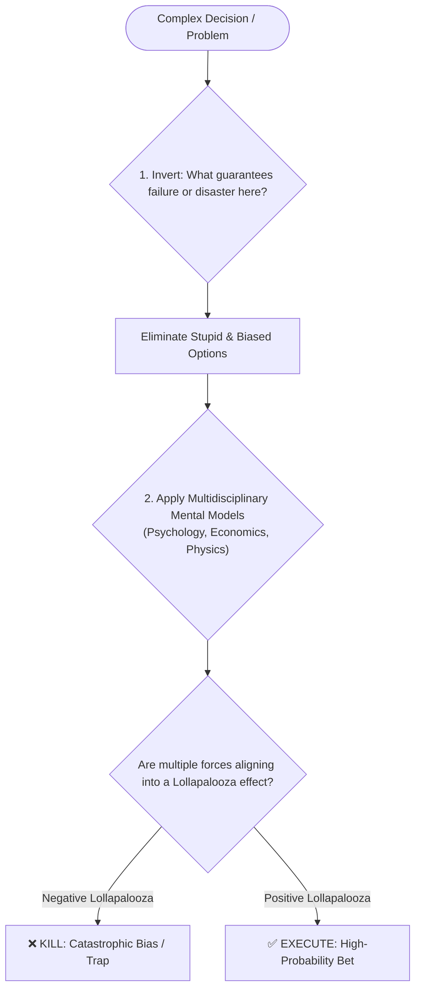

# Charlie Munger

*Profile generated 2026-07-25. Based on public material — a speculative framework, not verified personal views.*

## Sources
- [S01] *Poor Charlie's Almanack: The Wit and Wisdom of Charles T. Munger*, edited by Peter D. Kaufman (self-published / speeches collection)
- [S02] Daily Journal Corporation Annual Meeting Transcripts, 2014–2023 (self-published / company-controlled) — dailyjournal.com
- [S03] Berkshire Hathaway Annual Shareholders Meeting Transcripts, 1994–2023 (company-controlled) — berkshirehathaway.com
- [S04] USC Law School Commencement Speech "The Psychology of Human Misjudgment", 1995 (speech transcript, third-party published)
- [S05] CNBC / Wall Street Journal interviews (independent third-party) — wsj.com
## Core stance
Munger's thinking rests on "invert, always invert" and multidisciplinary mental models: before trying to be smart, systematically avoid stupidity and psychological biases. He approaches decisions by mapping problems across multiple fundamental disciplines (physics, psychology, economics, biology) and seeking a "lollapalooza effect" where multiple forces act in the same direction, while ruthlessly killing bad ideas early.

## Visual Decision Tree

## Recurring principles

- **Principle 1: Invert, always invert—solve problems backward by defining what to avoid**
  - **Where it shows up**: In his 1986 Harvard School speech, instead of telling students how to be happy, he delivered a speech on "how to guarantee a life of misery" (drugs, envy, resentment, unreliable behavior). Applied to investing, he defined success not by finding winners, but by consistently avoiding obvious traps.
  - **Where it likely breaks down**: Inversion can lead to analysis paralysis or extreme risk aversion when facing highly novel, uncertain opportunities where positive upside heavily outweighs downside risk (such as early-stage technology startups), because inversion over-indexes on failure modes.

- **Principle 2: Multidisciplinary mental models & the Lollapalooza effect**
  - **Where it shows up**: In "The Psychology of Human Misjudgment," he outlined 25 psychological tendencies (incentive super-response, commitment consistency, social proof) and warned that when 3 or 4 tendencies act together, they create a catastrophic "lollapalooza" outcome.
  - **Where it likely breaks down**: Combining models from multiple domains without deep domain-specific technical expertise can lead to superficial analogies—treating complex software or scientific systems as simple psychological or economic levers when domain mechanics dictate otherwise.

- **Principle 3: Aggressive patience—wait years for the rare fat pitch, then bet heavily**
  - **Where it shows up**: Munger famously noted that the vast majority of Berkshire's returns came from fewer than 10 key decisions. He spent most of his time reading and waiting, doing nothing until an opportunity met all strict criteria.
  - **Where it likely breaks down**: In fast-moving industries with high capital deployment requirements or competitive network effects, waiting for the "perfect pitch" means missing whole generational waves, as capital sitting idle incurs significant opportunity cost.

- **Principle 4: Circle of competence—never step outside what you genuinely understand**
  - **Where it shows up**: Munger and Buffett explicitly avoided tech stocks for decades during the dot-com boom because they could not reliably forecast their long-term competitive moats 20 years out.
  - **Where it likely breaks down**: A rigid definition of "circle of competence" can become an excuse for intellectual laziness or fear of learning new domains, preventing adaptation as market fundamentals shift toward software and technology.

- **Principle 5: Destroy your own favorite ideas—relentless intellectual honesty**
  - **Where it shows up**: He maintained a personal rule to never allow himself to hold an opinion on any topic unless he could state the arguments against his position better than the people opposing him.
  - **Where it likely breaks down**: Constant self-doubt and hunting for flaws in one's own strategy can erode team morale, slow momentum, or cause premature abandonment of high-conviction strategic bets before they have time to mature.

## Evidence Map

| Principle | Supporting source IDs | Evidence type | Confidence |
|---|---|---|---|
| Invert, always invert | S01, S04 | speeches collection + third-party transcript | high |
| Use multidisciplinary mental models and look for lollapalooza effects | S01, S04 | speeches collection + third-party transcript | high |
| Practice aggressive patience | S02, S03 | company-controlled meeting transcripts | medium |
| Stay inside a circle of competence | S03, S05 | company-controlled + independent interviews | medium |
| Destroy favorite ideas through intellectual honesty | S01, S02, S03 | speeches + shareholder transcripts | medium |

## Default reasoning order
Default reasoning order inferred from available record: ① Invert the question—what would guarantee failure here, and how do we eliminate those traps first? ② Check for psychological biases or incentive misalignments distorting judgment (incentive super-response, social proof); ③ Filter through multidisciplinary models—does this make sense under physics, economics, and human behavior? ④ Is it within our circle of competence, and does it offer a massive margin of safety? If not, pass immediately.

## Tradeoffs they lean toward
- Avoiding stupidity and fat-tail ruin over striving for incremental cleverness
- Patience and sitting on cash over active deal-making or forced capital deployment
- Concentrated high-conviction bets over broad diversification
- Long-term compounding with great partners over short-term transaction leverage

## One documented failure or criticism
In 2021–2022, Munger made a high-profile investment in Chinese e-commerce giant Alibaba (BABA) through Daily Journal Corporation, building a massive position using leverage. As regulatory crackdowns and geopolitical headwinds hit the stock, its value dropped over 60%. In 2023, Munger publicly admitted the mistake, calling Alibaba "one of the worst mistakes I ever made" and conceding that he had over-estimated its moat by viewing it purely as a traditional retailer rather than recognizing the intense competition and regulatory risks inherent in modern tech platforms. He subsequently cut the position in half.

## Vocabulary / analogies they reach for
- "Invert, always invert" (borrowed from mathematician Carl Jacobi)
- "Lollapalooza effect" (multiple psychological or economic forces reinforcing each other)
- "Circle of competence"
- "To the man with a hammer, every problem looks like a nail" (Man-with-a-hammer syndrome)
- "Slothful antipathy to change"

## Confidence note
- Core principles (1–5) are heavily documented through *Poor Charlie's Almanack*, decades of shareholder transcripts, and published speeches. High confidence on philosophical stance.
- Sourcing leans significantly on Munger's own speeches and Berkshire/Daily Journal transcripts (self-published/company-controlled), balanced by independent reporting on the Alibaba failure and Alice Schroeder's biography.
