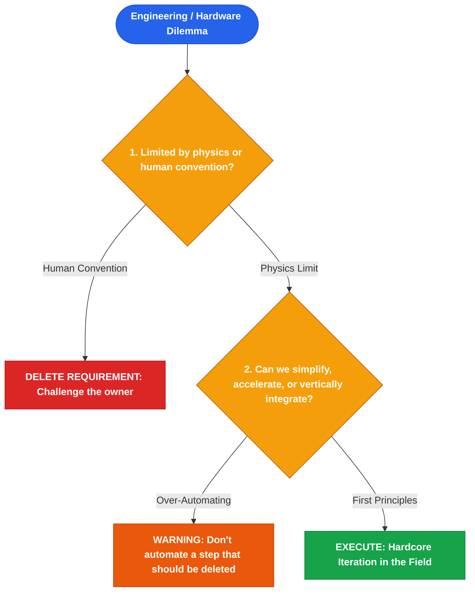

# Elon Musk

*Distilled Profile — covering deep tech, manufacturing velocity, and first-principles hardware engineering. Generated 2026-07-25.*

## Sources
- [Ashlee Vance Biography: Elon Musk](https://www.amazon.com/Elon-Musk-SpaceX-Tesla-Fantastic/dp/0062301233) — Authorized independent biography (2015)
- [Walter Isaacson Biography: Elon Musk](https://www.amazon.com/Elon-Musk-Walter-Isaacson/dp/1982181281) — Authorized independent biography (2023)
- [Everyday Astronaut SpaceX Starbase Tour](https://youtube.com) — Public video interviews on the 5-step engineering algorithm (2021)
- [Tesla 2018 Q1 Earnings Call Transcript](https://ir.tesla.com) — Public earnings call transcript on Model 3 production hell and over-automation admissions
- [SpaceX Starship Development Updates](https://spacex.com) — Public engineering updates
- [Tesla Master Plan Part 1-3](https://tesla.com) — Self-published strategic whitepapers

## Core stance
Musk's approach centers on first-principles physics reductionism paired with unhinged execution velocity. He rejects reasoning by analogy ("we do it because everyone else does"), boiling engineering and business problems down to fundamental physical limits (material cost, thermodynamics, raw mass) and reconstructing solutions from scratch. His methodology enforces aggressive subtraction, deletion of requirement owners, and rapid iterative testing in the wild over passive simulation.

## Visual Decision Tree

## Recurring principles

- **Principle 1: Apply the 5-Step Engineering Algorithm rigidly (Make requirements less dumb, delete, simplify, accelerate, automate)**
  - **Where it shows up**: At SpaceX Starbase and Tesla factories, Musk strictly enforces that every requirement must come with a named person who owns it—never a committee—and that the most common mistake of smart engineers is optimizing a thing that should not exist.
  - **Where it likely breaks down**: In the 2018 Tesla Model 3 "Production Hell", Musk rushed step 5 (automation) before steps 2 & 3 (deleting and simplifying), building complex robotic conveyor systems that constantly jammed. He later publicly admitted: *"Excessive automation at Tesla was a mistake. Humans are underrated."*

- **Principle 2: Reason from first principles physics, not analogy**
  - **Where it shows up**: When founding SpaceX in 2002, aerospace contractors quoted $65M+ for a single rocket. Musk calculated the raw material cost of aerospace-grade aluminum, titanium, copper, and carbon fiber on the London Metal Exchange—finding it was only 2% of the rocket's retail price—and decided to build rockets in-house.
  - **Where it likely breaks down**: Applying raw first-principles logic to human organizations and social platforms (such as the 2022 acquisition of Twitter/X) underestimates soft cultural dynamics, advertiser trust, and human nuance that cannot be solved purely by physics equations.

## Default reasoning order
1. Reduce the problem to raw material and physics limits.
2. Question every requirement and delete non-essential steps.
3. Accelerate cycle time through hardware field testing.

## Tradeoffs they lean toward
- Velocity over polish: Ships hardware iterations quickly, accepting exploding prototypes to gather real data.
- Vertical integration over outsourcing: Insists on in-house manufacturing to control cost and iteration speed.

## One documented failure or criticism
The 2018 Tesla Model 3 "Production Hell" over-automation crisis, where excessive reliance on robotic vision systems halted factory throughput until manual human assembly lines were re-installed in tents outside the Fremont factory.

## Vocabulary / analogies they reach for
- *First principles*: Reducing a problem to fundamental physics truths.
- *Production Hell*: Scaling manufacturing from prototype to mass volume.
- *Delete requirement*: Removing process steps before attempting optimization.

## Confidence note
High confidence in hardware manufacturing and engineering methodology. Moderate confidence in software governance.
