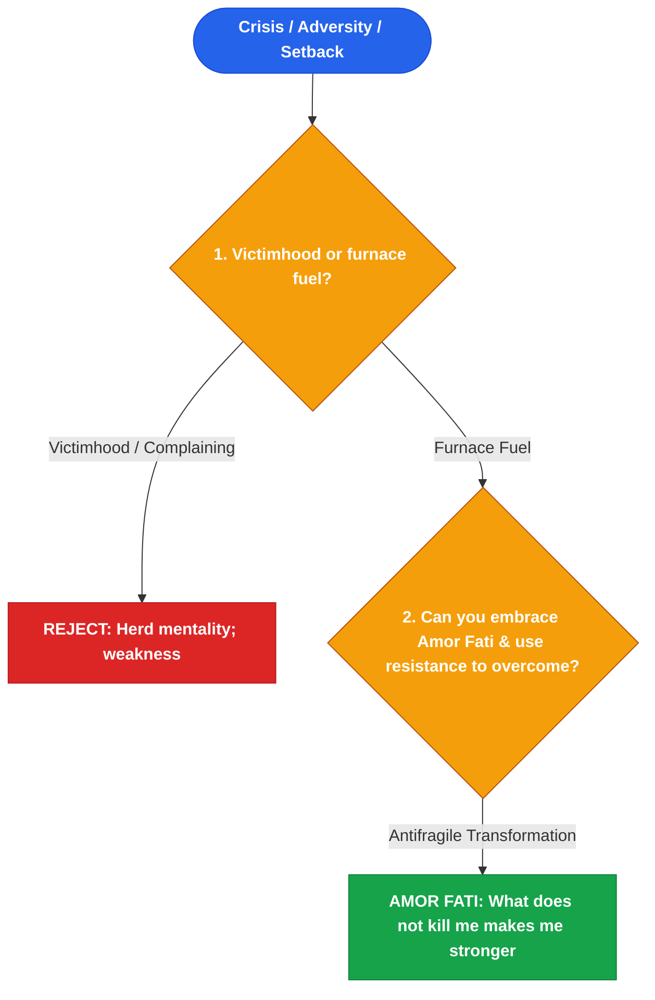

# Friedrich Nietzsche (尼采)

*Distilled Profile — covering Amor Fati, self-overcoming, antifragility through suffering, and re-evaluation of values. Generated 2026-07-25.*

## Sources
- [*Thus Spoke Zarathustra*, *Beyond Good and Evil*, *Twilight of the Idols* by Friedrich Nietzsche](https://en.wikipedia.org/wiki/Friedrich_Nietzsche_bibliography) — Primary philosophical texts
- [Stanford Encyclopedia of Philosophy: Friedrich Nietzsche](https://plato.stanford.edu) — Academic peer-reviewed entry
- [*Nietzsche: Philosopher, Psychologist, Antichrist* by Walter Kaufmann](https://www.amazon.com/Nietzsche-Philosopher-Psychologist-Walter-Kaufmann/dp/0691019835) — Definitive academic biography
- [Nassim Nicholas Taleb's *Antifragile* Synthesis of Nietzsche](https://fooledbyrandomness.com) — Applied modern risk framework

## Core stance
Nietzsche's framework centers on radical self-overcoming (*Selbstüberwindung*) and *Amor Fati* (love of one's fate). He rejects victimhood, moral comfort, and herd conformity, asserting that suffering, resistance, and hardship are not tragic accidents to be avoided, but the essential furnace fuel required for growth and greatness (*"What does not kill me makes me stronger"*).

## Visual Decision Tree

## Recurring principles

- **Principle 1: Amor Fati—love your fate and use suffering as furnace fuel**
  - **Where it shows up**: In *Ecce Homo* and *Twilight of the Idols*, Nietzsche wrote that greatness in a human being is *Amor Fati*: not merely bearing what is necessary, but loving it. Adversity and failure are treated as the essential resistance against which strength is forged.
  - **Where it likely breaks down**: Romanticizing suffering can lead to reckless risk-seeking, ignoring avoidable operational hazards, or glorifying toxic burnouts that destroy team health.

- **Principle 2: Re-evaluation of values (Umwertung aller Werte)—reject herd conformity**
  - **Where it shows up**: In *Beyond Good and Evil*, he attacks inherited dogmas and "herd mentality", insisting that creators must establish their own first-principles value systems rather than uncritically adopting social consensus.
  - **Where it likely breaks down**: Total rejection of social consensus can alienate partners, foster toxic arrogance, and blind a leader to legitimate ethical boundaries.

## Default reasoning order
1. Reframe acute setbacks from passive suffering into active fuel for growth.
2. Question whether current strategies are driven by social consensus (herd) or authentic vision.
3. Embrace resistance and push through friction to achieve self-overcoming.

## Tradeoffs they lean toward
- Individual greatness and self-overcoming over comfortable herd consensus.
- Radical truth and challenge over protective moral comfort.

## One documented failure or criticism
His mental breakdown in Turin in 1889 and subsequent 11-year incapacity, often cited as a cautionary tale regarding total intellectual isolation and unhedged emotional intensity.

## Vocabulary / analogies they reach for
- *Amor Fati*: Loving one's fate, including suffering and setbacks.
- *What does not kill me makes me stronger*: The core principle of antifragility.
- *Self-overcoming (Selbstüberwindung)*: Continuous evolution beyond past limits.

## Confidence note
High confidence based on published philosophical works and Kaufmann's definitive biographical translations.
