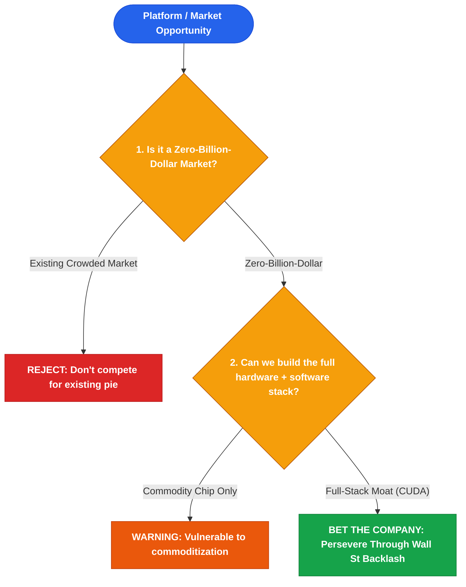

# Jensen Huang (黄仁勋)

*Distilled Profile — covering platform conviction, zero-billion-dollar market creation, and flat organizational execution. Generated 2026-07-25.*

## Sources
- [Nvidia 2006 CUDA Launch Press Release & Historical Financials](https://nvidia.com) — Primary corporate archives
- [Acquired Podcast: The Nvidia Story Part 1-3](https://acquired.fm) — Deep-dive multi-hour interview with Jensen Huang (2023)
- [Stanford Graduate School of Business Keynote: Jensen Huang](https://gsb.stanford.edu) — Public lecture on organizational structure and resilience (2024)
- [Nvidia Annual Shareholder Letters 2010-2024](https://nvidia.com) — Corporate archive
- [IEEE Spectrum Analysis of GPU Parallel Computing](https://spectrum.ieee.org) — Independent technical reporting
- [Wall Street Journal Profile on Jensen Huang Management Style](https://wsj.com) — Independent journalism

## Core stance
Huang's approach centers on "betting the company" on zero-billion-dollar markets long before financial metrics justify them. He operates with extreme flat organization (50+ direct reports) to maintain ground-level signal and eliminate middle-management filtering. His strategy prioritizes full-stack co-design (chips, networking, software, algorithms) over component-level efficiency.

## Visual Decision Tree

## Recurring principles

- **Principle 1: Create and dominate zero-billion-dollar markets through long-term platform conviction**
  - **Where it shows up**: In 2006, Nvidia launched CUDA, embedding parallel computing hardware into every GPU shipped, swelling chip production costs by billions when no commercial market existed. Huang absorbed a 50%+ drop in Nvidia stock for years while Wall Street demanded he abandon CUDA, laying the infrastructure that powered modern AI.
  - **Where it likely breaks down**: Sustaining a multi-billion dollar platform bet requires extreme capital reserves and public market patience; doing this in a cash-constrained startup can lead to bankruptcy long before the zero-billion-dollar market matures.

- **Principle 2: Run a flat, transparent organization with zero middle-management filtering**
  - **Where it shows up**: Huang keeps 50+ direct reports and refrains from 1-on-1 meetings, broadcasting strategic priorities in open, company-wide memo reviews to ensure everyone from VPs to junior engineers shares identical ground-truth context.
  - **Where it likely breaks down**: Flat management with 50 direct reports requires a founder with extraordinary energy and domain mastery; in large multi-divisional enterprises, it creates decision bottlenecks and executive burnout.

## Default reasoning order
1. Identify fundamental shifts in computing paradigms.
2. Build full-stack hardware and software ecosystems before demand arrives.
3. Maintain flat organizational alignment through direct communication.

## Tradeoffs they lean toward
- Long-term ecosystem control over short-term gross margins: Invested heavily in CUDA software when hardware margins were compressed.
- High risk platform bets over incremental product updates.

## One documented failure or criticism
The 2011 Nvidia Tegra mobile processor push, where Nvidia attempted to compete with Qualcomm in smartphone SoCs but was forced to pivot away after losing major handset design wins.

## Vocabulary / analogies they reach for
- *Zero-billion-dollar market*: A non-existent market today that will become a multi-billion dollar industry in a decade.
- *Full-stack co-design*: Designing chips, systems, networking, and software simultaneously.
- *Accelerated computing*: Shifting serial CPU tasks to parallel GPU execution.

## Confidence note
High confidence based on 30-year public track record at Nvidia, Acquired interviews, and Stanford GSB transcripts.
