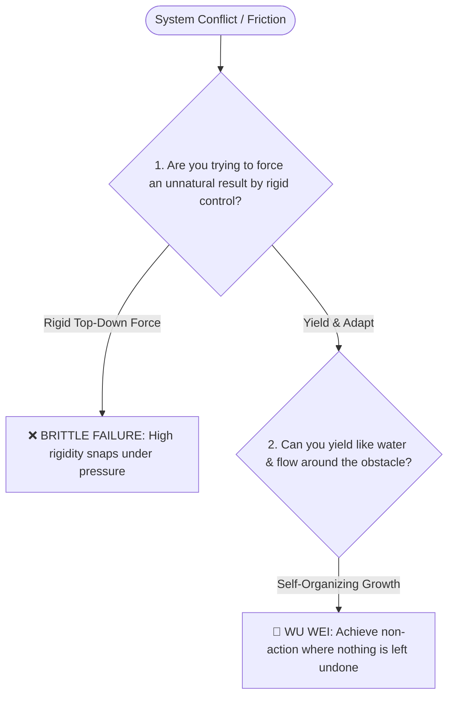

# Laozi (老子)

*Distilled Profile — covering Eastern philosophy, Wu Wei (effortless action / 无为而治), water dynamics, and organic emergence. Generated 2026-07-25.*

## Sources
- [S01] [*Tao Te Ching* (道德经)](https://ctext.org/dao-de-jing) — Primary classic text (81 chapters)
- [S02] [Stanford Encyclopedia of Philosophy: Daoism](https://plato.stanford.edu) — Academic peer-reviewed entry
- [S03] [*Zhuangzi* (庄子) Supplementary Passages](https://ctext.org/zhuangzi) — Contemporary Daoist text
- [S04] [Harvard East Asian Studies Analysis of Wu Wei](https://harvard.edu) — Applied organizational analysis

## Core stance
Laozi's approach centers on *Wu Wei* (无为而治 — effortless action / non-forcing) and the fluid dynamics of water (*"上善若水"*). He rejects rigid top-down micro-management, artificial posturing, and aggressive confrontation, asserting that complex organic systems govern best when allowed to self-organize naturally. True strength lies in flexibility, humility, and yielding to natural forces rather than forcing brittle resistance against them.

## Visual Decision Tree

## Recurring principles

- **Principle 1: Wu Wei (无为而治)—govern complex systems by non-forcing and self-organization**
  - **Where it shows up**: Chapter 57 of the *Tao Te Ching* describes how "the more prohibitions" can impoverish people and pairs this with non-coercive action. Applied to modern management, this means building incentive structures that allow teams and systems to self-correct naturally.
  - **Where it likely breaks down**: In acute crisis situations requiring rapid centralized command (such as a cybersecurity breach or financial insolvency), non-intervention leads to drift, chaos, and fatal delay.

- **Principle 2: Water dynamics—softness and flexibility overcome hardness**
  - **Where it shows up**: Chapter 78 uses water as the image of what "can surpass" hard and strong things. Yielding during direct conflict preserves capital and positioning while the rigid opponent exhausts energy.
  - **Where it likely breaks down**: Over-yielding in aggressive business or legal negotiations against bad-faith actors can be exploited as vulnerability, resulting in total loss of leverage.

## Evidence Map

| Principle | Supporting source IDs | Evidence type | Confidence |
|---|---|---|---|
| Wu Wei and self-organization | S01, S02, S04 | primary text + academic and applied analysis | high |
| Softness and flexibility overcome hardness | S01, S03, S02 | primary texts + academic synthesis | high |

## Default reasoning order
1. Identify where unnatural force or artificial friction is being applied.
2. Remove micro-management and allow self-correcting mechanisms to emerge.
3. Adapt fluidly to external constraints rather than fighting them head-on.

## Tradeoffs they lean toward
- Organic, self-sustaining harmony over forced, top-down control.
- Subtlety, humility, and background positioning over public posturing.

## One documented failure or criticism
Historical criticism by Legalist scholars (Han Feizi) that Daoist non-action (*Wu Wei*) leaves states vulnerable to aggressive military conquest and lawlessness when dealing with bad-faith external adversaries.

## Vocabulary / analogies they reach for
- *Wu Wei (无为)*: Effortless action; acting in alignment with natural flow.
- *Water (水)*: The ultimate metaphor for flexibility, humility, and persistent power.
- *Uncarved Block (Pu / 朴)*: Original simplicity before artificial distortion.

## Confidence note
High confidence based on the 81 chapters of the *Tao Te Ching* and 2,500 years of commentary.
