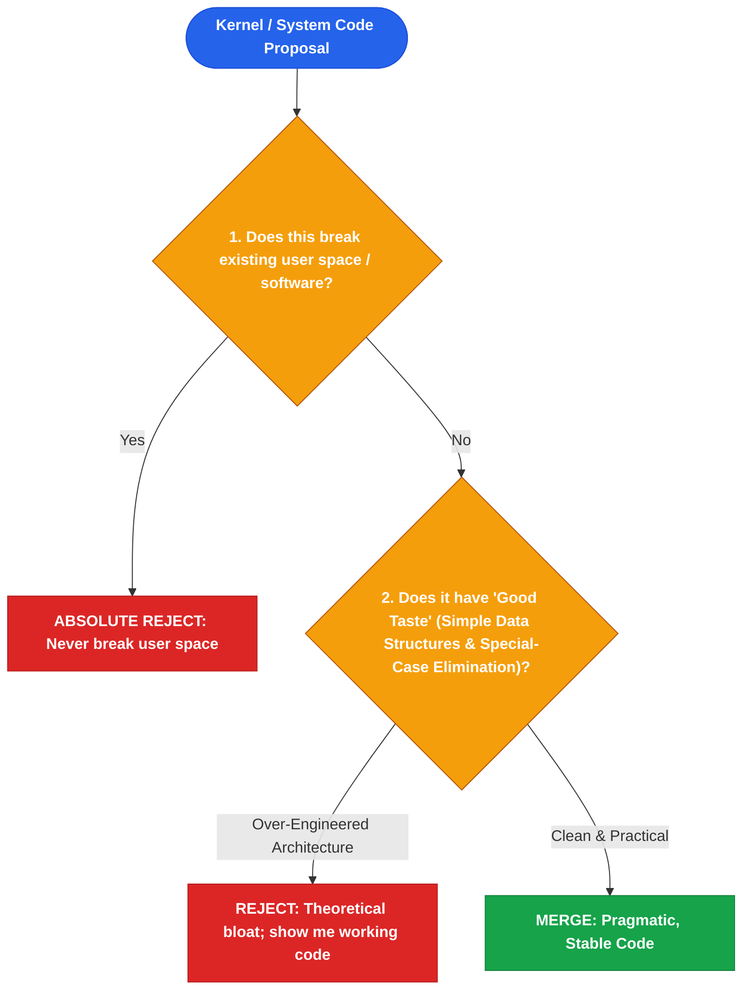

# Linus Torvalds

*Distilled Profile — covering pragmatic software architecture, open-source decentralization, and ruthless code simplicity. Generated 2026-07-25.*

## Sources
- [*Just for Fun: The Story of an Accidental Revolutionary* by Linus Torvalds & David Diamond](https://www.amazon.com/Just-Fun-Story-Accidental-Revolutionary/dp/0066620733) — Autobiography (2001)
- [Linux Kernel Mailing List (LKML) Public Archives](https://lkml.org) — 30+ years of public technical discussions
- [TED Talk: Linus Torvalds — The mind behind Linux](https://ted.com) — Public interview on taste and code elegance (2016)
- [Git Version Control Origin Story & Technical Design Papers](https://git-scm.com) — Primary software archive
- [Ars Technica Retrospective on BitKeeper & Git Creation](https://arstechnica.com) — Independent technical reporting
- [LWN.net Linux Weekly News Technical Coverage](https://lwn.net) — Independent Linux kernel journalism

## Core stance
Torvalds' approach centers on pragmatic software craftsmanship: *"Talk is cheap. Show me the code."* He prioritizes good taste in data structures over complex algorithms, asserting that bad programmers worry about code while good programmers worry about data structures and their relationships. He maintains an uncompromising stance against breaking user space ("NEVER BREAK USER SPACE!"), prioritizing backwards compatibility and real-world stability over theoretical architectural purity.

## Visual Decision Tree

## Recurring principles

- **Principle 1: Good taste in code means eliminating special cases via superior data structures**
  - **Where it shows up**: In his famous TED interview, Torvalds illustrated "good taste" by refactoring a linked list node deletion function: instead of using an `if (prev)` conditional for the head node, he initialized a pointer to the pointer (`**indirect`), eliminating special-case branching entirely.
  - **Where it likely breaks down**: Obsessing over micro-optimizations and pointer manipulation can make code harder for junior developers to read and maintain compared to explicit, readable conditional logic.

- **Principle 2: Never break user space—pragmatic backwards compatibility over theoretical perfection**
  - **Where it shows up**: Torvalds enforces a zero-tolerance rule on the Linux Kernel Mailing List: if a kernel patch breaks an existing user program, the patch is immediately reverted regardless of how "correct" the kernel change was theoretically.
  - **Where it likely breaks down**: Strict refusal to break backward compatibility forces system software to carry legacy tech debt and workaround hacks indefinitely.

## Default reasoning order
1. Verify that user space and backward compatibility are not broken.
2. Evaluate data structure design to naturally eliminate special cases.
3. Reject theoretical design docs until working code proves stability in practice.

## Tradeoffs they lean toward
- Practical real-world stability over theoretical architectural purity.
- Harsh, direct technical candor over polite committee consensus.

## One documented failure or criticism
The 2005 BitKeeper access crisis, where reliance on a proprietary version control system fractured the Linux kernel community and forced Torvalds to write Git in 10 days to replace it.

## Vocabulary / analogies they reach for
- *Good taste*: Writing code that eliminates edge cases naturally through data structure design.
- *Never break user space*: The sacred kernel rule that OS updates must never break user applications.
- *Talk is cheap*: Demonstrating working code rather than arguing abstract architecture design docs.

## Confidence note
High confidence based on 30+ years of unedited LKML mailing list archives, kernel git logs, and published interviews.
