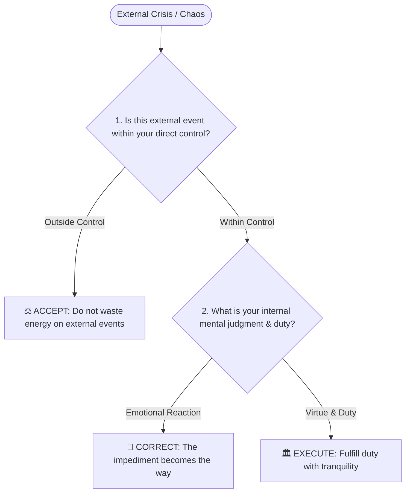

# Marcus Aurelius (马可·奥勒留)

*Distilled Profile — covering Stoic leadership under crisis, controlling internal response vs external chaos, and duty. Generated 2026-07-25.*

## Sources
- [*Meditations* (Ta Eis Heauton)](https://en.wikipedia.org/wiki/Meditations) — Primary personal journal writings (161–180 AD)
- [*Historia Augusta* & Cassius Dio Roman Histories](https://penelope.uchicago.edu) — Contemporary historical records of the Antonine Plague and Marcomannic Wars

## Core stance
Marcus Aurelius's mental model centers on the Stoic dichotomy of control: separating external events (which are neutral and outside one's control) from internal judgments (which are 100% within one's control). Facing war, plague, and betrayal, his framework treats obstacles not as disruptions, but as the raw material for practicing virtue (*"The impediment to action advances action. What stands in the way becomes the way"*).

## Visual Decision Tree

## Recurring principles

- **Principle 1: Focus exclusively on internal judgment, not external events (Dichotomy of Control)**
  - **Where it shows up**: During the Antonine Plague and northern border wars, Marcus wrote daily reminders in *Meditations* that people, diseases, and betrayals cannot harm the mind unless one chooses to feel harmed: *"Remove the judgment 'I am hurt', and the hurt itself disappears."*
  - **Where it likely breaks down**: Extreme Stoic detachment can lead to perceived coldness, emotional repression, or slowness in taking urgent external PR/political actions when public perception requires empathy over quiet duty.

- **Principle 2: The obstacle is the way—turn adversity into strategic progress**
  - **Where it shows up**: Facing treasury bankruptcy during the Marcomannic Wars, he auctioned off imperial palace luxuries (gold, crystal, artwork) in the Forum to fund the army without raising taxes on citizens.
  - **Where it likely breaks down**: Treating every obstacle as a Stoic test of virtue can lead to tolerating flawed systems, abusive business partners, or unsustainable operational environments that ought to be dismantled rather than endured.

## Vocabulary
- *Dichotomy of control*: Distinguishing between what is up to us (our actions, desires) and what is not (external events).
- *Amor Fati*: Embracing everything that happens as necessary and useful.
- *Imperator*: Duty-bound leadership in times of acute crisis.

## Confidence note
High confidence based on his surviving personal journal (*Meditations*) written during active war campaigns.
