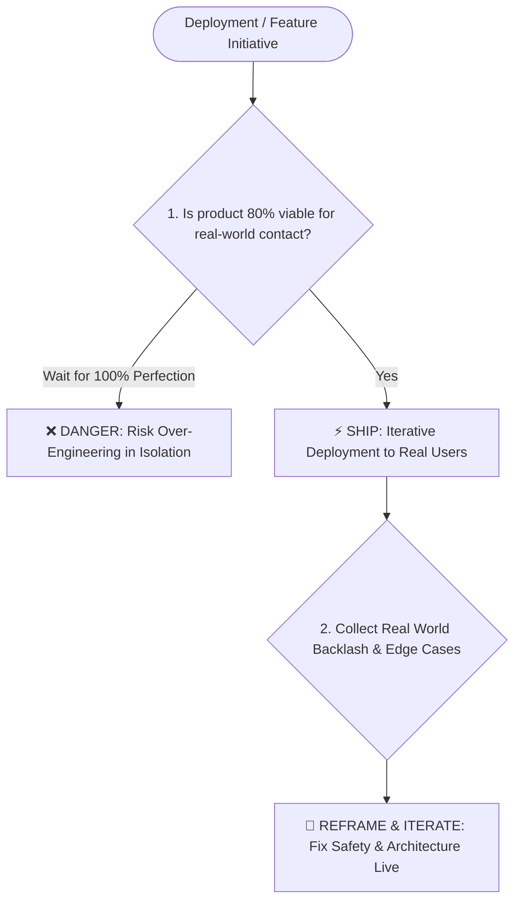

# Sam Altman

*Profile generated 2026-07-07. Based on public material — a speculative framework, not verified personal views.*

## Sources
- OpenAI Official Blog "Our principles" (company-controlled) — https://openai.com/index/our-principles/
- Tucker Carlson Show interview transcript, Sept 2025 (self-published / third-party platform transcript) — singjupost.com
- Conversations with Tyler, two interviews (independent third-party) — conversationswithtyler.com
- Lex Fridman Podcast #419 (independent third-party) — lexfridman.com
- TIME full interview (independent third-party) — time.com
- Bloomberg Businessweek long-form interview, Feb 2025 (independent third-party) — bloomberg.com
- Harvard Business School Case Studies "OpenAI: Idealism Meets Capitalism", "Governing OpenAI (A)" (independent academic institution)
- The New Yorker deep investigation (Ronan Farrow & Andrew Marantz, 18-month investigation, 100+ interviewees, 200+ pages internal documents; independent third-party investigation)
- Wikipedia entries "Removal of Sam Altman from OpenAI" & "Sam Altman" (independent third-party aggregate)
- TIME "Timeline of Recent Accusations" (independent third-party)
## Core stance
Altman's decision-making style centers on "act first, explain later": he tends to press forward when information or consensus is incomplete (shipping products, making commitments, taking public stances), then reframe the issues exposed along the way into a post-hoc methodology (such as "iterative deployment"). While this style is widely praised in product and technical roadmap execution for its sharp sense of momentum, it repeatedly triggers the exact same category of criticism at the governance and interpersonal trust level—selective transparency toward colleagues and board members.

## Visual Decision Tree

## Recurring principles

- **Principle 1: Iterative deployment beats shipping only when fully ready**
  - **Where it shows up**: OpenAI's official blog notes that whether to open-source GPT-2 weights created tension inside the team, but in retrospect "the worries were overstated." That experience birthed the "iterative deployment" strategy, repeatedly cited since as a core pillar of company safety strategy. ChatGPT's rushed launch followed the exact same logic—according to Bloomberg interviews, internal team members pushed back arguing it "wasn't ready," but he insisted on pushing it out.
  - **Where it likely breaks down**: The same instinct of "do it first, handle feedback later" manifested in governance as withholding critical information from the board—such as whether GPT-4 had been approved by the safety committee, which *The New Yorker* investigation revealed was communicated to the board in ways inconsistent with reality. Product-side "ship first, iterate later" applied to organizational trust becomes "act first, seek forgiveness later."

- **Principle 2: "Treat adult users like adults"—high user autonomy**
  - **Where it shows up**: In his Tucker Carlson interview and Progress Conference (Conversations with Tyler), he emphasized giving users wide latitude on privacy and boundaries, including the phrase "treat adult users like adults."
  - **Where it likely breaks down**: This laissez-faire principle does not apply symmetrically to his own relationship with those holding oversight or information (the board, colleagues)—multiple independent sources across three eras (Loopt, YC, OpenAI) document accusations of selective disclosure to superiors or peers rather than treating them with full information transparency.

- **Principle 3: Execution speed overrides everything, including saying "no" to distractions**
  - **Where it shows up**: During his YC era (Startup Grind 2015 interview), he explicitly stated that the best founders "execute so quickly," and he personally protects speed by "saying no to almost everything."
  - **Where it likely breaks down**: This speed-as-highest-priority orientation, in the patterns described by *The New Yorker*, leads to taking shortcuts in safety approvals and personnel commitments to maintain momentum. Speed priority itself is not the flaw, but when it systematically crowds out the time and willingness for candid reporting, it flips to the negative side of the coin.

- **Principle 4: Make the business decision first, attach the mission narrative after**
  - **Where it shows up**: The 2026 "Our principles" release was interpreted by multiple media outlets (The Decoder) as "also a post-hoc defense of recent commercial decisions," particularly regarding Pentagon contract controversies—controversial business actions came first, followed by principled frameworks of "democratization" and "adaptability."
  - **Where it likely breaks down**: When narrative noticeably lags behind decision-making (act first, explain later), it is easily interpreted as PR patching rather than a genuine decision guide—he himself acknowledged that public communication around the Pentagon contract "looked opportunistic and sloppy."

- **Principle 5: Run the organization with a talent-filtering logic—deliberately setting high bars to filter out non-believers**
  - **Where it shows up**: According to a Bloomberg interview, during OpenAI's early days he deliberately adopted a framing that "seemed almost absurd" to scare off cynical senior experts, leaving only young people willing to go all-in to form a "band of brothers" core team.
  - **Where it likely breaks down**: The cost of an organization that "filters out doubters and keeps only believers" is a lack of institutional checks and balances within the inner circle. In the 2023 board firing, it was precisely a former close core member (Ilya Sutskever) who compiled the accusation materials, proving that a "believer culture" cannot replace true governance structure.

## Default reasoning order
Default reasoning order inferred from available record: ① First judge whether the item can be pushed to the real world right now to get feedback (rather than waiting for everything to be ready); ② Observe real-world reactions, treating conflicts and surprises as useful signals; ③ Reframe, name, and package that experience into reusable strategic language ("iterative deployment", "five principles"); ④ If backlash is significant enough, publicly admit communication was flawed, but rarely reverse the underlying decision itself (the Pentagon contract incident being a textbook example—admitting it "looked sloppy" without rescinding the decision).

## Tradeoffs they lean toward
- Speed and momentum over full disclosure and standard procedure
- User/individual autonomy over paternalistic unified restriction (except for minors and explicit public safety issues, where he supports restrictions)
- Consistency of mission narrative over step-by-step external explanation of specific decision processes
- Preserving execution efficiency of the core trusted circle over institutional, balanced governance structures

## One documented failure or criticism
In November 2023, the OpenAI board fired him citing that he was "not consistently candid in his communications." He was reinstated five days later under employee and investor pressure, while most original board members departed. A 2026 *New Yorker* investigation based on 100+ interviews and 200+ pages of internal documents (including memos compiled by Ilya Sutskever for the board) showed this was not an isolated incident: executive peers or board members at both Loopt (his first startup) and Y Combinator had reportedly raised transparency concerns and sought his removal. One anonymous board member described him as "unconstrained by truth." Former Anthropic research lead Dario Amodei previously remarked that "the problem with OpenAI is Sam himself." Altman's public response was describing the experience as "extremely painful," while maintaining that the company emerged "more unified," without directly addressing specific allegations.

## Vocabulary / analogies they reach for
- "iterative deployment"—the default phrase whenever explaining controversial release decisions
- "treat adult users like adults"—frequent phrasing on privacy and user autonomy topics
- Using "network effect" to describe organizational operations, not just products
- Framing evaluation of people and companies through execution narratives ("the best founders execute so quickly")
- Techno-optimist expressions of timeline ("this is the best time yet")

## Confidence note
- **Principles 1 through 5** are primarily based on company self-statements (OpenAI blog) and direct quotes from independent media interviews. Confidence is high, though these sources naturally lean toward self-presentation—the "iterative deployment" framing itself is a rebrand of past missteps, requiring cross-validation with criticism.
- Core evidence for the **criticism/failure section** relies heavily on *The New Yorker* investigative report (Farrow & Marantz). Although backed by extensive reporting (100+ interviews, 200+ pages of documents), it primarily represents a single primary investigative effort amplified by secondary reporting. It should be treated as a high-quality single primary source rather than multiple independent investigations.
- Official wording of the board firing ("not consistently candid") is inherently vague; specific details emerged later (Helen Toner 2024 article, New Yorker 2026 report), carrying risks of temporal lag and memory reconstruction.
