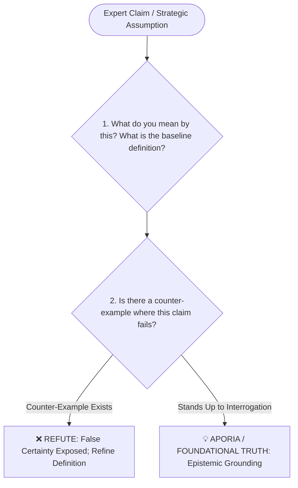

# Socrates (苏格拉底)

*Distilled Profile — covering epistemic humility, Socratic questioning (Elenchus), and auditing false certainty. Generated 2026-07-25.*

## Sources
- [S01] [*Platonic Dialogues: Apology, Crito, Phaedo, Euthyphro* by Plato](https://en.wikipedia.org/wiki/Socratic_dialogues) — Primary historical accounts of Socratic cross-examinations
- [S02] [*Memorabilia* by Xenophon](https://penelope.uchicago.edu) — Secondary contemporary historical account
- [S03] [Stanford Encyclopedia of Philosophy: Socrates](https://plato.stanford.edu) — Academic philosophical peer-reviewed entry
- [S04] [Internet Encyclopedia of Philosophy: The Socratic Method](https://iep.utm.edu) — Academic reference
- [S05] [Harvard Law Review: Socratic Method in Legal Pedagogy](https://harvardlawreview.org) — Applied modern methodology

## Core stance
Socrates' approach centers on radical epistemic humility: *"I know that I know nothing."* Rather than delivering dogmatic answers, his methodology (the *Elenchus* or Socratic Method) uses systematic cross-examination to expose hidden contradictions, unexamined assumptions, and false certainty in expert claims, stripping away superficial confidence until foundational truth remains.

## Visual Decision Tree

## Recurring principles

- **Principle 1: Systematic Cross-Examination (Elenchus) to expose unexamined assumptions**
  - **Where it shows up**: In Plato's *Euthyphro* and *Apology*, Socrates interrogates politicians, poets, and craftsmen claiming expertise, demonstrating through sequential questions that their confidence rested on unexamined social conventions rather than logical definitions.
  - **Where it likely breaks down**: Endless questioning without offering constructive alternatives can paralyze decision-making, frustrate team momentum, and alienate stakeholders who require actionable direction over philosophical skepticism.

- **Principle 2: Radical Epistemic Humility—the examined life**
  - **Where it shows up**: When the Oracle at Delphi called him the wisest man in Athens, Socrates concluded he was wisest only because he recognized his own ignorance while others falsely believed they knew what they did not.
  - **Where it likely breaks down**: Claiming total ignorance can be weaponized as intellectual disingenuousness or passive aggression during high-stakes business negotiations where authoritative posture is required.

## Evidence Map

| Principle | Supporting source IDs | Evidence type | Confidence |
|---|---|---|---|
| Cross-examine to expose assumptions | S01, S03, S04, S05 | primary accounts + academic references | high |
| Practice radical epistemic humility | S01, S02, S03 | primary/secondary accounts + academic reference | high |

## Default reasoning order
1. Demand precise definitions for core terms and strategic claims.
2. Search aggressively for counter-examples and logical edge cases.
3. Refine or dismantle the assumption based on logical consistency.

## Tradeoffs they lean toward
- Foundational truth over superficial agreement or corporate harmony.
- Continuous questioning over quick dogmatic execution.

## One documented failure or criticism
His trial and execution by the Athenian court in 399 BC on charges of corrupting the youth and impiety, stemming from his persistent alienation of political leaders without building institutional defensive alliances.

## Vocabulary / analogies they reach for
- *Elenchus*: The Socratic method of refutation by cross-examination.
- *Aporia*: The state of puzzled helplessness when false certainty is dismantled.
- *Midwife of ideas*: Assisting others in giving birth to their own underlying truth.

## Confidence note
High confidence based on Plato's early dialogues, Xenophon's accounts, and 2,400 years of academic philosophical consensus.
